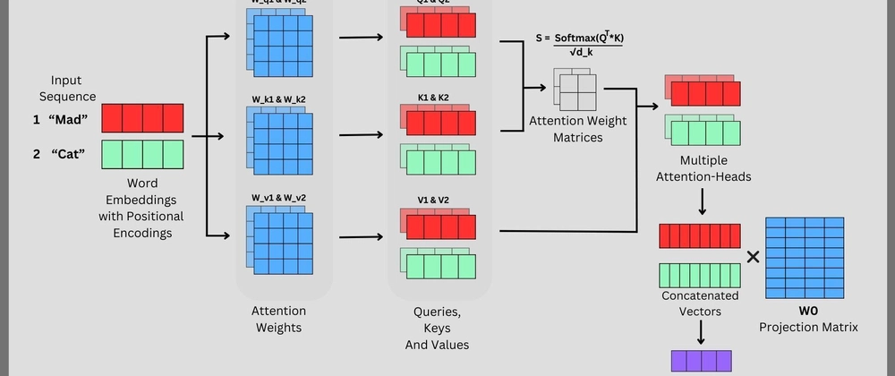
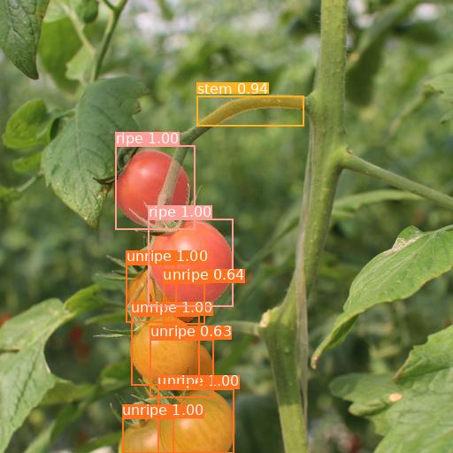
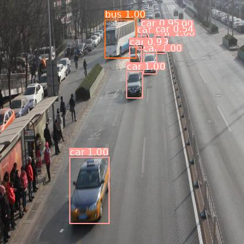



## vision transformer发展背景
2017年，一家来自谷歌的团队发表了可能将会影响人类历史走向的论文《Attention is All You Need》，提出了大名鼎鼎的Transformer架构，而现在各位所熟知的所有大语言模型，都是基于此基础架构的发展延伸。这个重大的架构发现可以说终结了一个时代，也开创了一个新的时代。在2017年之前，各大公司的AI lab研究路线高度集中在CNN（卷积神经网络）和RNN/LSTM（循环神经网络）两大基础范式之上，但因为彼时算力的限制，传统的架构似乎已经开发到了极限。而在新的Transformer架构来临后，各大AI lab迅速跟进，首先在NLP领域迎来爆发。2018年，谷歌推出BERT，预训练Tansfomer模型开始主导NLP领域发展；2019年，GPT-2在彼时算力并不充足的当下向世人展示了大幅超越传统模型的文本生成能力；2020年，拥有1750万亿参数的GPT-3,向通用NLP模型迈出了历史性一步。  
NLP领域在Transformer的驱动下高速发展，也有一些人在思考，Transformer能不能替代传统的CNN，在CV领域引发又一场革新。于是，2020年，Google Research 团队的 Dosovitskiy 等人在 ICLR 2021 发表论文《An Image is Worth 16×16 Words》，核心发现是：一个不含卷积组件的标准 Transformer 编码器，在有足够预训练数据的情况下，可以在图像识别上达到最先进的水平，这就是本篇博客的主角——Vision Transfomer(后文简述ViT)。在后面的几年里，VIT不断进行发展，又涌现了DeiT、PVT、TNT、Swin等一众变体，而上述的这些VIT模型，日后也成为了多模态视觉-语言模型中的重要基石。  

**阅前杂谈**   

本篇博客旨在向已有一定Transformer基础的人介绍VIT结构、优势、使用策略，如果你对Transformer的Encoder-Decoder结构不甚了解，建议先去网上寻找其他资料学习Transformer。本篇博客的介绍将会结合理论和代码，代码部分需要一定pytorch基础，并尽可能减少数学公式的计算，以介绍原理实现为主，同时代码部分将会以作者在github的开源仓库 https://github.com/everglow01/VIT 为基础，欢迎各位的关注。  

## 初识ViT整体结构   


### 1.图像切块——Patch Embedding
各位浏览上图可以看到，完整图片再进入Transformer Encoder之前，进行了诸多图像的预处理，在这一小节中将介绍将图像分为一个个小块的原理，以及为什么要把完整的图片切成块，这似乎并不符合传统CNN对图像的处理方法。  
#### 为什么要切块？  
传统的CNN通过滑动卷积核，逐像素的提取图像局部特征，天然理解图像的空间结构。也就是说，对于CNN而言，模型的输入就是一张完整的图片。  
但Tansformer的输入必须是一个个**序列**，他只能处理**token**，对二维图像毫无概念，所以VIT所做的工作，就是要**把二维图像翻译成Transformer能读懂的一个个token**  

类比一下：如果一张图片是一篇文章，那么每一个切出来的小块（Patch）就是其中的一个词。我们规定一张 224×224 的图片，用 16×16 大小的 patch 切割，横竖各切 14 刀，正好得到 **14×14 = 196 个 patch**，也就是 **"一篇 196 个词的文章"**。Transformer 读完这 196 个词，就完成了对整张图的理解。   

#### 如何实现图像切块？  
直觉上，“切块”听起来像要用传统CV方法先将图像裁成一块块，再分别处理，但我们在工程实现上有更效率、更优雅的处理办法，就是在代码中用一个指定类型的`Conv2d`一步搞定： 

```python
# kernel_size = stride = patch_size，保证不重叠地覆盖每个 patch
# 输入 [B, 3, 224, 224] → 输出 [B, 768, 14, 14]
# B -> Batch_size
self.proj = nn.Conv2d(in_c, embed_dim, kernel_size=patch_size, stride=patch_size)
```
看上去只有一行代码，但他实际上完成了VIT里相当重要的工作！ 
但卷积核大小等于步长（stride）时，每次滑动都落在下一个完全不重叠的区域，这意味着卷积核在扫过每一个Patch时，完成了一次线性投影——将每个16x16x3=768（这是一个Patch包含的全部像素数，16x16的大小，3的通道数）维的原始像素块，映射到768维的embedding向量空间。这一步将切块和投影两步并一步，虽然不符合我们的直觉，但相当高效的处理好了我们所需要的输入数据。  
完成这一步后，你可能还是有疑问，这里的数据结构依然是一个二维数组，也就是一个“图像”，并不是一个“序列”。是的，所以我们需要将图像展平（reshape），把二维图像reshape成Transformer需要的“序列”格式： 
```python
# [B, 768, 14, 14]
# → flatten(2)   → [B, 768, 196]   # 把空间维展平
# → transpose    → [B, 196, 768]   # token 维度放到中间
x = self.proj(x).flatten(2).transpose(1, 2)
```  

至此，一张图片就变成了形如 **[B, 196, 768]** 的 token 序列，196 个 patch，每个 patch 用一个 768 维的向量表示，可以直接送入后续的 Transformer Encoder。 

### 2.位置编码与 CLS Token —— Patch + Position Embedding  
对应图中：中间一排编号 0*、1、2…9 的 token，其中 0* 标注为 "Extra learnable [class] embedding"。  
完成上一步后，我们又有了新的疑惑和思考，刚刚说了Transformer并不能够像CNN那样理解空间结构，而我们输入的“序列”又只是对应图片的一个部分，196 个 patch token，对 Transformer 来说只是"一袋无序的词"，它不知道 patch 1 在左上角，patch 196 在右下角，我们要如何让Transformer Encoder理解每一个部分在完整图片中的位置关系呢？ 
#### 位置编码——给每个 Token 一个"座位号"

ViT 的做法简单直接：为每一个 patch token 额外加上一个**可学习的位置向量**，让模型在训练过程中自己学会"第 N 个 token 对应图像的哪个区域"。

```python
# 位置向量形状 [1, 197, 768]，训练时和模型参数一起更新
self.pos_embed = nn.Parameter(torch.zeros(1, num_patches + 1, embed_dim))

# forward 中，因为形状与Patch完全一致，所以直接相加即可
x = self.pos_drop(x + self.pos_embed)
```

每个 token 的 embedding 向量，加上对应位置的 position embedding 后，就同时携带了"我是什么内容"和"我在哪里"两份信息，Transformer 也就有了感知空间位置的能力。

细心的读者可能注意到了一个细节：`pos_embed` 的长度是 `num_patches + 1`，也就是 **196 + 1 = 197**。多出来的这个"1"是哪里来的？

#### CLS Token——图像的"班长"

这个"+1"来自一个特殊的可学习向量，叫做 **CLS Token**（Classification Token），也就是图中编号为 `0*` 的那个，注释写着"Extra learnable [class] embedding"。

它借鉴自 NLP 领域的 BERT 模型：在所有 patch token 之前，插入一个与任务无关的"占位 token"，让它在经过 Transformer Encoder 的层层注意力计算后，自然地聚合整张图的全局信息。最终分类时，我们只取这一个 token 的输出，而不是对 196 个 patch token 做平均或拼接。

```python
# 可学习参数，形状 [1, 1, 768]，每个样本共享同一个初始值
self.cls_token = nn.Parameter(torch.zeros(1, 1, embed_dim))

# forward 中，expand 成 [B, 1, 768]，拼到序列最前面
cls_token = self.cls_token.expand(x.shape[0], -1, -1)
x = torch.cat((cls_token, x), dim=1)  # [B, 196, 768] → [B, 197, 768]
```

拼接之后，序列从 196 个 token 变成了 197 个，CLS token 坐在"0 号位"，后面跟着 196 个 patch token，整个序列再加上位置编码，就准备好送入 Transformer Encoder 了。

可以用一个简单的比喻来理解 CLS token 的角色：196 个 patch 是班里的同学，各自携带着自己区域的信息；CLS token 是班长，它没有自己对应的图像区域，但通过注意力机制和所有同学"交流"，最终汇总出整个班级（整张图片）的综合情况，交给分类头做最终判断。  

### 3.核心模块 —— Transformer Encoder  
终于来到了激动人心的时刻，所有图像的预处理已经完成，我们要将处理好的一个个token送入Transformer Encoder进行计算和学习。
对应图中：右侧的 Transformer Encoder 展开图，Norm → Multi-Head Attention → Norm → MLP，重复 L 次。
这一部分是模型进行学习的核心部分，我将分为三个小块进行叙述   

#### Multi-Head Attention  
最经典的Transformer中的多头注意力机制，这里默认各位读者有一定的Transfomer基础，我仅简要叙述。  
  

观察上图，输入序列是两个已经携带了位置编码的词向量——红色的 "Mad" 和绿色的 "Cat"。
多头注意力的整个计算流程，可以跟着这张图从左到右走一遍。

**第一步：生成 Q、K、V**

每个 token 的 embedding，分别乘以三组可学习的权重矩阵
$W_Q$、$W_K$、$W_V$（图中左侧的 Attention Weights），
得到对应的 Query、Key、Value 向量。
图中可以看到，红色和绿色的 token 各自生成了一组 Q/K/V，
它们的含义是：
- **Q（Query）**：我想找什么信息？
- **K（Key）**：我能提供什么信息？
- **V（Value）**：我实际携带的内容是什么？

**第二步：计算注意力权重**

用每个 token 的 Q，去和所有 token 的 K 做点积，
衡量两两之间的相关程度，再除以缩放因子 $\sqrt{d_k}$ 防止数值过大，
最后经过 Softmax 归一化，得到图中的 **Attention Weight Matrices**——
一个表示"谁该关注谁、关注多少"的权重矩阵。

$$S = \text{Softmax}\left(\frac{Q^TK}{\sqrt{d_k}}\right)$$

**第三步：加权汇总 V，得到多头输出**

用上一步的注意力权重，对所有 token 的 V 加权求和，
每个 token 就得到了一个融合了全局上下文的新表示。
图中右侧可以看到，红色头和绿色头分别输出了各自的结果（Multiple Attention-Heads）。 

$$
\text{Attention}(Q, K, V) = \text{Softmax}\left(\frac{QK^T}{\sqrt{d_k}}\right)V
$$

"多头"的精髓在于：把 embedding 维度切成 h 份，每一份独立做一次注意力计算，
让不同的头去捕捉不同类型的关联——
有的头可能学会关注空间上相邻的 patch，有的头则关注语义上相近的 patch。

**第四步：拼接 + 输出投影**

将 h 个头的输出拼接成一个长向量（图中 Concatenated Vectors），
再乘以输出投影矩阵 $W_O$（图中最右侧的蓝色矩阵）（$W_O$本身是一个随模型一起训练的 768×768的权重矩阵，没有什么特殊的来源，
就是一个普通的 nn.Linear，只不过它在结构上承担了"多头融合"这个语义角色，论文里给它起了个专门的名字叫 $W_O$）
压缩回原始的 embedding 维度，得到最终输出。

在代码中，Q/K/V 的生成被合并进了同一个线性层，效率更高：

```python
# 一次生成 Q/K/V，再 reshape 拆分到每个头
qkv = self.qkv(x).reshape(B, N, 3, self.num_heads, C // self.num_heads).permute(2, 0, 3, 1, 4)
q, k, v = qkv[0], qkv[1], qkv[2]

# 缩放点积注意力
attn = (q @ k.transpose(-2, -1)) * self.scale  # 除以 sqrt(d_k)
attn = attn.softmax(dim=-1)

# 加权汇总 V，拼接多头，输出投影
x = (attn @ v).transpose(1, 2).reshape(B, N, C)
x = self.proj(x)  # 对应图中的 W_O
```

对 ViT 而言，注意力机制带来了 CNN 所不具备的能力：
**每一个 patch token，在一次计算中就能直接和图中任意位置的 patch 交互**，
不需要像 CNN 那样靠堆叠多层卷积来逐步扩大感受野。
这正是 ViT 能捕捉长距离依赖关系的根本原因。 

---

####  MLP / FFN（Mlp 类） 
注意力层负责让 token 之间充分交流，而接下来的 MLP，则类似于传统的CNN模型中的全连接层，负责对每个 token 单独做进一步的非线性变换
可以把它理解为：注意力层解决的是"我该关注谁"的问题，MLP 解决的是"我该如何理解我收集到的信息"的问题。

结构非常简洁，两个线性层夹一个激活函数：

```python
self.fc1 = nn.Linear(in_features, hidden_features)  # 升维：768 → 3072
self.act = nn.GELU()                                 # 非线性激活
self.fc2 = nn.Linear(hidden_features, out_features)  # 降维：3072 → 768
```

其中隐藏层的维度由 `mlp_ratio=4` 控制，即先把 768 维**升到 4 倍（3072 维）**，
经过激活函数引入非线性后，再**降回 768 维**。
先升维再降维的设计，是为了在高维空间中完成更丰富的特征变换，
同时保持输入输出维度一致，方便后面的残差连接。

激活函数选用的是 **GELU** 而非传统的 ReLU。
ReLU 会把所有负值直接清零，而 GELU 对负值有一个平滑的过渡，
保留了少量负值的信息，在 Transformer 类模型中表现普遍更好。

值得注意的是，MLP **对每个 token 独立作用**，不同 token 之间没有任何信息交换。

---

#### Pre-LN 残差结构（Block 类）

介绍完注意力层和 MLP，我们可以把整个 Encoder Block 拼起来看。
图中右侧展示的结构是：**Norm → Attention → 残差 → Norm → MLP → 残差**，重复 L 次。

对应到代码中，一个 Block 的 forward 只有两行：

```python
x = x + self.attn(self.norm1(x))  # 先 Norm，再 Attention，再残差
x = x + self.mlp(self.norm2(x))   # 先 Norm，再 MLP，再残差
```

这里有三个细节值得关注。

**残差连接**：每个子层的输出都要加回输入本身（`x + ...`）。
这样做的好处是，即使某个子层的输出很差，原始信息也能通过"捷径"直接传递下去，
有效缓解了深层网络中的梯度消失问题，让模型能堆叠更多层。

**Pre-LN**：LayerNorm 放在 Attention 和 MLP **之前**，而非之后。
原始 Transformer 论文采用的是 Post-LN（先计算再归一化），
但实践中发现 Pre-LN 的训练更加稳定，不容易在深层网络中出现梯度爆炸，
因此 ViT 选择了 Pre-LN 的设计。

**LayerNorm 具体做了什么**：LayerNorm 的目标是把每个 token 的 embedding 向量
归一化到均值为 0、方差为 1 的分布，防止数值在层与层之间传递时越来越大或越来越小，导致训练不稳定。

具体计算分三步：对当前 token 的 768 维向量求均值 $\mu$ 和方差 $\sigma^2$，
然后做标准化，最后用两个可学习的参数 $\gamma$（weight）和 $\beta$（bias）做仿射变换，
让模型自己决定归一化后的缩放和偏移：

$$\text{LN}(x) = \frac{x - \mu}{\sqrt{\sigma^2 + \epsilon}} \cdot \gamma + \beta$$

在代码中，LayerNorm 的初始化是：

```python
norm_layer = partial(nn.LayerNorm, eps=1e-6)
self.norm1 = norm_layer(dim)  # dim=768
self.norm2 = norm_layer(dim)
```

`eps=1e-6` 是加在分母里的一个极小值，防止方差为零时出现除以零的情况。
权重初始化时，$\gamma$ 全部初始化为 1，$\beta$ 全部初始化为 0：

```python
elif isinstance(m, nn.LayerNorm):
    nn.init.ones_(m.weight)   # γ = 1
    nn.init.zeros_(m.bias)    # β = 0
```

这样在训练刚开始时，LayerNorm 相当于"什么都不做"（乘以 1 加上 0），
只做纯粹的标准化，随着训练推进，$\gamma$ 和 $\beta$ 才逐渐学出有意义的缩放和偏移。

还有一点值得和 BatchNorm 对比一下——BatchNorm 是跨样本、在 batch 维度上做归一化，
对 batch size 很敏感；而 **LayerNorm 是在单个 token 的特征维度上做归一化**，
每个 token 独立计算，和 batch size 完全无关，更适合 token 数量不固定、batch size 较小的 Transformer 场景。

整个 Encoder 就是把这样一个 Block **串联 L 次**（ViT-Base 中 L=12），
每经过一层，token 之间的信息交换就更充分一次，最终 CLS token 汇聚了整张图的深层语义信息，
准备交给最后的分类头做判断。  

## 整理和总结ViT骨干结构  
通过刚刚的介绍，各位对VIT骨干的结构一定有了更深刻的理解，但这也让我们不由得思考，
为什么是VIT——把Transformer运用到CV领域相比CNN究竟有何优势；
ViT 怎么用——ViT 是否只是学术上的尝试，在工业界是否真的落地了？  
接下来让我们一起思考这些问题 。 

### 为什么是 ViT

在回答这个问题之前，我们先正视一个事实：**原始 ViT 在中小规模数据集上并不比 CNN 强。**
在原论文中也坦诚地指出，在只有 ImageNet-1K（约 130 万张图）的情况下，ViT 的表现甚至不如同等规模的 ResNet。
这是因为 CNN 的卷积结构天然带有"局部感知"和"平移不变性"的归纳偏置，
而 ViT 没有这些先验，必须从数据中从头学习空间结构，确实产生了初始训练难以收敛的，数据量不足时容易欠拟合的问题。
**但当数据规模足够大，训练周期足够长时，这一局面将完全反转。**

Google 在原始 ViT 论文中，用内部数据集 JFT-300M（3 亿张图）预训练后，
ViT-H/14 在 ImageNet 上达到了 88.55% 的 Top-1 准确率，在 CIFAR-100 上达到 94.55%，
在 VTAB 评测集上达到 77.63%，同时所需的训练算力显著低于 BiT-L 和 EfficientNet-L2 等 CNN 的最强模型。 

随后 Google 进一步将数据集扩展到 JFT-3B（30 亿张图），并扩大模型规模，
ViT-G/14 在 ImageNet 上达到了 90.45% 的 Top-1 准确率，刷新了当时的最优纪录，
并且在 ImageNet-v2 上比基于 EfficientNet-L2 的 Noisy Student 模型高出约 3%。 

ViT 的变体也在各个视觉任务上持续推进 SOTA。
以微软的 Swin Transformer 为例，它在 ImageNet-1K 上达到 86.4% 的 Top-1 准确率，
在 COCO 目标检测任务上取得 58.7 box AP 和 51.1 mask AP，
在 ADE20K 语义分割任务上取得 53.5 mIoU，
以大幅度优势超越了此前的最优结果。 

CSWin Transformer 则进一步将这一趋势延续，
在不使用任何额外训练数据的情况下，
于 ImageNet-1K 上达到 85.4% 的 Top-1 准确率，
COCO 检测任务上取得 53.9 box AP，ADE20K 分割任务上取得 51.7 mIoU，
在相近算力下全面超越了 Swin Transformer。 

这背后有一个深层的原因：**ViT 的扩展性（Scalability）远强于 CNN。**
CNN 的归纳偏置是一把双刃剑——它在小数据时是优势，但也限制了模型从超大规模数据中学习更通用表示的上限。
ViT 没有这些限制，模型越大、数据越多，它的提升幅度就越大，而直到今天，我们都仍未逼近这个上限。

以下是几个关键 Benchmark 的数据汇总，供参考：

| 模型 | 预训练数据 | ImageNet Top-1 | 备注 |
|------|-----------|---------------|------|
| ResNet-152x4 (BiT-L) | JFT-300M | ~87.5% | CNN 最强基线之一 |
| ViT-H/14 | JFT-300M | 88.55% | 原始 ViT 论文 |
| ViT-G/14 | JFT-3B | 90.45% | 当时 SOTA |
| Swin-L | ImageNet-22K | 87.3% | 无需 JFT 级数据 |
| CSWin-B | ImageNet-21K | 87.5% | Swin 变体的超越 |

> 📄 论文原文：[An Image is Worth 16×16 Words](https://arxiv.org/abs/2010.11929)  
> 📄 Swin Transformer：[arxiv.org/abs/2103.14030](https://arxiv.org/abs/2103.14030) | [GitHub](https://github.com/microsoft/Swin-Transformer)  
> 📄 CSWin Transformer：[arxiv.org/abs/2107.00652](https://arxiv.org/abs/2107.00652) | [GitHub](https://github.com/microsoft/CSWin-Transformer)  

### ViT怎么用  
不得不面对的现实是，在实时检测，工业检测领域，CNN仍然是现在的首选，轻量化的卷积结构和低成本开销的训练，使得CNN风格的模型在边缘设备部署有相当明显的优势。在推理速度方面，哪怕是最轻量级ViT骨架也难以和现在已经普及的轻量化CNN模型媲美。但在现如今蓬勃发展的多模态模型领域，ViT风格的骨干是毫无疑问的首选。  

**CNN在边缘端的优势**  
数据说话：MobileViT 在精度上优于 MobileNetV2，但在 iPhone 12 上的推理延迟至少慢 5 倍。 
即便是专门为移动端设计的轻量 ViT——EfficientFormer-L1，在 iPhone 12 上的推理延迟为 1.6 ms，
才勉强追平了 MobileNetV2×1.4 的 1.6 ms，而后者早在 2018 年就已经大规模落地。 

反观 CNN 阵营，YOLOv8n 在 CPU 上的单张推理延迟约为 80.4 ms，
兼顾了实时性与精度，更大的变体也只是在延迟和精度之间做权衡。 
这种成熟的工程化能力，是目前 ViT 系模型在边缘端难以复制的。

以下是轻量 CNN 与轻量 ViT 的推理速度对比（iPhone 12，CoreML 编译）：

| 模型 | 类型 | ImageNet Top-1 | 推理延迟（iPhone 12） |
|------|------|---------------|----------------------|
| MobileNetV2 ×1.4 | CNN | 74.7% | 1.6 ms |
| MobileViT-XS | ViT | 74.8% | ~7.2 ms（约 4.5× 慢）|
| EfficientFormer-L1 | 轻量 ViT | 79.2% | 1.6 ms |
| EfficientFormer-L7 | 轻量 ViT | 83.3% | 7.0 ms |

> 📄 EfficientFormer 论文：[arxiv.org/abs/2206.01191](https://arxiv.org/abs/2206.01191)  
> 📄 MobileViT 论文：[arxiv.org/abs/2110.02178](https://arxiv.org/abs/2110.02178)

可以看到，轻量 ViT 经过精心设计后，在精度上已经显著超越同级别 CNN，
但"和 CNN 打平推理速度"本身就已经是一件值得写进论文标题的事了——
这恰恰说明，推理效率仍然是 ViT 在边缘端落地的核心瓶颈。  

**ViT 的破局方式——预训练 + 微调**  
当我们在训练或使用ViT模型到真实场景进行推理时，真正的使用范式并不是将模型参数完全初始化，从头训练，
而是应该加载大规模预训练后的权重（如DINOv2, ImageNet-21k等）进行微调，
这一块在稍后我将结合自己仓库的代码进行进一步讲解  


**多模态领域的视觉特征提取器**

如果说边缘端实时推理是 CNN 的主场，那么多模态大模型领域，则是 ViT 毫无争议的疆土。

这背后有一个天然的优势：多模态模型需要把图像和文本放在同一个语义空间里对齐，
而 ViT 输出的是一组 token 序列，和语言模型处理文本 token 的方式完全一致。
CNN 输出的是二维特征图，要接入语言模型还需要额外的适配层；
ViT 则几乎可以"直插"进任何 Transformer 架构的语言模型，完美适配。

而这一判断已经被一系列标志性模型用实践验证：

- **CLIP（2021，OpenAI）**：用 ViT 作为图像编码器，与文本编码器在 4 亿图文对上做对比学习，
  打通了图像与语言的语义空间，成为后续几乎所有多模态模型的视觉编码器基础。

- **SAM（2023，Meta AI）**：SAM 的图像编码器基于经过 MAE 预训练的 ViT，
  负责一次性生成图像的 embedding，再由提示编码器和掩码解码器完成分割任务。 
  SAM 提供了 ViT-B、ViT-L、ViT-H 三个规格的变体，
  其中最大的 ViT-H 变体仅图像编码器就包含约 6.32 亿参数，占整个模型参数量的 99% 以上。 

- **LLaVA（2023）**：LLaVA 的视觉编码器直接采用 OpenAI 的 CLIP ViT-L/14-336px，
  通过一个轻量的投影层将视觉特征映射到语言模型的词嵌入空间，
  实现了图像与文本的端到端联合理解。 

- **GPT-4V / 多模态 Claude**：视觉编码器同样基于 ViT 架构，
  具体实现虽未完全公开，但 ViT 作为视觉主干已是业界共识。

目前主流多模态大语言模型所使用的视觉编码器，
几乎清一色是经过 CLIP 风格对比学习训练的 ViT，
其中 CLIP ViT-L 是使用最为广泛的标准配置。 

以下是几个代表性多模态模型的视觉编码器配置：

| 模型 | 视觉编码器 | 发布机构 | 年份 |
|------|-----------|---------|------|
| CLIP | ViT-L/14 | OpenAI | 2021 |
| LLaVA / LLaVA-1.5 | CLIP ViT-L/336px | 学术界 | 2023 |
| SAM | ViT-H/16（MAE预训练） | Meta AI | 2023 |
| InternVL | ViT-6B（自研） | 上海AI Lab | 2023 |
| Qwen-VL | ViT（扩展至448分辨率）| 阿里巴巴 | 2023 |

> 📄 CLIP 论文：[arxiv.org/abs/2103.00020](https://arxiv.org/abs/2103.00020)  
> 📄 SAM 论文：[arxiv.org/abs/2304.02643](https://arxiv.org/abs/2304.02643)  
> 📄 LLaVA 项目：[llava-vl.github.io](https://llava-vl.github.io/)

可以说，在多模态时代，ViT 已经不只是一个"视觉模型"，
而是连接视觉与语言两个模态的核心枢纽。
理解 ViT，是理解当下所有多模态大模型的必经之路——
这也正是我们从头介绍这篇文章的意义所在。  

## ViT的入门使用策略  
接下来将借助我个人仓库 https://github.com/everglow01/VIT 进行一些简单的入门使用策略介绍，
详细的使用说明请移步项目主页的README.md查看。  

### 1.预训练权重加载  
如前文所述，ViT 在中小规模数据集上并不占优势，它真正的威力来自于大规模预训练。
对于普通开发者而言，从头训练一个 ViT 既不现实也无必要——
**正确的入门姿势是加载预训练权重，在自己的数据集上微调。**

本仓库使用的是 Google 在 ImageNet-21K 上预训练的 ViT 权重，
下载后放入 `weights/` 目录，通过 `--weights` 参数指定路径即可加载：

```bash
python train.py \
  --task classify \
  --data-path 你的数据集路径 \
  --model vit_base_patch16_224_in21k \
  --weights weights/jx_vit_base_patch16_224_in21k-e5005f0a.pth \
  --epochs 100 \
  --device cuda:0
```

这里有一个参数值得特别关注：`--freeze-layers`。
设为 `True` 时，Transformer Encoder 的全部参数被冻结，
只有最后的分类头参与训练，显存占用更低、收敛更快，
**数据量较少时强烈推荐开启。**

> 详细的权重下载地址、模型规格选择和参数说明，请参考
> [仓库 README](https://github.com/everglow01/VIT/blob/main/README.md)。  

### 2. 图像分类 / 检测 / 分割微调
在上一步我们加载了预训练好的骨干权重，冻结骨干后需要学习的就只有对应任务的头部网络。
分类任务对应一个轻量的线性分类头，检测任务对应 Fast R-CNN 风格的检测头，
分割任务则在检测头之上再加一个 Mask R-CNN 风格的掩码分支。

三个任务共用同一套 ViT 骨干，只是下游的头部不同，
通过 `--task` 参数切换即可：

```bash
# 分类
python train.py --task classify ...

# 检测
python train.py --task detect ...

# 分割
python train.py --task segment ...
```

值得注意的是，三个任务对资源的要求差异显著：

- **分类**：头部参数极少，显存友好，8GB 显存下 `batch-size 128` 完全可行
- **检测 / 分割**：FPN neck 和 R-CNN 头引入了大量额外计算，
  显存需求明显上升，**建议至少 8GB 显存，batch size 控制在 2-4**

训练完成后，权重和训练曲线会自动保存到 `run/train/expN/` 目录下，
包括 `best.pth`、`loss_curve.png`、`confusion_matrix.png` 等，
方便直观地评估训练效果。

> 数据准备格式、完整训练命令和参数说明，请参考
> [仓库 README](https://github.com/everglow01/VIT/blob/main/README.md)。  
 
### 3. ONNX 导出与部署

模型训练完成后，还面临一个现实问题：PyTorch 模型在生产环境中的推理效率并不理想，
直接部署 `.pth` 权重依赖完整的 PyTorch 环境，也难以在非 Python 环境中使用。

将模型导出为 ONNX 格式，是 ViT 走向实际部署的关键一步。
ONNX 是一种开放的模型交换格式，导出后可以对接：

- **TensorRT**：NVIDIA GPU 推理加速，适合服务器端高吞吐场景
- **OpenVINO**：Intel 硬件推理优化，适合工控机、工业相机等边缘设备
- **ONNX Runtime**：跨平台通用推理引擎，部署成本最低

这也呼应了前文的讨论——ViT 在原生 PyTorch 下的推理速度确实不占优势，
但经过 TensorRT 等工具的图优化和量化加速后，
在算力充足的服务器端完全可以满足实时推理的需求。

仓库的 `onnx/` 目录提供了导出脚本，训练完成后即可一键导出：

```bash
python onnx/export.py \
  --weights run/train/exp/weights/best.pth \
  --model-name vit_base_patch16_224_in21k \
  --num-classes 你的类别数 \
  --output model.onnx
```

> 详细的导出参数和后续推理加速配置，请参考
> [仓库 README](https://github.com/everglow01/VIT/blob/main/README.md)。  

### 4.推理结果展示 
训练结束后，使用推理脚本用训练好的pth文件进行推理，就能得到如下图所示的效果：
   
  

## 总结和思考  
1998年，Yann LeCun 的 CNN + 反向传播工作标志了图像处理领域的重大进步，自那时候起，CV领域的各路专家学者将目光移向深度学习的领域，
2012年，AlexNet赢得了ImageNet挑战赛，向全世界展示了深度学习的惊人潜力，深度学习的黄金时代也就此拉开，
2017年，Transformer横空出世，再到2020年ViT将这个全新的架构引入现代计算机视觉，
这条技术演进的脉络，本质上是人类对 **"如何让机器理解图像"** 这一问题的不断追问。 
在这篇文章中我们学习了：  
- 理解了 ViT 为什么要把图像切成 patch，把视觉问题转化为序列问题
- 拆解了 Patch Embedding、位置编码、CLS Token、Multi-Head Attention、MLP 的每一个细节
- 看清了 ViT 在边缘端的局限，以及它在多模态领域无可替代的地位
- 借助仓库代码，走通了从预训练权重加载到分类、检测、分割微调的完整流程  

我们认识到了Transformer的强大潜力，领略了vision transformer在庞大数据海洋里超群的特征提取能力，
那么还能更进一步吗？CNN 的卷积核是人类对视觉的先验——局部感知、平移不变；
ViT 抛弃了这些先验，靠海量数据和全局注意力重新学会了"看"。
那么下一个突破口在哪里？继续堆数据、堆参数，还是会有人找到一种我们还没想到的新归纳偏置？  

也许不远的将来，又会诞生一种全新的架构，同时也会带来全新的思考方式，
或许我们可能真的有机会接触到真正的通用人工智能的产生，vision transformer显然不会是终点，
怀着这样的信念，人类才能推动着这一领域一次次自我颠覆，更多的可能性，仍然等着人们去探索和发现。

