

## 前言   
在上一期中我们着重介绍了 RT-DETR 这一模型，并且解释了什么是 DETR 的问题。今天我们继续来看 DETR 的变种模型——RF-DETR。   

RF-DETR于2025年11月发表于论文[《RF-DETR: Neural Architecture Search for Real-Time Detection Transformers》](https://arxiv.org/abs/2511.09554)，由Roboflow公司和CMU联合提出，被 ICLR 2026所收录，据[官方口径](https://rfdetr.roboflow.com/latest/)，RF-DETR基于 DINOv2 视觉 Transformer 骨干网络，在 COCO 和 RF100-VL 上实现了最先进的精度-延迟权衡。是截至目前（2026.5），实时检测领域的 **SOTA** 方法。  

按照惯例，我们今天仍然将介绍了 RF-DETR 的backbone、neck、Encoder/Decoder以及 RF-DETR 的独创之处——NAS（神经架构搜索）。不了解 DETR 的读者请见上一篇博客《详解RT-DETR》。另外由于DINOv2自监督模型的特殊性，本博客还会涉及到一些强化学习和自监督学习的基础知识。      

## 详解 RF-DETR   
### 背景与定位  
模型名字中的“RF”就是Roboflow的缩写，是Roboflow公司开发的实时目标检测模型。其设计目的主要是解决开放词表检测器（YOLO-World）和专用检测器（YOLO26、RT-DETR）精度和推理速度之间的矛盾。  

### 网络结构  
#### Backbone：DINOv2——自监督预训练ViT    
DINO的名字来源于  Self-DIstillation with NO labels，其核心思路是“不用label，用蒸馏来预训练”。
DINOv2 是 Meta AI 2023 年发布的自监督 Vision Transformer 模型（其自身结构几乎与ViT完全一致），从1.42亿张**无标签**图像中学习强大的的视觉特征，拥有极佳的泛用性和鲁棒性，在大部分场景无需微调即可使用。
> 论文[《DINOv2: Learning Robust Visual Features without Supervision》](arxiv:2304.07193)    
 
**为什么要自监督？**    

在讲 DINOv2 怎么训练之前，我们先想想：为什么 RF-DETR 不像 RT-DETR 那样选用一个在 ImageNet 上有监督预训练的 ResNet/HGNetv2，而要选一个“没人告诉它图里是什么”的模型？   

有监督预训练有一个绕不开的问题——标签会限制模型看到的世界。在 ImageNet 上做 1000 类分类，模型最终学到的特征会高度偏向“可分类”这件事，对类别相关的纹理、轮廓非常敏感，但对“类别外”的几何关系、空间结构、细粒度部位的差异往往一笔带过。检测任务恰恰需要后者：模型既要分清楚是什么，更要知道在哪儿、长什么样、和周围怎么挨着的。  

而自监督的套路完全不同，它不告诉模型“这是猫”，而是逼模型回答：同一张图被裁剪、抖动、模糊后，你还认不认得它是同一个东西？图里某一块被遮住了，你能不能根据上下文把它脑补出来？ 当一个模型能稳定地回答这两个问题，它必然学到了一组语义+几何+上下文都很扎实的通用特征。这正是检测器最想要的 backbone。  

**自蒸馏的核心思想**

DINO/DINOv2 的训练范式叫做**自蒸馏（Self-Distillation）**。蒸馏这个词大家应该不陌生，传统的知识蒸馏需要一个已经训好的大模型当老师，让小学生模仿老师的输出。但 DINO 这里玩了个花招：**老师和学生是同一个模型**，只不过老师的参数是学生参数的“滑动平均”版本。   

具体怎么做？我们准备两个结构完全一样的网络，记作 **Student** $f_{\theta_s}$ 和 **Teacher** $f_{\theta_t}$。Student 走标准反向传播更新参数；Teacher 不接收梯度，它的参数 $\theta_t$ 由 Student 参数 $\theta_s$ 的**指数移动平均（EMA）** 得到：    

$$\theta_t \leftarrow \lambda \cdot \theta_t + (1 - \lambda) \cdot \theta_s$$   

其中 $\lambda$ 是接近 1 的常数（DINOv2 中通常从 0.994 余弦上升到 1.0）。这样做的好处很直观：Teacher 始终是 Student 的“慢一步、稳一点”版本，输出更平滑，给 Student 提供了一个比自己当前状态更可靠的拟合目标。学生追着一个比自己稍微聪明一点的“老版本自己”跑，损失不断下降。   

   

**Multi-crop：同一张图，两种视角**

有了师生结构，下一个问题是：给 Student 和 Teacher 看什么？   

DINOv2 采用了一种叫 **Multi-crop** 的输入策略。对同一张图，随机生成两类视图：   
- **Global crops**：2 个大视角，分辨率 $224 \times 224$，覆盖图像 50% 以上的区域，保留了完整的语义结构。   
- **Local crops**：若干个小视角（默认 8 个），分辨率 $96 \times 96$，只覆盖图像 5%–50% 的局部区域，可能只是一只眼睛、一片叶子。   

**关键规则**：所有视图（大+小）都喂给 Student，但只有 global crops 喂给 Teacher。换句话说，Teacher 看到的是“一棵完整的树”，Student 看到的是“一片叶子”，然后我们让 Student 回答：你这片叶子的特征，和 Teacher 看到的整棵树，是不是一致的？   

这一不对称设计强迫模型学到**局部—全局一致性（local-to-global correspondence）**——也就是无论我看到的是整体还是局部，我应该都能映射到同一个语义嵌入。这种性质对检测尤其重要，因为检测器面对的恰恰是图中各种尺度、各种位置的局部目标。  

**两个训练目标：DINO Loss + iBOT Loss**   
DINOv2 在 DINOv1 的基础上，把两条自监督路线合并了起来：一条管图像级语义（DINO loss），一条管 patch 级细节（iBOT loss）。  

**1. 图像级目标——DINO Loss**   
对每一个视图，网络末端接一个投影头（projection head），输出一个 $K$ 维的向量（默认 $K = 65536$），再过 softmax 得到一个概率分布。我们把 Student 在视图 $x$ 上的输出记作 $P_s(x)$，Teacher 在视图 $x'$ 上的输出记作 $P_t(x')$，则 DINO loss 是两者之间的交叉熵：   

$$\mathcal{L}_{\text{DINO}} = -\sum_{x' \in \mathcal{V}_g}\ \sum_{x \in \mathcal{V},\ x \neq x'}\ P_t(x') \cdot \log P_s(x)$$   

其中 $\mathcal{V}_g$ 是 global crops 集合，$\mathcal{V}$ 是所有视图集合。直观理解就是：Teacher 给一个 global view 输出一个软分布，Student 看到的任何其他视图（无论大小）都要预测出同样的软分布。   

这里有一个非常关键的工程细节，叫做**centering + sharpening**，用来防止训练坍缩（collapse），输出一个常数分布或者全部塌缩到某一维。   

- **Centering**：对 Teacher 的输出做一个滑动平均的减项，把分布从“被某一维主导”往“均匀分布”拉。
- **Sharpening**：对 Teacher 输出的 softmax 用一个非常低的温度（$\tau_t \approx 0.04$–$0.07$，正常是 $1$），让分布变尖锐，避免被 centering 拉成完全均匀。   

两者一拉一推，使 Teacher 的输出始终保持在“既有区分性又不过度集中”的状态，训练得以稳定进行。   

**2. Patch 级目标——iBOT Loss**  
DINO loss 只关心整张图的 [CLS] token 表示，对 ViT 输出的众多 patch token 没有直接监督。DINOv2 引入 iBOT 的思路来补上这一块：   

具体做法是 **Masked Image Modeling（MIM）**，类似 BERT 的“完形填空”。把 Student 输入图像中的部分 patch 随机 mask 掉，让 Student 仅根据可见的 patch 去预测被遮住位置的特征；而 Teacher 看到的是**未被 mask 的完整图像**，它对应位置的 patch 输出就作为软标签。   

记被 mask 的 patch 位置集合为 $\mathcal{M}$，则 iBOT loss 写作：   

$$\mathcal{L}_{\text{iBOT}} = -\sum_{i \in \mathcal{M}}\ P_t^{(i)}(x)\cdot \log P_s^{(i)}(\tilde{x})$$   

其中 $\tilde{x}$ 是被 mask 后的图像，$P^{(i)}$ 表示第 $i$ 个 patch 位置的输出分布。这样一来，模型不仅要在整体语义上对齐，每一个 patch 自己也得对得上，这迫使 backbone 学到**位置敏感、细粒度的视觉表征**——正好是检测器需要在 patch 网格上做密集预测的能力。  

最终的总损失就是两者加权求和：   

$$\mathcal{L}_{\text{total}} = \mathcal{L}_{\text{DINO}} + \mathcal{L}_{\text{iBOT}}$$   

**数据：LVD-142M 的“筛子”**        
有了好的损失函数还不够，自监督最看重的另一件事是**数据**。DINOv2 团队没有简单地把网上爬来的图片一股脑塞进去，而是构建了一个叫 **LVD-142M** 的精选数据集。   

它的构建逻辑大致是：从一个约 25 亿张图片的原始池子出发，先用一组 curated 数据集（如 ImageNet-22k、Google Landmarks 等）作为“种子”，然后用一个预训练 ViT 提取所有图片的特征，对原始池子里的图片做**最近邻检索 + 去重 + 类别均衡聚类**，最后筛出 1.42 亿张分布均匀、质量较高、与种子语义接近的图片。   

这一过程很像“用筛子从泥沙里挑金子”，结果是：相比直接用未筛选的网络爬虫数据，LVD-142M 训练出来的 DINOv2 在下游任务上的表现明显更好，且**完全不依赖任何人工标注**。   

**伪影问题与 Register Tokens**   

把视角从训练机制拉回到 backbone 的输出本身——直接拿 DINOv2 出来一用，你会发现一个非常诡异的现象：在最后一层的 patch token 里，某些位置的特征向量**范数（norm）异常巨大**，比正常 patch 高出十倍甚至上百倍，可视化在 attention map 上就是几块刺眼的“亮斑”，被称为 ViT 的**伪影（artifacts）**。   

更怪的是，这些 high-norm 的异常 token 几乎全部出现在图像中**信息量最低的背景区域**——比如一面纯色墙、一片天空、一块桌面。本该最“无聊”的地方反而获得了最强的激活。   

Meta AI 在 2023 年的论文[《Vision Transformers Need Registers》](https://arxiv.org/abs/2309.16588)中对此给出了一个非常反直觉的解释：模型在训练过程中，自发地把这些“反正没什么内容”的背景 token 征用成了自己的“草稿纸”——用来存储一些全局性的、与具体位置无关的信息（比如全局上下文摘要、给 CLS 辅助使用的中间量等）。这是 ViT 在没有显式 scratchpad 机制下被迫做出的“自适应涌现”。   

这个行为对分类任务影响不大（CLS token 该怎样还怎样），但对**密集预测任务（检测、分割、深度估计）就是灾难**：因为 patch token 是直接被下游用作位置特征的，而这些位置的特征已经被模型挪作他用，相当于交付给检测头的地图里，被偷偷塞进了几块不属于地图本身的便签纸。RF-DETR 这种以每个 patch 为基本单元做预测的检测器，恰恰是受此影响最严重的一类。   

**怎么修？** 答案出奇地简单——既然模型需要 scratchpad，那就显式地给它几张草稿纸。具体做法是：在 patch token 序列之外，再额外拼接 $N$ 个**可学习的 Register Tokens**（DINOv2 with Registers 默认 $N=4$）：   

$$\text{Tokens} = [\,\text{CLS};\ \text{REG}_1,\ \ldots,\ \text{REG}_N;\ \text{patch}_1,\ \ldots,\ \text{patch}_{HW}\,]$$   

这些 register tokens 和 patch tokens 一样参与所有的 Self-Attention 计算，也接收梯度更新，但在**输出端被完全丢弃**——既不参与下游的分类，也不送给检测头做密集预测。它们用完即弃，唯一的职责就是充当模型“想存什么就往里塞”的中转站。   

效果非常直接：   

- patch token 上的 high-norm 伪影**几乎完全消失**，attention map 重新变得干净；
- 模型的“草稿”信息被引流到了 register tokens 上，patch token 重新专注于自己位置的语义；
- 在检测、分割等密集预测任务上，下游精度有显著且稳定的提升。   

这也是为什么 RF-DETR 默认采用**带 Registers 版本的 DINOv2**，并在 NAS 搜索空间里专门留了一条“**是否启用 register tokens**”的开关——它确实是一个会显著影响下游精度、却几乎不增加延迟的关键设计。   

**为什么 RF-DETR 选 DINOv2**   

回过头来看 RF-DETR 的选择，就一目了然了：   
1. **强通用特征**：DINOv2 backbone 在分类、分割、深度估计、检测等任务上几乎无需微调即可达到接近 SOTA 的性能，迁移到检测任务的“起点”非常高。
2. **patch 级表征丰富**：iBOT 路线让每个 patch 的 token 都有清晰的语义和定位信息，正好契合 DETR 风格检测器以 patch 序列为 Encoder/Decoder 输入的范式。
3. **训练成本边际效益高**：检测数据集（COCO、RF100-VL）规模有限，从一个见过 1.42 亿张图的 backbone 开始 fine-tune，比从 ImageNet 的 1.28M 起步要划算得多。   

至于 DINOv2 如何被 RF-DETR 进一步剪裁、改造以满足实时性约束，我们将在 NAS 一节中详细展开。   

#### Neck：Projector    
这是RF-DETR的关键设计，用于将ViT单尺度($40\times40\times768$)的输出魔改为多尺度特征，同时兼顾实时推理的轻量化。    

   

从示意图的原理上看，Projector 远比FPN、PAnet等传统跨尺度融合模式要简单得多。只是对同一张图做了三种分辨率变换，能够这样操作的原因是DINOv2每一层都已经有了全局感受野，天然混合有细节和语义，并不需要FPN那样的跨层信息传递。    

#### Encoder：窗口注意力 + 全局注意力交替    
   

**窗口注意力**：在我前几期博客中的[Swin Transformer](https://everglow01.github.io/Owen-Studio/posts/swin-transformer/)讲解中有详细讲解，这里简单的带过。   
把特征图切成 $W\times W$的小窗口（用NAS搜索出来，一般为两个窗口），每个token只和窗口内的token做 Self-Attention。    

**全局注意力层**：完整的全局注意力计算，让跨窗口的远距离token建立联系，弥补窗口注意力的盲区。   

两者在Encoder中交替叠加，局部感知能力和全局语义能力兼得，同时可以减少使用纯全局注意力的计算量，更好地进行实时推理。   

#### Decoder：标准结构 + 可剪枝层    
看到这一节标题先别紧张——RF-DETR 的 Decoder 其实和上一篇博客《详解 RT-DETR》中的 Decoder **几乎完全一致**，这里我们把基础部分快速过一遍，重点讲 RF-DETR 在这块多出来的一处独到设计：**Decoder Layer Pruning（解码器层级剪枝）**。   

**与 RT-DETR 一致的部分**   

- **Query 来源**：依旧是 **IoU-aware Query Selection**——从 Encoder 输出的全部特征里，按 "分类分数 × IoU 预测" 综合排序，挑出 Top-K（默认 300）个作为 object queries 的内容初始值，对应空间坐标作为初始参考框。
- **Decoder Layer 结构**：标准三件套——Self-Attention（query 之间互相算特征）、Cross-Attention（query 去看 Encoder 输出的多尺度特征）、FFN（非线性增强）。
- **训练匹配**：每次前向用**匈牙利算法**做一对一匹配，正样本算分类+L1+GIoU，负样本只算分类（背景类）。
- **彻底摆脱 NMS**：一对一匹配让每个 query 学会"我只负责一个目标"的 concept，Decoder 里的 Self-Attention 又让 query 之间互相回避——推理时直接取置信度最高的若干预测即可。

这些点上一期已经从头到尾讲透了，不再赘述。不熟悉的读者请回去翻一下 RT-DETR 那一章的损失函数小节。   

**RF-DETR 的新东西：Decoder Layer Pruning**   

RT-DETR 的 Decoder 固定 6 层，训练时**每一层都接独立的预测头 + 独立的匈牙利匹配 + 独立的损失**，但推理时只用最后一层的输出，**前 5 层的预测头被全部丢弃**。这是经典 DETR 的辅助损失（auxiliary loss）做法——它让中间层也能拿到直接的梯度监督，加速收敛、稳定训练，但中间层的预测头在部署时纯属"训练阶段的脚手架"。   

RF-DETR 在这一基础上多走了一步——既然每一层都被监督过、都能独立输出一组合法的检测结果，那为什么推理时一定要走完所有层？   

答案就是 **Decoder Layer Pruning**：推理时可以在任意一层提前"出口"，丢掉后续所有层。    

设训练时 Decoder 总共有 $L$ 层，每一层 $l$ 都有自己的预测头 $\text{Head}_l$ 与对应损失 $\mathcal{L}^{(l)}$，总损失：   

$$\mathcal{L}_{\text{decoder}} = \sum_{l=1}^{L} \mathcal{L}^{(l)}$$   

部署时则只走前 $l^\star$ 层（$l^\star \leq L$），用 $\text{Head}_{l^\star}$ 的输出做最终预测，后续 $L - l^\star$ 层连同它们的预测头一起**直接砍掉**：   

$$\text{Output} = \text{Head}_{l^\star}(\,z^{(l^\star)}\,)$$   

这相当于训练时"养着一棵 6 层的树"，部署时"想截到哪一节就截到哪一节"。在 NAS 搜索阶段，$l^\star$ 也是一个可搜的维度——延迟预算紧的部署场景（Nano、Small）会自动选较小的 $l^\star$，精度优先的场景（Large）则保留满层。   

**为什么这招能 work？**   
关键在于辅助损失把每一层都训练成了**独立可用的预测器**。如果没有辅助损失，中间层的输出根本不是"完整的检测结果"，砍掉后面就会引发混乱。而 RF-DETR 在训练时让每一层都走完整套匈牙利匹配和损失计算，等于把 $L$ 个不同精度档位的 Decoder 同时塞进了一份权重里。   

这背后其实是和 NAS 那一节同源的思想——**一次训练，多档输出**。Backbone 那边用 weight-sharing supernet 实现"训一次切多种尺寸"，Decoder 这边用辅助损失 + layer pruning 实现"训一次切多种深度"，两者拼到一起，就成了 RF-DETR 灵活到几乎离谱的部署能力。   

#### NAS：让模型自动搜索最优配置    
聊到这里，RF-DETR 的“肉身”已经搭得差不多了：DINOv2 当 backbone、Projector 把单尺度拆成多尺度、Encoder 里窗口与全局注意力交替……但你有没有发现一件事——**这些模块里到处都是“调参点”**：backbone 用前几层？Projector 输出几个尺度？Encoder 堆多少层？窗口开多大？输入分辨率多少？这些问题在我们上面介绍的时候完全没有提及，因为这并不是由训练人决定的，而是用过模型内在的自动优化机制。     

任何一个数字往上下挪一点，精度和延迟都会跟着变。手动一个个试，是 RT-DETR 时代的做法（人工实验搞出来 -R18/-R34/-R50/-L/-X 一堆变体），但这一套放到 2026 年实在过于原始。RF-DETR 的回答是：**把这件事交给搜索算法**——也就是 **NAS（Neural Architecture Search，神经架构搜索）**。   

**NAS 的“三件套”**    
要理解 RF-DETR 做了什么，得先知道一个标准 NAS 系统通常长什么样。它由三个部分组成：   

1. **搜索空间（Search Space）**：定义“候选架构长什么样”。比如某层的通道数能从 $\{64, 128, 256\}$ 中选、深度能在 $[6, 12]$ 之间取。
2. **搜索策略（Search Strategy）**：从这个庞大的空间里挑出有希望的架构。早期的 NAS（如 Zoph & Le 2017 的 NASNet）用**强化学习**——把架构选择当作一个序列决策问题，让一个 RNN 控制器以策略梯度（REINFORCE）的方式逐 token 输出架构描述，把验证集精度当作 reward 回传给控制器更新策略。后续也出现了进化算法、贝叶斯优化、可微分 NAS（DARTS）等多种路线。
3. **性能评估（Performance Estimation）**：给每个候选架构一个分数。最朴素的做法是把它从头训完，但那样代价是天文数字（NASNet 用了 800 块 GPU 跑了一个月）。   

RF-DETR 走的是一条“一次训练，到处采样”的路子，不再像经典 RL-NAS 那样每个架构独立训练，但思路里仍然保留了“search 空间 + 搜索器 + 评估”这三件套的骨架。   

**RF-DETR 的核心思路：Weight-sharing Supernet**    
为什么经典 NAS 那么慢？原因很简单——**每评估一个架构，都要把它从零训一遍**。假设搜索空间里有 $10^5$ 个候选架构，每个训一周，那给你全世界的显卡都不止渴。   

RF-DETR 借鉴了 **权重共享超网（Weight-sharing Supernet）** 的思想（源自 BigNAS、Once-for-All 等工作）：   
1. 设计一个**最大版本的网络**（Supernet），它包含搜索空间里所有候选结构的“并集”。比如 Encoder 最深可以是 12 层，那 Supernet 就有 12 层；Backbone 最宽 hidden_dim 是 768，那 Supernet 也就把它做到 768。
2. 训练 Supernet 时，每一步**随机采样一个子网络（subnet）** 来做前向和反向传播；不同 subnet 之间**共享对应位置的参数**。
3. 训练完成后，Supernet 就成了一个“万能仓库”——从里面任意切出一个 subnet，它都已经具备较好的精度，**不需要重新训练**。   

打个比方：你不再是为每件衣服单独织一匹布，而是先织一大块预留了所有剪裁线的通用布，需要哪种尺寸的衣服时，照着尺寸直接裁下来就能穿。   

这一招把“训练成本”和“评估候选数”彻底解耦——训练一次，评估十万次都行。这才让真正大规模的架构搜索成为可能。   

 

**搜索空间：RF-DETR 到底在搜什么？**   

  

RF-DETR 的搜索维度横跨**从输入到输出的整条链路**，可以粗略分成四类：   

| 模块 | 可搜的维度 | 备注 |
|------|-----------|------|
| **输入** | 图像分辨率（如 $448$, $512$, $576$, $640$） | 分辨率每加 64，token 数平方增长 |
| **Backbone（DINOv2）** | 使用的 ViT 层数（深度子集）、是否使用 register tokens、patch size | 不改 hidden_dim，避免破坏预训练权重 |
| **Projector** | 每个尺度的输出通道数、下采样的具体配置 | 控制 Neck 的轻重 |
| **Encoder** | 总层数、窗口/全局注意力的交替模式、窗口大小 $W$、FFN 扩展比等 | 决定推理延迟的大头 |

Decoder 的 query 数量、层数也在搜索范围之内，但权重影响相对较小。   

值得一提的是backbone不轻易改宽度这条原则。原因前面 DINOv2 一节已经讲过——hidden_dim 和投影头的预训练权重是高度耦合的，改宽度等于把 DINOv2 的 1.42 亿张图“白练了”。所以 RF-DETR 在 backbone 这一侧只敢“变浅”不敢“变窄”：用前 $k$ 层（$k \in \{6, 8, 10, 12\}$）当作 backbone 即可，权重直接复用 DINOv2 的对应层。   

**Supernet 的训练：怎么让一块布能裁出所有衣服？**    
最大的难点在于：如果只随机采一个 subnet 来训，那些不被采到的“极端配置”（比如最深+最大窗口）就永远学不好。RF-DETR 采用了一种叫做 **Sandwich Rule（三明治采样）** 的策略（来自 BigNAS）——每一个 batch 内，同时训练以下几类 subnet：   

1. **最大 subnet**：Supernet 本身，确保上界被充分训练。
2. **最小 subnet**：搜索空间里最浅最窄的那个，确保下界也练到位。
3. **随机 2 个中间 subnet**：覆盖搜索空间的“腰部”。  

四者共享同一份输入图像，前向各自走自己的路径，损失加起来一起反向传播：   

$$\mathcal{L}_{\text{supernet}} = \mathcal{L}(\text{max}) + \mathcal{L}(\text{min}) + \sum_{i=1}^{2} \mathcal{L}(\text{rand}_i)$$  

这个写法保证了**搜索空间任何一个点都不会被遗忘**——最大和最小是“天花板和地板”，中间随机覆盖中间地带。   

此外还有两个工程细节：   

- **In-place Distillation（原地蒸馏）**：把最大 subnet 当作 Teacher，让较小的 subnet 在训练时不仅学 ground truth，还要学最大 subnet 的输出分布。等于把 DINOv2 学到的“自蒸馏”思想又复用了一遍——大网络给小网络当老师，让小网络的精度上限提升。
- **BN 重校准**：因为不同 subnet 走的路径不同，每个 subnet 的 BatchNorm 统计量也不一样。Supernet 训完后，部署任何一个 subnet 前都要用一小批数据**重新跑一次 BN 统计**（实际上 RF-DETR 用的是 LayerNorm，在层层之间已经完整了Normalization，不需要这一步，但这是NAS相关文献里常见的坑）。   

**搜索阶段：延迟感知的 Pareto 寻优**   
Supernet 训练完成后，就到了真正的“搜索”环节。RF-DETR 关心的不只是“哪个架构精度最高”，而是 “在给定延迟预算下，哪个架构精度最高”——这是一个多目标优化问题。   

形式化地写，我们要在搜索空间 $\mathcal{A}$ 中找出 **Pareto 前沿**：   

$$\mathcal{P} = \big\{\ a \in \mathcal{A}\ \big|\ \nexists\ a' \in \mathcal{A}:\ \text{mAP}(a') \geq \text{mAP}(a)\ \wedge\ \text{Latency}(a') < \text{Latency}(a)\ \big\}$$   

Pareto 前沿上的每一个点都是“在这个延迟下精度无法被压榨更高”的最优配置。   

RF-DETR 采用 **进化算法（Evolutionary Search）** 搜索 Pareto 前沿：   

1. **初始化**：随机采样数百个 subnet，组成初代种群。
2. **评估**：对每个 subnet，在 Supernet 上**直接取权重**，在验证集上跑一次得到 mAP；在目标硬件（如 T4 GPU、Jetson Orin）上跑一次得到真实延迟。注意这里没有任何“重训练”——评估一个架构的成本从“几天”降到了“几分钟”。
3. **筛选**：按 Pareto 支配关系挑出当前的 Pareto 前沿，作为下一代的父代。
4. **变异 / 交叉**：在父代的基础上小幅修改（改一层深度、改一次窗口大小），或者把两个父代的配置拼起来产生子代。
5. **迭代**：重复 2–4 若干轮，前沿会逐步“外推”——同样的延迟下精度更高，或同样的精度下延迟更低。  

想象你站在一片散落着大大小小石头的海滩上，每块石头是一个 subnet，石头的高度代表它的精度，石头横向的位置代表它的延迟。Pareto 前沿就是从左往右扫视时，你看到的石头顶端构成的"天际线"——只有那些没有被其他更高更左的石头挡住的，才在天际线上。  

进化算法的每一次迭代，就像潮水悄悄上涨——一些原本露出的石头被淹没（被新的、更优的 subnet 支配），新的更高的石头从远处浮现（变异/交叉产生的新候选）。天际线随每一轮迭代被往上、往外推一段，但水位本身只升不降。   

值得对比的是，这套**进化策略**在概念上和强化学习的 NAS 控制器是“等价目标，不同手段”：RL 用一个**参数化策略 $\pi_\phi$** 来输出架构序列、用 REINFORCE 优化 $\mathbb{E}_{a \sim \pi_\phi}[R(a)]$；而进化算法**不维护显式策略**，靠种群和选择算子隐式地“爬山”。在权重共享的设定下，每次评估代价非常低廉，进化算法的 sample-efficiency 反而更友好——这也是近几年 NAS 圈子从 RL 主流回归到进化/随机搜索的根本原因。   

**延迟怎么算？为什么必须在真机上测？**    
NAS 论文里一个经常被忽视的坑是：**FLOPs 不等于 Latency**。两个 FLOPs 相同的架构，在同一块 GPU 上可能跑出 1.5 倍的延迟差，原因来自 memory bandwidth、kernel launch overhead、算子的 fusion 友好度等等。   

RF-DETR 直接走最朴实但最有效的路线——在目标硬件上实测延迟。具体做法是：   
1. 提前枚举搜索空间里每个**算子级配置**的真实延迟（这一步可以离线一次性完成），构建一个 LUT（Look-Up Table）。
2. 搜索时把整体延迟近似为 LUT 的加和：   

$$\text{Latency}(a) \approx \sum_{l \in a} \text{LUT}[l]$$   

3. Pareto 前沿上的候选最后再过一次**端到端实测**校准。   

这样既保证了搜索过程中评估延迟的速度（毫秒级），又保证了最终选出的架构效率在边缘上不会华而不实。   

**输出：一族而非一个**   
最终 RF-DETR 不是产出一个固定的模型，而是**沿着 Pareto 前沿切出一族模型**：   

| 模型 | 适配延迟档位 | 典型部署 |
|------|------------|---------|
| RF-DETR-Nano | 最低延迟 | 移动端、Jetson Nano |
| RF-DETR-Small | 中低 | Jetson Orin、边缘服务器 |
| RF-DETR-Base | 中等 | T4 / A10 |
| RF-DETR-Medium | 中高 | A10 / A100 半负载 |
| RF-DETR-Large | 最高精度 | A100 满负载 / H100 |

这是 RF-DETR 相对 RT-DETR 最大的范式差异：RT-DETR 是“一个网络结构，配几个不同大小的 backbone”，RF-DETR 是“一次性给你一族沿 Pareto 前沿分布的架构，每个都是该延迟档位下的最优解”。换句话说，RT-DETR 给的是手工挑出的几件成衣，RF-DETR 给的是一整条裁缝流水线，照着你要的延迟尺码当场出活。   

**小结：NAS 给 RF-DETR 带来了什么**   
回到最初的问题——RF-DETR 凭什么号称“实时检测领域 SOTA”？这一节其实就是答案的核心：   

1. **DINOv2 提供了强 backbone**（特征质量天花板高）。
2. **Projector + 窗口/全局交替 Encoder 提供了灵活的骨架**（架构有大量可调维度）。
3. **NAS 把这些维度自动调到了帕累托最优**（在每个延迟档位上把性能压榨到极致）。   

三者环环相扣：没有 1 的强 backbone，再调架构精度也上不去；没有 2 的灵活骨架，NAS 没东西可搜；没有 3 的自动搜索，2 的灵活性也只会变成调参噩梦。RF-DETR 的工程优雅之处，正在于这三块的相互成全。     

## 如何在 Roboflow 库中简单调用 RF-DETR 模型进行微调或推理    

上一章节的 RT-DETR 我们借助的是 Ultralytics 这一“万能模型平台”，到了 RF-DETR 这边，Roboflow 自己也给出了一个非常干净的官方 Python 库——直接就叫 `rfdetr`。和 Ultralytics 一样，整套接口收敛到了 **加载 → 推理 → 训练 → 导出** 四件事上，几乎零学习成本。   

### 安装   

```bash
pip install rfdetr
```   

一行命令完事，模型权重下载、可视化、ONNX/TensorRT 导出工具链全部就位。如果要做 GPU 训练，确保 CUDA 版本与 PyTorch 匹配即可（这一点跟所有 PyTorch 项目都一样，不再赘述）。   

### 可用模型   

Roboflow 官方目前主要发布了 NAS 搜出来的几个 Pareto 前沿点位，对应的类名一目了然：   

| 模型类 | 参数量 | COCO mAP50-95 | 适用场景 |
|--------|--------|---------------|---------|
| `RFDETRNano` | ~14M | 48.4 | 移动端、Jetson Nano |
| `RFDETRSmall` | ~20M | 53.0 | Jetson Orin、边缘 |
| `RFDETRBase` | ~29M | 54.7 | T4 / A10，默认首选 |
| `RFDETRMedium` | ~44M | 56.3 | A10 / A100 半负载 |
| `RFDETRLarge` | ~128M | 60.5 | A100 满负载 / H100 |

不知道选哪个的话，直接从 `RFDETRBase` 开始——它是精度与速度的甜点位，绝大部分通用场景下都不会让你失望。   

### Python API：加载、推理、训练、导出   

```python
from rfdetr import RFDETRBase

# 1. 加载预训练模型（首次运行会自动从官方下载权重）
model = RFDETRBase()                    # 也可换成 RFDETRNano/Small/Medium/Large

# 2. 推理：图片、视频、文件夹、URL、PIL.Image、numpy.ndarray 都支持
detections = model.predict('your_image.jpg', threshold=0.5)

# detections 是一个 supervision 库的 Detections 对象，
# 包含 xyxy 坐标、置信度、类别 id，可以直接用 supervision 做可视化
import supervision as sv
image = sv.cv2_to_pillow(sv.cv2.imread('your_image.jpg'))
annotated = sv.BoxAnnotator().annotate(image.copy(), detections)
annotated.save('output.jpg')

# 3. 训练：换上自己的数据集（COCO 格式）
model.train(
    dataset_dir='path/to/your_dataset',
    epochs=100,
    batch_size=32,
    grad_accum_steps=1,
    lr=1e-4,
    output_dir='runs/my_rfdetr',
)

# 4. 导出（部署阶段必用）
model.export(format='onnx')             # 也支持 'tensorrt'、'coreml'
```   

### 数据集格式   

和 Ultralytics 用 YOLO txt 格式不同，`rfdetr` **默认是 COCO 格式**——一个根目录下三个子目录加各自的 `_annotations.coco.json`：   

```
your_dataset/
├── train/
│   ├── _annotations.coco.json
│   └── *.jpg
├── valid/
│   ├── _annotations.coco.json
│   └── *.jpg
└── test/
    ├── _annotations.coco.json
    └── *.jpg
```   

如果你的数据集本来是 YOLO 格式或 Pascal VOC 格式，最简单的做法是直接上 Roboflow 网站建个项目，把数据传上去，下载的时候选 "**COCO 格式**" 就行了——Roboflow 本身就是干数据集这件事起家的，转换、清洗、标注、版本管理一条龙，对自家的 `rfdetr` 库是无缝转接了属于。   

### 一些训练上的小坑   

1. **学习率不要照搬 YOLO 经验**：RF-DETR 的 backbone 是 DINOv2 预训练 ViT，对学习率比 ResNet/HGNetv2 更敏感。官方推荐 `lr=1e-4`、backbone 部分再额外降一档（库内默认配置已经处理好，自己改的时候要心里有数）。
2. **batch size 不够就用梯度累积**：DETR 系模型对 batch size 要求很高，换言之就是需要大显存显卡，笔者用的RTX4060 8GB完全没法用，用 `grad_accum_steps` 把"一次大batch的反向传播"拆成"N 次小batch的反向传播。官方建议的`batch_size=32`，那么你的`batch_size`与`grad_accum_steps`相乘等于32即可。
3. **小目标场景把 query 数量调大**：默认 300 个 query 在密集小目标（航拍、人群）上可能不够，库里有 `num_queries` 参数可调。
4. **预训练权重很重要**：和 RT-DETR 一样，DETR 系从头训成本极高，小数据集上务必从官方权重 fine-tune，别轻易尝试从零开始。   

### 推理部署：直接 ONNX / TensorRT   

`model.export(format='onnx')` 出来的 ONNX 已经包含了完整的后处理（无需手动写NMS——RF-DETR 本身就不要 NMS），可以直接喂给 ONNX Runtime 或 TensorRT。Jetson 边缘设备(如CPU推理)上推荐走TensorRT路线，能直接吃满NAS当初为该硬件挤出来的延迟优化收益。   

```bash
# CLI 也有等价命令
rfdetr export --model base --format onnx --output rfdetr-base.onnx
```   

*注意：以上内容具有时效性，rfdetr 库迭代较快，参数名和默认值请以[官方文档](https://rfdetr.roboflow.com/latest/)为准。*   

## RF-DETR 实际应用中的 workflow   

讲到这里，前面分模块、分技术点讲了一大堆——DINOv2、Projector、Encoder、Decoder、NAS——但有读者读完后心里其实还揣着两个非常实际的疑问：   

1. **DINOv2 不是无标签自监督训练的吗？那我们用 COCO 这种带 GT 框的数据集微调，到底是怎么训的？**
2. **NAS 那一套又重又复杂，我每次微调自己的数据集时，也得跑一遍 NAS 吗？**

这两个问题问得都非常好，也是把 RF-DETR 真正用起来时绕不开的两个 conceptual blocker。这一节我们就把它们说清楚，顺便把整条 workflow 从 Meta 到 Roboflow 再到你的个人计算机的模式画出来。   

### 困惑的来源：两套训练范式的"叠加"   

RF-DETR 的训练并不是"自监督"和"NAS"两件事杂糅在一起同时发生的，而是好几个独立阶段串联起来，每个阶段干自己的事，用自己的损失函数，互不打扰。用户拿到模型时，前面所有阶段都已经被前人替你跑完了，**你做的只是流水线最后一步**。   

要把这条链路搞清楚，我们顺着时间线从最上游开始讲起。   

### 完整四阶段流水线   

```
┌──────────────────────────────────────────────────────────────┐
│  阶段 1：DINOv2 自监督预训练                                   │
│  执行者：Meta AI（2023）                                       │
│  数据：LVD-142M（1.42 亿张无标签图像）                          │
│  损失：DINO Loss + iBOT Loss（自蒸馏，无 GT）                   │
│  产物：会"看图"的 ViT 主干权重                                  │
└──────────────────────────────────────────────────────────────┘
                            ▼  加载 ViT 权重（丢弃投影头/teacher）
┌──────────────────────────────────────────────────────────────┐
│  阶段 2：NAS Supernet 训练                                    │
│  执行者：Roboflow（2025）                                      │
│  数据：Objects365 / COCO 等大规模检测数据集                     │
│  损失：检测损失（匈牙利匹配 + 分类 + L1 + GIoU）                 │
│  产物：一个"万能仓库"超网，每个 subnet 都已被训过                 │
└──────────────────────────────────────────────────────────────┘
                            ▼  超网上跑进化算法
┌──────────────────────────────────────────────────────────────┐
│  阶段 3：NAS 搜索（Pareto 前沿）                               │
│  执行者：Roboflow                                             │
│  产物：5 个固定架构 → Nano / Small / Base / Medium / Large     │
└──────────────────────────────────────────────────────────────┘
                            ▼  每个架构再做完整训练
┌──────────────────────────────────────────────────────────────┐
│  阶段 4：5 个架构各自完整训练                                   │
│  执行者：Roboflow                                             │
│  数据：COCO                                                   │
│  产物：5 个 .pt 预训练权重文件（pip install 后下载的就是这个）     │
└──────────────────────────────────────────────────────────────┘
                            ▼  发布
─────────────────────────────  分界线  ─────────────────────────
                            ▼
┌──────────────────────────────────────────────────────────────┐
│  阶段 5：用户微调（你做的事）                                   │
│  执行者：你                                                   │
│  数据：你自己的 COCO 格式数据集                                 │
│  损失：检测损失（和阶段 4 完全相同）                             │
│  学习了什么：只动权重，架构是固定的                              │
└──────────────────────────────────────────────────────────────┘
```   

仔细看上面的workflow，你会发现"自监督" 只发生在阶段 1，"NAS" 只发生在阶段 2-3，到了阶段 5 你做的事情就是纯粹的有监督微调，和训练 RT-DETR、YOLO 在数学上没有任何本质差异。前两件事都是 Meta 和 Roboflow 替你做的"重活"，你拿到的是已经被打磨成形的最终成品（权重文件）。   

### 第一个问题：自监督预训练 → 有监督微调，到底怎么衔接？   

**DINOv2 的自监督训练和用 COCO 微调，是两个完全分开的阶段，用两套完全不同的损失函数。**   

我们把镜头拉到 RF-DETR 的完整结构上看看权重的来源：   

```
图片
  │
  ▼
[ DINOv2 ViT Backbone ]   ←── 权重从 DINOv2 预训练加载（阶段 1 的产物）
  │
  ▼ patch tokens
[ Projector ]              ←── 权重在阶段 2 的 NAS 训练中得到
  │
  ▼ 多尺度特征
[ Encoder ]                ←── 同上
  │
  ▼
[ Decoder + Heads ]        ←── 同上
  │
  ▼
预测框 + 类别
```   

- **Backbone**：从 DINOv2 加载，自监督学到的特征提取能力全部体现在这里。
- **其他所有模块**（Projector、Encoder、Decoder、分类/回归头）：在阶段 2-4 的 NAS 检测训练中初始化并训练好——这些组件DINOv2 backbone训练时根本不存在。   

到了阶段 5 你微调时，**损失函数就是标准的检测损失**，具体可以参考 RT-DETR 那一篇博客给过的公式：   

$$\mathcal{L}_{\text{finetune}} = \sum_{j=1}^{M}\left[\mathcal{L}_{\text{cls}}(c_j, \hat{p}_{\hat\sigma(j)}) + \mathbb{1}_{\{c_j \neq \varnothing\}} \cdot \mathcal{L}_{\text{box}}(b_j, \hat{b}_{\hat\sigma(j)})\right]$$   

**完全用上了 COCO 的 GT 框和类别标签**。没有任何 "DINO Loss" 或 "iBOT Loss" 的影子——那两个损失函数在阶段 1 用完就退休了。   

**一个最直观的类比：BERT**   

| 阶段 | NLP（BERT） | CV（RF-DETR） |
|------|-----------|------------|
| 自监督预训练 | 完形填空（MLM），无任何分类/问答标签 | 自蒸馏，无任何检测框 |
| 产物 | 会"读懂句子"的 Transformer | 会"看懂图"的 ViT |
| 有监督微调 | 接分类头，用情感分析数据集训练 | 接 Projector+Decoder，用 COCO 训练 |
| 微调阶段损失 | 分类交叉熵 | 检测损失 |

你也许会想到"BERT 不是用 MLM 训的吗，为什么微调情感分析时输入还能有'正面/负面'标签？"——RF-DETR 这边道理完全一致。**预训练学的是通用表示，微调学的是任务特定的映射**，两者损失函数不一样、训练阶段不重叠，但权重是接力的。   

### 第二个问题：NAS 也参与微调阶段吗？   

简短答案——**不会**。NAS 在阶段 2-3 跑完后，**架构就被固定下来了**。当你写下：   

```python
from rfdetr import RFDETRBase
model = RFDETRBase()
```   

这一行构造函数里所有的层数、通道数、窗口大小、是否带 register tokens、Decoder 截到第几层……**全是 Roboflow 在阶段 3 NAS 搜出来后固化在源码里的**。你看到的 Python 类只是这些"出厂配置"的一个 “展示橱窗”。   

打开 `rfdetr` 库的训练接口，你能配的参数只有这些：   

```python
model.train(
    dataset_dir=...,
    epochs=...,
    batch_size=...,
    lr=...,
    grad_accum_steps=...,
    ...
)
```   

**全是训练超参（hyperparameters）**，仅影响"权重怎么更新"。   

而 NAS 影响的是**架构超参（architectural hyperparameters）**——影响"模型长什么样"。两类参数在概念上是完全分离的，**微调只动前者，不动后者**。   

**为什么不让用户跑 NAS？**   

理论上可以，但成本完全不现实：   

1. **Supernet 训练**：要在 Objects365 这种数千万张图的检测数据集上训，至少几十张 A100 跑一两周。比训整个 RF-DETR-Large 还要贵。
2. **延迟测量需要目标硬件**：评估 subnet 延迟时要在最终部署的硬件上实测。想为 Jetson Orin 优化你就得有 Jetson Orin，想为 A100 优化就得有 A100。
3. **你的数据集太小**：用户自定义数据集通常只有几千到几万张图，撑不起 NAS 那种"训超网 + 评估上万 subnet"的统计需求——NAS 搜出来的架构没有统计显著性。   

所以 Roboflow 的设计哲学非常务实：NAS 这种重型计算我替全世界用户跑一次，结果开源，你只管在我搜出来的5个版本里用一个你喜欢的就好。   

**那如果 5 档都不满意呢？**   

有两种办法：   

1. **介于两档之间**：比如 Base 不够快、Small 又不够准。**直接用 Base 微调，部署时启用 Decoder Layer Pruning**——前面 Decoder 那节讲过，推理时截到第 4 层而不是第 6 层，相当于在 Base 和 Small 之间动态滑一档。这是 RF-DETR 唯一让用户在部署时还能"切架构"的口子。
2. **真要自定义架构**：跳出 `rfdetr` 高层 API，去[官方 GitHub 仓库](https://github.com/roboflow/rf-detr)找 supernet 训练脚本。这条路是开放的，但你得准备好 Objects365 数据集 + 一个昂贵的训练服务器群——大多数情况下不值得。   

99.99% 的用户都会停在选项 1，Layer Pruning 给出来的中间档位已经覆盖了绝大多数延迟需求。   

### 实战 workflow 总结   

这条 workflow 想清楚以后，你就能理解为什么 RF-DETR 既"复杂"（论文里讲一堆 DINOv2、NAS、supernet）又"简单"（用起来 `pip install` 加几行代码），复杂的部分已经被meta和Roboflow帮你用庞大的计算集群计算完了，你所要做的只是在原有权重上进行传统的微调。   

## 总结  

我们从四个角度详细拆解了 RF-DETR：**DINOv2 自监督预训练**给出了强 backbone 与 Register Tokens 这样的细节修复，**Projector + 窗口/全局交替 Encoder**给出了灵活而高效的骨架，**Decoder Layer Pruning**让一份权重能跑出多档延迟，**NAS 自动搜索**则把这些组件在 Pareto 前沿上调到了极致。四者环环相扣，让 RF-DETR 成为 2025 年的 SOTA。

从 RF-DETR 身上其实也能看见现代 CV 的走向——在大模型档位 CNN 早已让出了精度优势，如今连一直引以为豪的推理延迟优势，也在 RF-DETR 这样的模型面前被进一步压缩。Transformer 这个架构的上限我们似乎还远没有摸到。RF-DETR 的出现证明：设计精妙的训练范式 + 自监督预训练 backbone，仍然可以让二维视觉模型继续向前迈一大步。

DETR 系列模型可能暂时就介绍到这里了，其他 DETR 变种你只要弄清楚 RT-DETR 和 RF-DETR，基本都能轻松理解。如果各位读者有什么问题，欢迎在 GitHub Discussions 中留言。

