


## 什么是DETR？  
DETR的全称是Detection Transformer，顾名思义，也就是Transformer风格的检测器。对比我们熟知的CNN风格检测器，如Fast R-CNN、YOLO，最大的区别是使用了Transformer中的Encoder、Decoder对图片进行分类和回归的预测。   

DETR首次发表于2020年的论文[《End-to-End Object Detection with Transformers》](https://arxiv.org/abs/2005.12872)，由Nicolas Carion团队发表于CVPR。论文中详细阐述了DETR作为目标检测器的优势和短板，其中最大的优势就是直接抛弃了NMS，做到了真正的"端到端"检测。但 DETR 并不是我们今天的主角，因其对多个尺度同时做全局注意力特征计算的特性，模型训练慢，推理极慢，完全不可能用于实时检测领域，感兴趣的读者可以去阅读原论文了解为什么会这样，我们今天将继续模型介绍的这个系列，要介绍的是 DETR 最出名的变种模型之一——RT-DETR。   

## 阅前杂谈  
请注意，本篇博客需要有一定深度学习基础，需要了解Transformer、原始DETR才能更好的理解消化全篇内容，如果你并不是很了解上述几点，建议先去学习它们，上述几点将作为本篇基础，不会再博客中详细介绍。

## RT-DETR详解   
### 背景与定位   
RT-DETR 是 DETR 的一个变种，2023 年由百度人工智能研究院提出，发表于 CVPR 2024。论文标题[《DETRs Beat YOLOs on Real-time Object Detection》](https://arxiv.org/abs/2304.08069)，从标题就能看出，RT 前缀代表 **Real-time**，矛头直接对准 YOLO 系列在实时检测中的地位。论文要解决的问题就一句话：在原生不依赖 NMS 的前提下，让 DETR 这一类模型跑到 YOLO 那个量级的实时速度。下面详细看看它是怎么做到的。  

### 网络结构   
#### 1.Backbone  
RT-DETR 在 backbone 上的选择比较保守，没去蹭当时正火的 ViT 风格，主力还是用了一直被验证好用的轻量 CNN——ResNet。ResNet 各位读者想必已经很熟悉了，现在几乎是各路模型默认的 baseline，结构优势就不再赘述。   

除去ResNet，在RT-DETR-L上选用了更大的 HGNetv2 作为backbone，而其他的 RT-DETR-R18/R34/R50 分别使用了 ResNet18/34/50。   

#### 2.Hybrid Encoder（核心）  
在原始DETR中，这一部分本来是 Transformer Encoder，这里变成Hybrid(高效的)，那么这个Encoder高效在哪？我们一步步解析。   

**AIFI模块（Intra-scale Feature Interaction，尺度内特征交互）**  
了解AIFI模块，我们先来想想Transformer Encoder 为什么这么慢？   

原始 DETR 中 Transformer Encoder 的输入是把backbone输出的三个不同尺度的特征图（S3 + S4 + S5）全部展平，将其拼接在一起，送入 Transformer Encoder 做**全局自注意力**。这里已经埋下了一个隐患，Self-Attention的复杂度是 $O(N^2)$，N是token数量，假设输入 640x640 分辨率图片，我们来大概的计算一下。   

在全局自注意力下，对于一张尺寸为 $H \times W$ 的特征图，展平后的token数就是 $N = H \times W$，那么S3特征图（stride=8）的输出尺寸是 $80 \times 80 = 6400$ 个token；S4（stride=16）为 $40 \times 40 = 1600$ 个token；S5（stride=32）为 $20 \times 20 = 400$ 个token。三者全部拼接后，总token数为：

$$N = 6400 + 1600 + 400 = 8400$$

全局自注意力的计算量正比于 $N^2$：

$$N^2 = 8400^2 = 70{,}560{,}000 \approx 7056 \text{ 万}$$

这个数字已经相当惊人了，而且这还只是单张图片、一次前向传播的开销。

RT-DETR 这篇论文里，作者抓住了这样一点：  
**多尺度特征之间，并不是所有交换都同等重要**。高层语义空间（S5）之间的交互有价值，应该用Transformer进行全局注意力计算，而低层语义空间（S3/S4）之间的交互并没有什么意义，因为其缺乏深层语义信息，强行进行注意力计算反而会引入噪声。  



那么问题就好解决多了，我们只需要对 S5 输出做注意力计算，相应的计算复杂度也大大降低：
S5 只有 $20 \times 20 = 400$ 个token，计算量变为：   

$$N_{S5}^2 = 400^2 = 160{,}000 \approx 16 \text{ 万}$$   

对比一下，计算量压缩了约：  

$$\frac{8400^2}{400^2} = \frac{70{,}560{,}000}{160{,}000} = 441 \text{ 倍}$$  

计算量被压下来一大截，模型训练也更稳了。   

**CCFM模块（Cross-scale Feature-fusion Module，跨尺度特征融合模块）**     
刚刚的AIFI模块，我们只用到了 S5 的输出，那S3/S4的输出怎么办？难道直接丢弃吗？当然不是，RT-DETR给出的回答是 CCFM 模块。    

跨尺度特征融合，这个名字很难让人不想到YOLO中引入FPN、PANet、BiFPN等 Neck 部位的多尺度特征融合模式，实际上 CCFM 也是这一思想的延续。  

  

如图所示，CCFM主要有三条数据流路线：  

**第一条：S5**：从AIFI模块里处理完后S5，形状仍然保持，因为其已经同时包含语义信息和位置信息，他将直通输出 P5，不与浅层信息融合。  

**第二条：S4**：来自中层的输出，他将于来自AIFI处理过后的S5输出融合，首先 S5 需要经过一次2×双线性上采样，将自身分辨率从 20×20 对齐至 S4 的 40×40，然后在 channel 维度与 S4 进行concat操作，进行信息的初步融合；然后使用RepBlock(重参数卷积)精炼，将刚刚融合的通道数压回标准维度；最终得到输出 P4。这里的P4既有中层的纹理信息，也有从 S5 流下的深层全局语义。   

**第三条：S3**：具体操作与第二条类似，只不过将第二条中的 S5 换成 P4，将 S4 换成 S3。  

三条路线串行走完后，将得到的P5，P3，P4展平拼接，将他们送入到 Transformer Decoder 中的K，V进行计算   

#### 3.Transformer Decoder   
**3.1 IoU-aware Query Selection（基于IoU感知的查询选择）**   
刚刚的 Encoder 仅对 Decoder 输出了K和V，那么Q在哪？别急，你的Q(iang)来了。    

IoU-aware Query Selection 从编码器输出的全部特征中，按置信度选取固定数量（默认 300 个）的图像特征，作为解码器的初始 object queries。

**怎么选？** 对编码器输出的每个位置特征，预测一个分类分数；取分类分数最高的 Top-300 个位置，其对应的特征向量就成为 object queries 的内容初始值，其对应的空间坐标则成为 Decoder 迭代精炼时的初始参考框。

**为什么叫 IoU-aware？** 原始 DETR 只看分类分数排序，但分类高不代表框就准。RT-DETR 在训练时让模型对每个 query 同时预测分类分数和预测框与真值的 IoU，选取时拿两者乘积排序——这样选出来的 query 既类别相关、框也大致定位得上，Decoder 的起点就比随机初始化好得多。   

**3.2 Decoder**   

先明确 Decoder 的输入和输出：
- **Q（Object Queries）**：来自 IoU-aware Query Selection 选出的 300 个初始查询向量（内容嵌入 + 参考框位置）
- **K、V**：来自 CCFM 输出的多尺度特征（P3、P4、P5 展平后拼接，共 $80^2 + 40^2 + 20^2 = 7200$ 个位置）
- **输出**：每个 query 对应的类别得分与边界框

RT-DETR 使用标准 Transformer Decoder，共 6 层，每层包含三个子模块：

1. **Self-Attention（自注意力）**：所有 object query 之间互相做注意力，让不同 query 感知彼此的存在，协商分工，避免多个 query 同时锁定同一目标。
2. **Cross-Attention（交叉注意力）**：object queries（Q）与多尺度图像特征（K、V）做注意力计算，从图像中提取目标的位置与外观信息。
3. **FFN（前馈网络）**：对 cross-attention 的输出做非线性变换，增强特征表达能力。

每个 Decoder Layer 之后都配有独立的分类头和回归头，输出当前层的预测结果。关于多层预测如何参与训练、以及 RT-DETR 如何彻底摆脱 NMS，我们将在损失函数一章中展开。


### 损失函数

在讲损失之前，先想一个问题：模型输出了 300 个预测框，图里只有 3 个真实目标，该怎么计算损失？

传统检测器的答案是：提前把每个 Anchor 或网格位置和某个真实框绑定好，谁 IoU 最高归谁负责——这叫**预定义分配**，分配策略在训练开始前就固定了。简单，但也是 NMS 存在的根源：既然多个候选框都在"认领"同一个目标，推理时就必须靠 NMS 事后去重。

RT-DETR 的回答截然不同：**每次前向传播后，动态地把 300 个预测框和真实框做最优匹配**，强制每个真实框只被一个预测框认领，其余框预测背景。这就彻底切断了 NMS 的需求，代价是需要一个聪明的匹配算法——这就是**匈牙利算法（Hungarian Algorithm）**。

#### 匈牙利匹配（Hungarian Matching）

匈牙利算法解决的是一个经典的**二分图最优匹配**问题：给定 $N$ 个预测框和 $M$ 个真实框（$N \gg M$，通常 $N=300$），找到一个匹配方案 $\hat{\sigma}$，使每个真实框恰好被一个预测框配对，且总匹配代价最小：

$$\hat{\sigma} = \underset{\sigma \in \mathfrak{S}_N}{\arg\min} \sum_{j=1}^{M} \mathcal{L}_{\text{match}}\left(y_j,\ \hat{y}_{\sigma(j)}\right)$$

每对匹配的代价 $\mathcal{L}_{\text{match}}$ 由三项加权求和构成，各司其职，既要类别对，也要位置准：

$$\mathcal{L}_{\text{match}} = \lambda_{\text{cls}} \cdot \mathcal{L}_{\text{cls}}\ +\ \lambda_{\text{bbox}} \cdot \mathcal{L}_{\text{bbox}}\ +\ \lambda_{\text{giou}} \cdot \mathcal{L}_{\text{giou}}$$

- **$\mathcal{L}_{\text{cls}}$（分类代价）**：预测框对真实类别 $c_j$ 的预测概率（取负），概率越高代价越低。匹配阶段直接用概率值，不用 Focal Loss——因为 Focal Loss 的调制因子依赖预测本身，放进匹配会引入不稳定性。
- **$\mathcal{L}_{\text{bbox}}$（L1 定位代价）**：预测框与真实框坐标的 L1 距离，衡量位置的绝对误差。
- **$\mathcal{L}_{\text{giou}}$（GIoU 代价）**：衡量两个框的几何重叠质量，比 IoU 更适合不重叠情况，也可微。

三项缺一不可：只看分类，位置差的框也能匹配上；只看 bbox/GIoU，类别不对的框也会被强行配对。三者综合，才能选出"类别对、位置也准"的最优匹配。

$\lambda$ 是超参数，论文默认 $\lambda_{\text{cls}}=2$，$\lambda_{\text{bbox}}=5$，$\lambda_{\text{giou}}=2$，定位项权重明显更高——匹配阶段更看重框的位置准不准。

匈牙利算法保证找到全局最优的一对一匹配，而不是贪心地逐个配对。这个匹配在**每次前向传播时动态执行**，不同 batch、不同 epoch 的匹配结果都可能不同，模型需要从这种动态分配中学会稳定的检测行为。

#### 训练损失

匹配完成后，对应关系确定，损失计算就直接了：

$$\mathcal{L} = \sum_{j=1}^{M} \left[\ \mathcal{L}_{\text{cls}}\!\left(c_j,\ \hat{p}_{\hat{\sigma}(j)}\right)\ +\ \mathbb{1}_{\{c_j \neq \varnothing\}} \cdot \mathcal{L}_{\text{box}}\!\left(b_j,\ \hat{b}_{\hat{\sigma}(j)}\right)\ \right]$$

- **分类损失 $\mathcal{L}_{\text{cls}}$**：使用 **Focal Loss**。300 个预测框里真实目标只有寥寥几个，正负样本严重失衡，Focal Loss 对难分样本加大权重，避免背景类把梯度淹没
- **定位损失 $\mathcal{L}_{\text{box}}$**：L1 Loss 约束绝对坐标误差，GIoU Loss 约束框的重叠质量，两者互补：

$$\mathcal{L}_{\text{box}} = \lambda_{\text{iou}} \cdot \mathcal{L}_{\text{GIoU}}\!\left(b_j,\ \hat{b}\right)\ +\ \lambda_{\text{L1}} \cdot \left\| b_j - \hat{b} \right\|_1$$

#### 迭代框精炼与辅助损失

回到 Decoder 的结构——每个 Decoder Layer 之后都有独立的预测头，这意味着 6 层各自都会输出一组 300 个预测。训练时，**每一层都独立地走一遍匈牙利匹配和损失计算**，6 层损失加总后一起反向传播：

$$\mathcal{L}_{\text{total}} = \sum_{l=1}^{6} \mathcal{L}^{(l)}$$

同时，每一层的预测框会作为下一层的**参考位置**，逐层修正——这与 Cascade RCNN 的级联思路如出一辙，让每一层都站在上一层的肩膀上，从粗到细地逼近目标位置。

两件事叠加下来：模型在 6 个不同精度的预测层上都有直接的梯度监督，既收敛得更快，小目标和遮挡目标也跟着改善。推理时只取最后一层的输出，前 5 层的预测头全部丢弃。

#### 为什么不需要 NMS？

现在我们可以完整回答这个问题了。

NMS 的存在，根因是一对多分配——同一个目标被多个候选框认领，推理时它们都有高置信度，必须靠后处理手动去重。RT-DETR 从训练时就用匈牙利算法执行**一对一分配**，强制模型学会"每个 query 负责且只负责一个目标"。经过数万次迭代，这一分工行为被内化进了权重；加上 Decoder 中的 Self-Attention 让各 query 彼此感知、主动回避重复，推理时的输出天然就没有重叠。

直接取置信度最高的若干个预测框即可，不需要 NMS。这也是端到端检测的真正含义。   

## 如何使用被集成进Ultralytics的RT-DETR   

聊完原理，我们来看看怎么真正地用起来。

讲到目标检测的工程化落地，第一个想到的就是 **Ultralytics**——最早因 YOLOv5、YOLOv8 一战成名，提供了一套写起来很顺手的模型接口。同一套 API，能跑 YOLO 系列、能跑 SAM，也能跑我们今天的主角 RT-DETR。如果你之前用过 YOLO，那 RT-DETR 你已经会用了，几乎零学习成本。

### 安装

```bash
pip install ultralytics
```

安装Ultralytics官方仓库，你也可以从GitHub克隆下来在本地安装。

### Python API：加载、推理、训练、导出

Ultralytics 把模型使用流程收敛到了**加载 → 推理 → 训练 → 导出**这四件事，全部通过统一的 `RTDETR` 类完成：

```python
from ultralytics import RTDETR

# 1. 加载预训练模型（首次运行会自动从官方下载权重）
model = RTDETR('rtdetr-l.pt')      # 也可换成 rtdetr-x.pt，更大、更准、稍慢

# 2. 推理：图片、视频、文件夹、URL、摄像头流都支持
results = model('your_image.jpg')
results[0].show()                   # 弹窗显示
results[0].save('output.jpg')       # 保存可视化结果

# 3. 训练：换上自己的数据集
model.train(
    data='your_dataset.yaml',
    epochs=100,
    imgsz=640,
    batch=16,
    device=0,                       # GPU 编号，CPU 训练改为 'cpu'
)

# 4. 验证 / 导出
metrics = model.val()               # 在 yaml 配置的验证集上跑评估
model.export(format='onnx')         # 也可以 'engine'(TensorRT)、'openvino'、'coreml' 等
```

### CLI：一行命令搞定

如果你嫌写 Python 麻烦，Ultralytics 还提供了完全等价的命令行接口，参数命名与 Python API 一致：

```bash
# 推理
yolo predict model=rtdetr-l.pt source='your_image.jpg'

# 训练
yolo train model=rtdetr-l.pt data='your_dataset.yaml' epochs=100 imgsz=640

# 验证
yolo val model=rtdetr-l.pt data='your_dataset.yaml'

# 导出为 ONNX（部署到 TensorRT/ORT 推理）
yolo export model=rtdetr-l.pt format=onnx
```

### 数据集格式

RT-DETR 在 Ultralytics 里沿用了 YOLO 风格的数据集格式——一个 `.yaml` 描述文件，配合 YOLO 格式的标注（每行 `class_id cx cy w h`，坐标均为相对值）：

```yaml
# your_dataset.yaml
path: /path/to/dataset        # 数据集根目录
train: images/train           # 训练图片相对路径
val: images/val               # 验证图片相对路径

names:
  0: person
  1: car
  2: dog
```

对应的目录结构：

```
dataset/
├── images/
│   ├── train/    # xxx.jpg
│   └── val/
└── labels/
    ├── train/    # xxx.txt （与图片同名）
    └── val/
```

如果你做过 YOLO，这套组织方式应该再熟悉不过。   

*注意：详细的训练设置，如lr、lrf等请查阅Ultralytic官方文档。上述所有内容具有时效性，一切请以官方文档为准。*

### 可用模型

Ultralytics 目前主要集成了 RT-DETR 的两个 HGNetv2 版本：

| 模型 | 参数量 | COCO mAP50-95 | 适用场景 |
|------|--------|---------------|----------|
| `rtdetr-l.pt` | ~32M | 53.0 | 默认首选，精度与速度的平衡点 |
| `rtdetr-x.pt` | ~67M | 54.8 | 追求精度上限，速度可接受时使用 |

如果你想跑 RT-DETR-R18/R34/R50 这些 ResNet 变体，需要去官方 PaddlePaddle 仓库或 [lyuwenyu/RT-DETR](https://github.com/lyuwenyu/RT-DETR) 的 PyTorch 复现版。   

### 几个小坑

1. **输入分辨率必须是 32 的倍数**：backbone 经过 5 次下采样，stride 累计到 32，如果你想改 `imgsz`，记得选 320、416、640、800 这种值，否则会报错。  
2. **Query 数量默认 300**：对密集小目标场景（航拍、人群、昆虫），300 可能不够用，需要去模型配置里把 `num_queries` 调大。  
3. **预训练权重很重要**：RT-DETR 训练成本比 YOLO 高，从头训练在小数据集上效果常常不如直接 finetune 官方预训练权重。  
 

## 总结  
到这里我们已经把 RT-DETR 的网络结构和训练机制基本拆完了：AIFI 只对 S5 做注意力把计算量砍掉一大截，CCFM 再把浅层信息融回来，IoU-aware Query Selection 给 Decoder 一个更高的起点，匈牙利匹配 + 一对一分配从训练阶段就把 NMS 的根因切掉。后面简单介绍了 Ultralytics 的接口，没用过的人也能很快上手。

如果你想再深入一层，强烈建议直接读论文结合官方 [lyuwenyu/RT-DETR](https://github.com/lyuwenyu/RT-DETR) 的源码进行学习。
