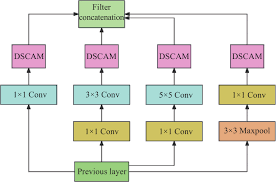
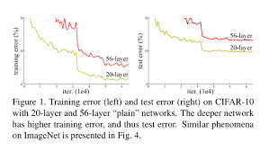
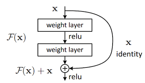
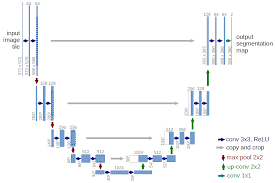


## 前言
如果说卷积神经网络（CNN）在 2012 年因为 AlexNet 而真正走进大众视野，那么 2015 年的 ResNet，就是把"深度学习"这四个字里的"深度"二字真正立住了的那一块基石。在它出现之前，神经网络做到二十几层已经被认为是相当深的结构；在它之后，上百层的网络也能够平稳的训练。而ResNet提出的"残差连接"也从一个具体的工程技巧，逐渐演化为现代深度学习里几乎无处不在的默认配置。从 Transformer 到 Diffusion，从 LLM 到多模态，你都能在结构图里找到它的身影。

这一篇博客我将分三个部分展开叙述：第一部分追溯它的诞生背景，看看当时整个 CV 界的“深度瓶颈”，ResNet 又是用什么方式把这个问题解决的；第二部分用 PyTorch 实现一个最简单的 ResNet，并做一个小消融实验来对“残差连接”这一结构进行验证；第三部分则将会跳出 ResNet 本身，聊聊"残差思想"是怎样突破传统CV、最终成为整个深度学习领域共用的结构语言。

## ResNet 的诞生
### 背景
ResNet 由微软亚洲研究院的 He Kaiming、Zhang Xiangyu、Ren Shaoqing 和 Sun Jian 于 2015 年提出，论文为[《Deep Residual Learning for Image Recognition》](https://arxiv.org/abs/1512.03385)，并最终斩获 CVPR 2016 的最佳论文奖（Best Paper Award）。同年，凭借 ResNet 这一武器，作者团队在 ILSVRC 2015 图像分类、检测、定位以及 COCO 检测、分割五个赛道上全部夺冠，ImageNet 分类 top-5 错误率被压到了 **3.57%**，第一次低于人类水平（约 5.1%）。

要理解 ResNet 解决了什么问题，首先得把镜头拉回 2014 年。彼时 AlexNet（2012，8 层）已经过去近两年，VGG（2014，最深 19 层）证明了"加深网络可以带来精度提升"，GoogLeNet（2014，22 层）则通过 Inception 模块在控制参数量的同时进一步做深。整个社区当时几乎形成了一个共识：**只要能把网络做得更深，精度就还能继续往上升**。     



但很快人们就发现事情没有那么简单。研究者尝试把 VGG 风格的网络从 19 层继续叠到 30 层、50 层时，模型的表现不仅没有变好，反而开始变差，而且变差的不只是测试集上的精度，**连训练集上的 loss 都比浅层网络更高**。这个现象在论文中被称作**退化问题（Degradation Problem）**。  


> Figure 1：56 层网络在 CIFAR-10 上的训练误差和测试误差都高于 20 层网络。

这里存在一个很重要的观点：**退化问题 ≠ 梯度消失/爆炸**。在 ResNet 出现之前，深网络难训练这件事本身大家都知道，但传统理解都归因于梯度消失或梯度爆炸。既然如此，只要用 BatchNorm 把每一层激活值的分布拉回 N(0,1) 附近，让梯度能够稳定回传不就好了吗？事实上 He Kaiming 团队在论文中明确指出，他们的所有实验都使用了 BN，初始化也都用了当时最先进的 He Initialization，**梯度的范数在反向传播过程中是正常的**，并没有出现消失或爆炸。换句话说，深层网络的"退化"，不是因为梯度算不出来，而是因为优化器本身，就无法在如此高维的空间找到空间低谷。现实世界中三维的山峰你能很轻易地分辨它的高峰低谷，但进入到一个数百维甚至千维的空间里，几乎没办法用反向误差传播去找到“最快下滑路径”，而 ResNet 就是要解决这一问题。   

这就是退化问题反直觉的地方。从数学上讲，一个 56 层的网络其表达能力一定 ≥ 20 层的网络，你完全可以让后面那 36 层全部学成恒等映射（identity mapping），这样 56 层的效果至少应该等同于 20 层。但实验证明，让一组卷积层去学习恒等映射，这件事本身就很难。优化器倾向于把每一层都学成"非零"的某种变换，恒等映射对它来说反而是一个非常特殊、不容易稳定到达的点。   

### ResNet 的解法：把"学习目标"换掉
He Kaiming 团队的切入点非常巧妙：既然让网络学习恒等映射这件事很难，那能不能**重新定义网络的学习目标**，让"什么都不做"反而成为最容易达成的状态？   

假设我们希望某几层堆叠的卷积最终学到的映射是 $H(x)$。传统做法是直接让这几层去拟合 $H(x)$。ResNet 的思路是：与其让这堆卷积层直接拟合 $H(x)$，不如让它去拟合一个**残差函数（Residual Function）**：

$$F(x) := H(x) - x$$   

那么原本要学习的 $H(x)$ 就可以重写为：

$$H(x) = F(x) + x$$   

在网络结构上，这一改动只需要从输入直接拉一条**跨层捷径（Shortcut Connection）**到几层卷积的输出，再把两者**逐元素相加**：   


> Figure 2：一个最基本的残差块（Residual Block）。

这个看起来无比简单的改动，却从根本上改变了网络的学习行为：  

- **恒等映射变得更容易学习**：如果当前这一组卷积层"什么都不学"（即 $F(x) \to 0$），整个模块的输出就自动等于输入 $x$。优化器要让一层变成恒等映射，只需要把那几个卷积的权重压向零即可，这件事对优化器来说**远比从头学一个恒等映射容易**。  
- **梯度有了一条"高速公路"**：反向传播时，梯度沿着 shortcut 直接回流到浅层，不需要逐层穿越所有卷积。即便堆叠到 152 层、1000 层，浅层依然能拿到足够强的梯度信号。  
- **学习目标本身更"小"**：相比直接拟合 $H(x)$，残差 $F(x)$ 通常是一个**幅度更小、变化更平缓的函数**——它只需要表达"在 $x$ 的基础上还需要做哪些修正"，而不必从零生成整张特征图。优化器在这种"小目标"上更容易找到下降方向。  

这三点合在一起，就是 ResNet 能够把网络做到 152 层（论文）甚至 1202 层（CIFAR 实验）而依然能稳定收敛的核心原因。

### 论文里那些值得一提的细节
除了残差块这一核心改动，ResNet 的论文中还有几处工程设计，深刻影响了后续几乎所有的深度网络。

**1. Bottleneck 结构**   
当网络深度从 34 层向 50 层以上扩展时，直接堆 3×3 卷积的参数量和 FLOPs 都会爆炸。ResNet 在 ResNet-50/101/152 中改用了 **Bottleneck（瓶颈）** 结构：   

$$1\times1 \text{（降维）} \to 3\times3 \text{（特征提取）} \to 1\times1 \text{（升维）}$$  

通过先用 1×1 卷积把通道数压低（比如从 256 压到 64），在低维空间做完 3×3 卷积之后，再用 1×1 卷积升回原来的通道数，最后与 shortcut 相加。这种设计在大幅减少计算量的同时，保持了模型的表达能力，**直接成为后来 ResNeXt、MobileNet v2、Transformer FFN 等结构的设计模板**。

**2. Shortcut 的两种形式**   
当残差块的输入输出通道数一致、空间分辨率也一致时，shortcut 就是一条纯粹的恒等连接（Identity Shortcut），不带任何参数；而当通道数或分辨率发生变化时（例如经过下采样 stage 的入口），shortcut 上会插入一个 1×1 卷积做维度对齐（Projection Shortcut）。论文的消融实验表明，**Identity Shortcut 在效果上略优于 Projection Shortcut**，且因为没有引入参数，工程实现上也更干净。这条经验在后续几乎所有使用残差的网络中都被沿用。   

**3. 全局平均池化代替全连接**   
ResNet 沿用了 GoogLeNet 的做法，用 **Global Average Pooling（GAP）** 替代了 VGG 末端那个庞大的全连接层。这在显著减少参数量的同时，也让网络对输入分辨率不再敏感——这一点在后来的检测、分割任务中尤其重要。

### 总结
ResNet 真正改变的，并不是"我们能不能把网络做得更深"这件事本身，而是**让"加深"这件事终于成为一个可控的工程操作**。在它之前，加深网络是一场带有赌博性质的实验；在它之后，加深网络变成了一种几乎线性的精度提升手段。   

从更宏观的角度看，ResNet 的价值还远不止 CV 领域。残差连接这一简单优雅的结构，后来在 Transformer 的每一个 Block、Diffusion 模型的 U-Net、几乎所有现代 LLM 的 Residual Stream 中反复出现，已然成为深度学习里事实上的"默认结构"。我们将在后续章节中再回过头来聊它的这条破圈之路。

下一章，我们将不再停留在论文层面，而是用 PyTorch 亲手实现一个最小的 ResNet，并预留几处可消融的位置，把这一章里讲过的"为什么"在代码层面展现并且验证。

## 用 PyTorch 手撕一个最小的 ResNet
讲了这么多原理，最直接的方式还是动手把它写出来跑一遍。这一章我们用 PyTorch 实现一个最小 ResNet，在 CIFAR-10 上做分类，并在关键位置留几个"可拆装"的开关，方便后面做消融。   

请注意，本章的目的不是写一个性能最优的 ResNet，原因很简单，torchvision 里早就有现成的 `resnet18` 可以直接拿来用。本章更重要的目的是把上一章讲过的"残差连接到底起到了什么作用"这件事，从代码层面展现一遍。

### 残差块（BasicBlock）
我们直接从最核心的残差块开始。论文中的 BasicBlock 结构非常简单，两个 3×3 卷积 + BN + ReLU，再加一条 shortcut。   

```python
import torch
import torch.nn as nn
import torch.nn.functional as F

class BasicBlock(nn.Module):
    expansion = 1

    def __init__(self, in_channels, out_channels, stride=1, use_shortcut=True):
        super().__init__()
        self.use_shortcut = use_shortcut

        self.conv1 = nn.Conv2d(in_channels, out_channels, kernel_size=3,
                               stride=stride, padding=1, bias=False)
        self.bn1 = nn.BatchNorm2d(out_channels)
        self.conv2 = nn.Conv2d(out_channels, out_channels, kernel_size=3,
                               stride=1, padding=1, bias=False)
        self.bn2 = nn.BatchNorm2d(out_channels)

        # 当输入输出维度不一致时，shortcut 需要一个 1x1 卷积做对齐（Projection Shortcut）
        # 否则就是一条纯粹的恒等连接（Identity Shortcut）
        if stride != 1 or in_channels != out_channels:
            self.shortcut = nn.Sequential(
                nn.Conv2d(in_channels, out_channels, kernel_size=1,
                          stride=stride, bias=False),
                nn.BatchNorm2d(out_channels)
            )
        else:
            self.shortcut = nn.Identity()

    def forward(self, x):
        # 主路：conv -> bn -> relu -> conv -> bn
        out = self.conv1(x)
        out = self.bn1(out)
        out = F.relu(out)
        out = self.conv2(out)
        out = self.bn2(out)

        # 残差相加（消融时可关闭）
        if self.use_shortcut:
            identity = self.shortcut(x)
            out = out + identity

        # 相加之后再过一次 ReLU
        out = F.relu(out)
        return out
```   

这里有两个细节需要展开说一下。   

第一个是 `use_shortcut` 这个开关，这是故意留出来的消融位——把它设为 `False`，整个块就退化成一个普通的"两层卷积堆叠"，和 VGG 风格的卷积模块几乎没有区别。后面我们会用它来对比 **带 shortcut 和不带 shortcut 在深层网络下的训练表现**。   

第二个是 shortcut 的两种形式。当 `stride=1` 且输入输出通道一致时，shortcut 是 `nn.Identity()`，没有任何参数；当下采样发生时（`stride=2`）或者通道数需要扩张时，才插入一个 1×1 卷积做维度对齐。这一点和上一章里讲到的论文细节完全一致。   

### 组装 ResNet
有了 BasicBlock，组装 ResNet 就是堆叠罢了。我们做一个 CIFAR-10 适配版的 ResNet，结构上和原论文的 CIFAR 实验保持一致：入口是一个 3×3 卷积（不是 ImageNet 版的 7×7），然后是三个 stage，每个 stage 内部由若干个 BasicBlock 串起来，stage 之间通过 stride=2 做下采样。

```python
class ResNet(nn.Module):
    def __init__(self, num_blocks_per_stage, num_classes=10, use_shortcut=True):
        super().__init__()
        self.in_channels = 16
        self.use_shortcut = use_shortcut

        # CIFAR-10 入口：3x3 卷积，不做下采样
        self.conv1 = nn.Conv2d(3, 16, kernel_size=3, stride=1, padding=1, bias=False)
        self.bn1 = nn.BatchNorm2d(16)

        # 三个 stage，通道数依次为 16/32/64，stage 间 stride=2
        self.stage1 = self._make_stage(16, num_blocks_per_stage, stride=1)
        self.stage2 = self._make_stage(32, num_blocks_per_stage, stride=2)
        self.stage3 = self._make_stage(64, num_blocks_per_stage, stride=2)

        self.avgpool = nn.AdaptiveAvgPool2d(1)  # Global Average Pooling
        self.fc = nn.Linear(64, num_classes)

    def _make_stage(self, out_channels, num_blocks, stride):
        strides = [stride] + [1] * (num_blocks - 1)
        layers = []
        for s in strides:
            layers.append(BasicBlock(self.in_channels, out_channels,
                                     stride=s, use_shortcut=self.use_shortcut))
            self.in_channels = out_channels
        return nn.Sequential(*layers)

    def forward(self, x):
        # 入口
        out = self.conv1(x)
        out = self.bn1(out)
        out = F.relu(out)

        # 三个 stage 串行
        out = self.stage1(out)
        out = self.stage2(out)
        out = self.stage3(out)

        # GAP + 分类头
        out = self.avgpool(out)
        out = torch.flatten(out, 1)
        out = self.fc(out)
        return out


def resnet20(use_shortcut=True):
    return ResNet(num_blocks_per_stage=3, use_shortcut=use_shortcut)

def resnet56(use_shortcut=True):
    return ResNet(num_blocks_per_stage=9, use_shortcut=use_shortcut)
```   

这里专门提供了 `resnet20` 和 `resnet56` 两个工厂函数，原因相信你已经猜到了，上一章那张论文 Figure 1 里对比的就是 20 层和 56 层网络，我们待会儿就要把这个对比亲手复现一遍。   

每个 stage 的 BasicBlock 数量由 `num_blocks_per_stage` 控制：3 个 block × 3 个 stage × 每个 block 2 层卷积 + 入口 1 层 + 末尾 fc 1 层 ≈ 20 层；9 个 block 同理算下来就是 56 层。

最后注意到末尾用的是 `AdaptiveAvgPool2d(1)`，即 GAP，把任意空间尺寸的特征图压成一个 1×1 向量，这一点也和上一章讲过的论文细节对应。   

### 训练代码
训练部分用的是 PyTorch 最标准的写法：   

```python
import torch
import torch.optim as optim
from torch.utils.data import DataLoader
from torchvision import datasets, transforms

device = "cuda" if torch.cuda.is_available() else "cpu"

# CIFAR-10 标准数据增强
train_tf = transforms.Compose([
    transforms.RandomCrop(32, padding=4),
    transforms.RandomHorizontalFlip(),
    transforms.ToTensor(),
    transforms.Normalize((0.4914, 0.4822, 0.4465),
                         (0.2470, 0.2435, 0.2616)),
])
test_tf = transforms.Compose([
    transforms.ToTensor(),
    transforms.Normalize((0.4914, 0.4822, 0.4465),
                         (0.2470, 0.2435, 0.2616)),
])

train_set = datasets.CIFAR10(root="./data", train=True, download=True, transform=train_tf)
test_set = datasets.CIFAR10(root="./data", train=False, download=True, transform=test_tf)

train_loader = DataLoader(train_set, batch_size=128, shuffle=True, num_workers=2)
test_loader = DataLoader(test_set, batch_size=256, shuffle=False, num_workers=2)


def train_one(model, epochs=50, lr=0.1):
    model = model.to(device)
    criterion = nn.CrossEntropyLoss()
    optimizer = optim.SGD(model.parameters(), lr=lr, momentum=0.9, weight_decay=5e-4)
    scheduler = optim.lr_scheduler.CosineAnnealingLR(optimizer, T_max=epochs)

    for epoch in range(epochs):
        model.train()
        train_loss, train_correct, train_total = 0.0, 0, 0
        for x, y in train_loader:
            x, y = x.to(device), y.to(device)
            optimizer.zero_grad()
            out = model(x)
            loss = criterion(out, y)
            loss.backward()
            optimizer.step()

            train_loss += loss.item() * x.size(0)
            train_correct += (out.argmax(1) == y).sum().item()
            train_total += x.size(0)
        scheduler.step()

        # 测试集评估
        model.eval()
        test_correct, test_total = 0, 0
        with torch.no_grad():
            for x, y in test_loader:
                x, y = x.to(device), y.to(device)
                out = model(x)
                test_correct += (out.argmax(1) == y).sum().item()
                test_total += x.size(0)

        print(f"[Epoch {epoch+1:3d}] "
              f"train_loss={train_loss/train_total:.4f}  "
              f"train_acc={train_correct/train_total:.4f}  "
              f"test_acc={test_correct/test_total:.4f}")
```   

这里有意识地把训练 loss 也打印出来，不只是 test acc。因为这里可以展现退化问题最经典的现象：去掉 shortcut 的深层网络，连训练 loss 都降不下去。如果只看 test acc，你会以为是过拟合或者别的什么问题；只有同时看着 train loss 一起，才能确认这不是过拟合，是优化器降不下去了。

### 留给读者的几个消融实验
铺垫到这里，下面给出三组消融实验。希望有心的读者能自己做一次实验，再回到上一章的"为什么"对照阅读。

**消融 1：shortcut 的作用（核心）**   
这是最能直接验证残差思想的实验。同时训练以下四个模型，对比它们的 train loss 曲线和 test acc：

```python
m1 = resnet20(use_shortcut=True)    # 20 层 + shortcut
m2 = resnet20(use_shortcut=False)   # 20 层 - shortcut
m3 = resnet56(use_shortcut=True)    # 56 层 + shortcut
m4 = resnet56(use_shortcut=False)   # 56 层 - shortcut

for m in [m1, m2, m3, m4]:
    train_one(m, epochs=50)
```

预期能观察到的现象有两个层次：
- **浅层（20 层）**：有无 shortcut 差距不大，因为 20 层本身还没进入"退化"的高发区。
- **深层（56 层）**：有 shortcut 的训练正常收敛；去掉 shortcut 的不仅 test acc 更差，**连 train loss 都比 20 层版本更高**。这一现象如果你能亲眼看到，那就是你独立复现了论文 Figure 1 中那张著名的退化曲线。

**消融 2：进一步把网络加深**   
有了 `num_blocks_per_stage` 这个旋钮，你可以非常方便地把网络做得更深，比如 `num_blocks_per_stage=18`（约等于 110 层）：

```python
m_deep_with    = ResNet(num_blocks_per_stage=18, use_shortcut=True)
m_deep_without = ResNet(num_blocks_per_stage=18, use_shortcut=False)
```

注意训练去掉 shortcut 的 110 层网络时，你大概率会观察到 loss 直接卡死、几乎不下降的现象。这正是上一章中提到的"优化器在高维空间里找不到下降方向"的真实表现。   

**消融 3：BN 是不是就能解决问题？**   
这一组用来回应上一章里那段强调过的观点：**退化问题 ≠ 梯度消失**，BN 解决不了它。你可以在 `BasicBlock` 里把 BN 全部去掉（或者干脆替换成 `nn.Identity()`），再分别训练有 shortcut 和无 shortcut 的版本：

```python
# 改造 BasicBlock：把 self.bn1 / self.bn2 换成 nn.Identity()
# （改造代码留给读者自己完成）
```

如果 BN 真的就能"治好"深层网络，那么无 shortcut + 有 BN 应该和带 shortcut 的版本差距不大。但实际跑下来你会发现，就算由BN层的存在，没有 shortcut 的深层网络该训不动还是训不动。这就是 He Kaiming 在论文中强调的那一点：残差连接解决的，是优化层面的根本问题，BN 只能让数值稳定，无法替代它。

### 小结
这一节我们用代码复现了 ResNet 原论文中做的一部分实验，能够让你更加直观的感受到“残差连接”这一结构在深度学习领域的开创性。

下一章我们会再次跳出 ResNet 本身，去探索一个更抽象的话题：残差这种结构，如何从一个简单 CNN 结构走向如今动辄几百B的大语言模型。


## 残差思想的外溢
前面两章里，"残差连接"一直都待在 CV 这个圈子里。但你有没有想过，今天那些动辄几十上百层的大模型，深度早就远远超过了当年的 ResNet，它们靠的是什么？答案其实不意外，正是同一条 shortcut。   

2017 年 Transformer 横空出世，把深度学习带进了一个全新的阶段。而在它的每一个 Encoder、Decoder Block 里面，残差连接依然存在，并发挥着至关重要的作用。

### CV 领域内的延续：U-Net 与各种"skip"
残差思想最早溢出的地方，其实就在 ResNet 隔壁的 CV 子领域，分割。   

2015 年同年发布的 [U-Net](https://arxiv.org/abs/1505.04597) 是医学图像分割里几乎人手一份的网络。它的结构很直观，一条编码器把分辨率从高到低逐步下采样，再一条解码器把分辨率从低到高逐步上采样。U-Net 真正出名的地方，是它在编码器和解码器对应层级之间拉的那一组 skip connection，浅层的高分辨率特征图被直接 concat 到深层上采样后的特征图上。   



这里的 skip 和 ResNet 的 shortcut 形式上不太一样，ResNet 用 add，U-Net 用 concat，但要解决的问题是同一个：让浅层的精细信息有一条"不被下采样吃掉"的通路，直接抵达深层的预测头。后来的 FPN、PANet、HRNet 这些多尺度结构，做的也是同一件事，给信息流多开几条绕过主路的通道。   

整个 CV 界在 2015 年之后基本默认了一件事：只要网络要堆得深，就得给信息流一条 shortcut，不管它叫 residual、skip、还是 lateral。

### 进入 Transformer：每一个 Block 都是一个残差块
让残差连接真正"破圈"的，是 2017 年那篇 [《Attention Is All You Need》](https://arxiv.org/abs/1706.03762)。  

如果你把 Transformer 的 Encoder Block 拆开看，每一层其实就是两个残差块串起来：

$$x' = \text{LayerNorm}(x + \text{Attention}(x))$$   
$$x'' = \text{LayerNorm}(x' + \text{FFN}(x'))$$   

注意力子层和 FFN 子层外面，各自都套了一层 $x + \text{Sublayer}(x)$ 的结构，也就是我们前面说过的残差公式。 

为什么 Transformer 也需要残差？答案和 ResNet 当年的回答几乎是同一句话：没有残差，深层 Transformer 训不起来。早期的 Transformer 也就 6 层 Encoder + 6 层 Decoder，但后来要堆到 24 层、48 层、96 层甚至更深，没有残差连接，梯度回不到浅层。GPT 系列从 12 层一路堆到 96 层、BERT-Large 的 24 层、再到现在动辄上百层的 LLM Decoder，每一层里都老老实实保留着 He Kaiming 当年那条 shortcut。

后来的 Pre-LN 和 Post-LN 之争（讨论的是 LayerNorm 应该放在残差里面还是外面），讨论的也是"残差连接在 Transformer 里怎么用最稳定"这件事。没有任何一个版本敢去掉残差本身。

### 在 LLM 里被命名：Residual Stream
到了大语言模型这一阶段，残差连接甚至有了一个专门的名字：Residual Stream（残差流）。  

这个概念由 [Anthropic 的可解释性研究](https://transformer-circuits.pub/2021/framework/index.html)正式提出。在他们的视角里，一个 Transformer LLM 在做的事情，不是"每一层逐步变换输入"，而是"每一层都在往同一条贯穿全网的残差流上读写信息"。  

具体来说，每个 token 在网络里都有一条贯穿所有层的"信息总线"，这就是 residual stream。每一层的 Attention 和 FFN 都从这条流上读取信息（通过它们的输入投影），处理之后再把结果加回到这条流上（通过残差相加）。从入口的 embedding 一路到末端的 unembedding 头，residual stream 始终是同一个高维向量，内容会随着层数推进被一层层修订，但它的"身份"不曾中断。   

我个人觉得这个视角挺有意思的：残差连接到这里已经不再只是"为了防止训练垮掉的补救措施"，它本身就是 LLM 的核心计算范式。LLM 的每一层做的事情，差不多就是一次对 residual stream 的"局部读—加工—写回"。  

回头看 ResNet 当年提出的 $H(x) = F(x) + x$，这里的 $x$ 此时已经不只是某一组卷积的输入，而是从模型入口一路流到模型出口的那条主线。

### Diffusion 里也是同一个故事
顺带一提，现在火热的 Diffusion 模型也没逃过残差的影响。Stable Diffusion 这类模型的核心去噪网络就是一个 U-Net，而这个 U-Net 内部的每一个 block 都是带残差的卷积块（很多实现直接复用了 ResNet 风格的 BasicBlock）；外面再套上 U-Net 自己的 skip connection。一个 Diffusion U-Net 里，残差连接其实出现了两层：宏观上的 skip，微观上的 residual block。  

文本到图像、视频生成、3D 生成这些今天看起来很前沿的方向，骨子里跑的还是当年 ResNet 那一套结构语言。/

### 一点点总结
回过头看，残差连接能成为现在的"默认结构"，我个人觉得有几个原因：  

1. 它在优化层面的好处是普适的。不管 CNN 还是 Transformer，只要网络要堆得深，"让恒等映射变成默认行为、让梯度有条高速通路"这件事就有价值，和数据模态、和具体子任务关系都不大。  
2. 它对架构本身几乎没有强假设。残差只要求"输入和输出能加起来"，不在意你中间做的是卷积、是注意力还是别的什么，所以它能塞进几乎任何模块。  
3. 它在工程上几乎是零成本。一条 shortcut，多一次 add 操作而已，但换来的稳定性和可训练性的提升远远超过这点开销。   

从 2015 年的 ResNet 出发，残差连接走过了 CV、NLP、Diffusion、LLM 这一路，被反复使用、被重新命名（skip、residual stream），被各种结构装进自己的设计里。每次有新架构出来，不管是 Vision Transformer、Swin、ConvNeXt、Mamba、还是各种新的 LLM，你只要去看它的结构图，几乎都能在某一层、某一段找到那条熟悉的"绕过主路的箭头"。  

这大概也是 He Kaiming 当年那篇论文影响最远的地方：它不只解决了"网络做不深"这个具体问题，还给整个深度学习社区贡献了一种思考网络结构的方式，任何复杂的变换，都可以被拆解成"一条主路 + 一条捷径"。这件事十年后回头看，确实变成了几乎所有现代深度模型默认遵循的设计原则。

## 写在最后
这篇博客从 2015 年 He Kaiming 那篇 CVPR 最佳论文写起，先聊了 ResNet 当年是为了解决什么问题，又用 PyTorch 把核心结构和最小可跑的网络敲了一遍，还留了几组简单的消融实验；最后一章再把视角拉远，看着残差连接如何走出 CV，进入 Transformer、Diffusion、LLM，成为今天几乎人手一份的默认配置。   

下次你再在某张模型结构图里看到那条熟悉的"高速通路"，希望已经不再陌生。那一条小小的 shortcut，撑起了现在我们能用到的几乎所有强推理、强特征提取能力的模型。ResNet 留给后人的，远不止一个 backbone，而是一种被时间反复验证过的**思考**方式。   

