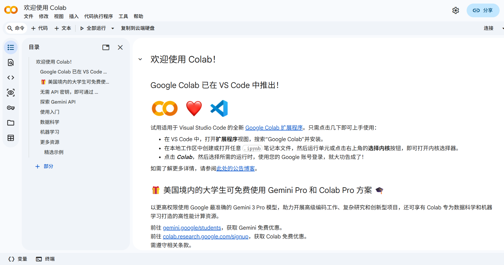
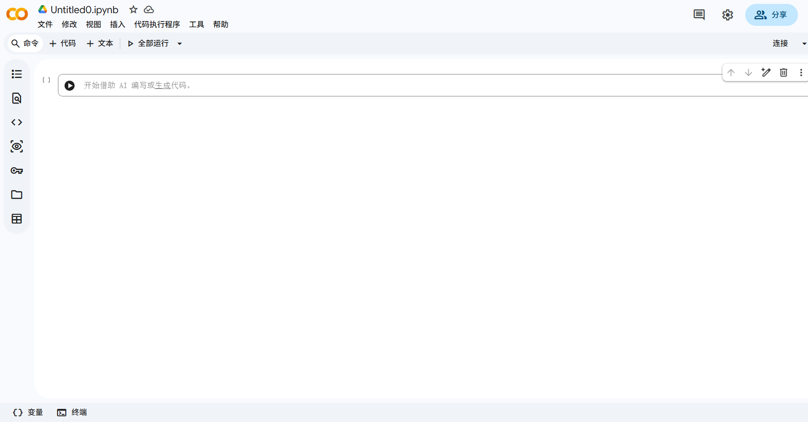
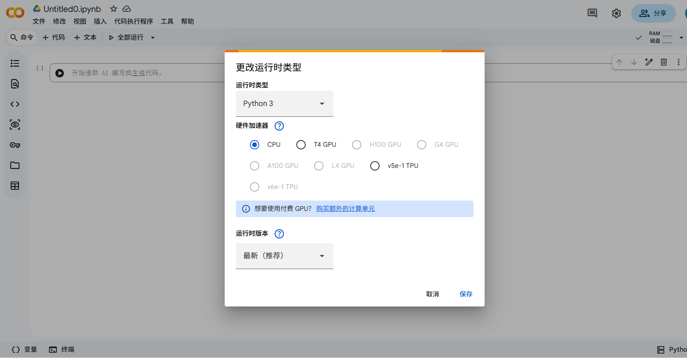
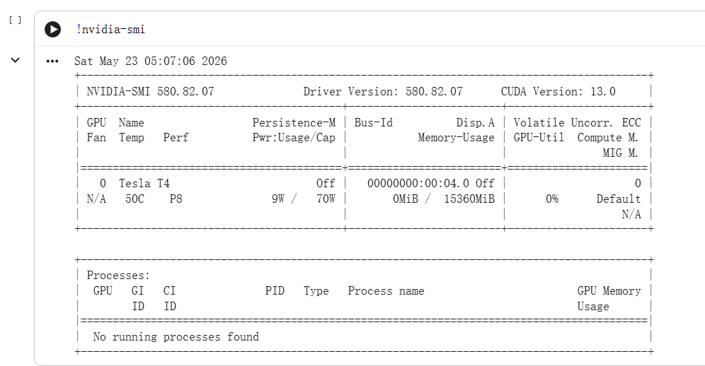
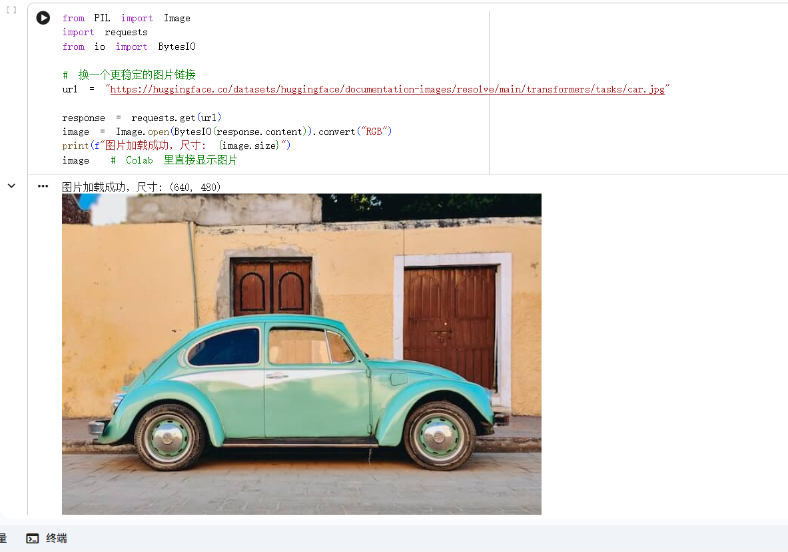



## 前言  
本文旨在让即便没有基础的读者再阅读后，也能快速的使用 Google Colab 计算平台，使用国内 Qwen 视觉-语言大模型进行小规模的 LoRA 微调，本文将给出完整的代码和使用示例。   

首先让我们来了解一下完成模型微调所需要的基础知识。  

## Google Colab 是什么？   
Google Colab 是由谷歌推出的在线计算平台，Colab 是 calculate lab 的简称，他提供了免费的 GPU 算力(Tesla T4)供用户使用，虽然平台也有A100、H100这样的高端显卡，但那都是需要付费或进行美国大学生学生认证后才能使用。本教程还是使用免费的 GPU 和内存环境进行示范，如果各位读者有需求可以按照自己的需求订阅Google Colab的会员。   

在浏览器搜索Google Colab 并用自己的谷歌账号登录就会进入如下的界面：   

  

这里界面左侧有一个目录，里面包含了一些基础入门的知识，强烈建议在正式使用前先完整阅读。包括如何使用，以及Google Colab能完成哪些事，在后面进行示例讲解的时候心里有数。   

这时我们可以创建一个新的工作空间：在左上角的“文件”处，选择“在云端硬盘中新建笔记本”，就会自动跳转到如下图所示的工作空间了。因为刚开始创建时，工作空间的名字还是默认状态，建议各位读者先对空间名字进行自定义修改，防止下次使用时找不到原工作空间。   

   

到这一步，Google Colab的基础准备就已经完成了，下一步就是进行GPU的连接：   
注意工作空间右上角“连接”选项，点击后需要耐心等待一会，系统会为你分配运行时和基础环境。当显示已连接，且旁边出现了“RAM”，“磁盘”的占用条说明工作空间已经完成初始化。这时我们要去链接Google Colab分配的GPU。   

点击右上角的“下三角形🔻”，选择“更改运行时类型”，就会看到下面的界面。   

     

注意这里，只需要修改“硬件加速器”下的选项，把“CPU”改成“T4 GPU”即可保存。    
等待系统再次为你分配运行时，当右下角出现 “T4(Python3)”字样时，GPU设置就成功啦。    

## 什么是LoRA？   
这是只要接触过大模型微调就一定绕不开的问题。LoRA，全称 Low-Rank Adaptation，由微软在 2021 年提出，已经成为今天大模型微调事实上的标准做法。   

**为什么需要 LoRA？**   

我们先想一下传统的"全参数微调"是怎么做的。假设我们手上有一个 Qwen-VL 7B 模型，想让它在某个特定任务上表现更好，最直接的做法就是把所有 70 亿参数都拿出来，用新数据继续训练。听上去很合理，但问题在于：   

- **显存爆炸**：训练时不仅要保存参数本身，还要保存梯度、优化器状态(Adam 需要保存一阶和二阶动量)。一个 7B 的模型在 FP16 下大概要 14GB 显存放参数，加上梯度和优化器状态，没有 80GB 的 A100 根本跑不起来。   
- **存储灾难**：每微调一个任务就要存一份完整的 7B 权重，10 个任务就是 140GB。如果你想给不同客户提供定制化服务，硬盘很快就被吃光。   
- **过拟合风险**：下游任务的数据集往往只有几百到几千条，让 70 亿参数全部参与训练，模型很容易"记住"训练样本，丢掉预训练时学到的通用能力。   

那有没有一种办法，既能让模型适配下游任务，又不用动那么多参数呢？这就是 LoRA 想要解决的问题。   

**LoRA 的核心思想**   

LoRA 的洞察来自一个非常重要的假设——**大模型在适配下游任务时，参数的变化量 $\Delta W$ 是低秩的**。   

什么意思呢？我们把微调过程写成数学形式。原始权重是 $W_0 \in \mathbb{R}^{d \times k}$，微调后变成 $W_0 + \Delta W$。传统全参微调中，$\Delta W$ 是一个完整的 $d \times k$ 矩阵，参数量和 $W_0$ 一样多。LoRA 假设 $\Delta W$ 其实没有那么"复杂"，它可以用两个小矩阵相乘来近似：   

$$\Delta W = BA, \quad B \in \mathbb{R}^{d \times r}, \quad A \in \mathbb{R}^{r \times k}$$   

其中 $r$ 是远小于 $d$ 和 $k$ 的"秩"(rank)，比如 $d=k=4096$，而 $r$ 可能只取 8 或 16。   

这样一来，原本 $d \times k = 16{,}777{,}216$ 个参数的 $\Delta W$，被压缩成了 $(d + k) \times r = 65{,}536$ 个参数，整整缩小了 256 倍。我们冻结原始的 $W_0$，只训练 $A$ 和 $B$ 这两个小矩阵，前向传播就变成了：   

$$h = W_0 x + \Delta W x = W_0 x + B A x$$   

```
       ┌───────────┐
   x → │    W_0    │ → 冻结，不参与梯度更新
       └───────────┘
              │
              ↓
       ┌──────┐   ┌──────┐
   x → │  A   │ → │  B   │ → α/r 缩放后加到原输出上
       └──────┘   └──────┘
       训练       训练
```   

初始化的时候有个小细节：$A$ 用高斯分布随机初始化，$B$ 初始化为零矩阵。这样训练刚开始时 $BA = 0$，模型行为和原始模型完全一致，避免一上来就把预训练知识破坏掉。   

**几个关键超参数**   

实际使用 LoRA 的时候，我们需要关心几个参数：   

| 参数 | 含义 | 经验值 |
| :--- | :--- | :--- |
| `r` (rank) | 低秩矩阵的秩，决定容量和参数量 | 4、8、16、32 |
| `alpha` | 缩放系数，最终结果会乘以 $\alpha/r$ | 一般取 $r$ 的 1～2 倍 |
| `target_modules` | 在哪些线性层上插入 LoRA | `q_proj, v_proj` 是最常见的组合 |
| `dropout` | LoRA 路径上的 dropout 比例 | 0.05～0.1 |   

`r` 越大，LoRA 的表达能力越强，但参数量也越多，越容易过拟合。对于视觉-语言模型这种已经过充分预训练的大模型，`r=8` 或 `r=16` 在大多数任务上已经够用。   

`alpha` 是一个常常被忽略但很关键的参数。LoRA 论文里给出的实际计算是 $\Delta W = (\alpha / r) \cdot BA$，引入它的目的是让我们调整 `r` 的时候不用重新调整学习率。简单来说：固定 `alpha`，改变 `r` 时，模型的"等效学习率"基本不变。   

`target_modules` 决定了我们要让哪些权重"可训练"。Transformer 的每一层 Attention 都有 $W_q, W_k, W_v, W_o$ 四个投影矩阵，FFN 还有两个。原论文实验发现，只在 $W_q$ 和 $W_v$ 上加 LoRA 效果就已经很好；如果想榨干一点性能，可以把所有线性层都加上，代价是参数量翻几倍。   

**为什么 LoRA 有效？**   

回到那个核心假设——$\Delta W$ 真的是低秩的吗？   

LoRA 论文做了一组实验：他们把全参微调得到的 $\Delta W$ 拿过来做 SVD 分解，发现绝大部分能量都集中在前几个奇异值上，剩下的奇异值几乎为零。换句话说，**模型在适配下游任务时，本质上只是在一个非常低维的子空间里"挪动"参数**，剩下的高维方向上几乎没什么变化。   

这背后其实是一个更深的现象：大型预训练模型的"内在维度"(intrinsic dimension)远小于其名义参数量。这个观察在 BERT、GPT、LLaMA 上都被反复验证过，是 LoRA 能成立的根本原因。   

**LoRA 与全参微调的对比**   

| 维度 | 全参微调 | LoRA |
| :--- | :--- | :--- |
| 显存占用 | 高，需要为所有参数保存梯度和优化器状态 | 低，只为 $A, B$ 保存 |
| 训练参数量 | 100% | 通常 0.1% ～ 1% |
| 存储开销 | 每个任务一份完整模型 | 每个任务只存几 MB 的 LoRA 权重 |
| 训练速度 | 慢 | 快 |
| 下游性能 | 上限略高 | 在大多数任务上能达到 95% 以上 |
| 多任务切换 | 需要加载完整模型 | 切换 LoRA 权重即可 |   

对于个人开发者和小团队来说，LoRA 几乎是唯一能在消费级 GPU 上微调大模型的可行路径。这也是本教程选择 LoRA 的原因——一张免费的 T4 显卡，16GB 显存，正好够跑一次 Qwen-VL 的 LoRA 微调。   

**推理时怎么用？**   

LoRA 训练好之后，推理时有两种用法：   

- **合并(merge)**：把 $BA$ 直接加回 $W_0$，得到一份新的权重 $W' = W_0 + (\alpha/r) BA$。这样推理时和原始模型完全一样，没有任何额外开销，但失去了"热插拔"的灵活性。   
- **不合并**：保留 $W_0$ 和 LoRA 权重分开存储，前向时同时跑两条路径。代价是每层多一次小矩阵乘法，但好处是可以在同一个基础模型上加载多份 LoRA 权重，按需切换。   

如果是部署到生产环境、且任务固定，建议直接 merge；如果是多任务、多用户场景，保留分离形式会更灵活。HuggingFace 的 `peft` 库对这两种用法都有现成的接口，我们后面会看到具体怎么调用。   

## 正式进入Google Colab进行微调   

理论铺垫够了，下面我们就一格一格地把整个微调流程跑通。Colab 的工作方式是按"单元格(cell)"组织代码的，每个单元格可以独立运行，运行结果会直接显示在格子下面。建议各位读者跟着把每一格代码新建一个 cell 复制进去，边跑边看输出。   

**第一步：确认 GPU 已连接**   

打开新建的笔记本后，第一件事永远是看看 GPU 到底分到了没有。新建一个 cell，输入：   

```python
!nvidia-smi
```   



`!` 是 Colab 的语法糖，表示这一行是 shell 命令而不是 Python 代码。运行后会输出一张 GPU 信息表，关键看两件事：显卡型号是不是 `Tesla T4`，显存是不是 `15360MiB`(约 15GB)。如果输出报错说找不到 nvidia-smi，那说明运行时还没切到 GPU，回到上面"更改运行时类型"那一步重做一次。   

紧接着再跑一段 Python 代码，从 PyTorch 的角度二次确认：   

```python
import torch
print(torch.cuda.is_available())
print(torch.cuda.get_device_name(0))
print(f"显存: {torch.cuda.get_device_properties(0).total_memory / 1024**3:.1f} GB")
```   

输出：   

```
True
Tesla T4
显存: 14.6 GB
```   

`True` + `Tesla T4` 就说明 PyTorch 已经能正常调用 GPU 了。注意这里显存显示 14.6GB 而不是 15GB，是因为有一小部分被显卡驱动和系统保留了，正常现象。   

**第二步：安装依赖并加载 Qwen2-VL-2B 模型**   

Colab 自带的环境里 `transformers` 版本可能偏老，VLM 相关的几个库也不齐，先统一装一遍：   

```python
!pip install transformers peft datasets accelerate bitsandbytes qwen-vl-utils -q
```   

`-q` 是 quiet 模式，输出会少很多。这里有个**坑要提醒一下**：装完 `bitsandbytes` 之后，Colab 有时候需要重启运行时(顶部菜单 "代码执行程序 → 重新启动会话")才能让新版本生效，否则下一格加载 4bit 量化模型时会报 `ImportError: Using bitsandbytes 4-bit quantization requires bitsandbytes`。如果遇到了，重启完从这一格之后接着跑即可。   

然后正式加载模型：   

```python
from transformers import Qwen2VLForConditionalGeneration, AutoProcessor, BitsAndBytesConfig
import torch

bnb_config = BitsAndBytesConfig(
    load_in_4bit=True,
    bnb_4bit_compute_dtype=torch.float16
)

model = Qwen2VLForConditionalGeneration.from_pretrained(
    "Qwen/Qwen2-VL-2B-Instruct",
    quantization_config=bnb_config,
    device_map="auto"
)
processor = AutoProcessor.from_pretrained("Qwen/Qwen2-VL-2B-Instruct")
print("模型加载成功")
```   

这里有两个细节值得展开：   

- `BitsAndBytesConfig(load_in_4bit=True)` 是关键，它会把原本 FP16 的权重压成 4bit 存储。Qwen2-VL-2B 的全精度大小约 4.5GB，量化后只需要 1.5GB 左右，T4 的 15GB 显存就绰绰有余了。`bnb_4bit_compute_dtype=torch.float16` 表示存储是 4bit 但计算时再升回 FP16，精度损失会小很多。   
- `device_map="auto"` 让 `transformers` 自动把模型分片放到可用设备上，对单卡 T4 而言就是全部塞进 GPU。   

第一次运行时会从 HuggingFace 下载约 4GB 的权重文件，T4 上一般要等 1-2 分钟。看到 `模型加载成功` 就算过关。   

**第三步：先做一次推理，验证模型能用**   

微调之前先确认模型本身没问题，免得后面训练出问题时分不清是数据问题还是模型问题。   

```python
from PIL import Image
import requests

url = "https://huggingface.co/datasets/huggingface/documentation-images/resolve/main/transformers/tasks/car.jpg"
image = Image.open(requests.get(url, stream=True).raw).convert("RGB")

messages = [
    {
        "role": "user",
        "content": [
            {"type": "image", "image": image},
            {"type": "text", "text": "这张图片里有什么？"}
        ]
    }
]

text = processor.apply_chat_template(
    messages, tokenize=False, add_generation_prompt=True
)
inputs = processor(
    text=[text],
    images=[image],
    return_tensors="pt"
).to("cuda")

with torch.no_grad():
    output = model.generate(**inputs, max_new_tokens=100)

response = processor.decode(output[0], skip_special_tokens=True)
print(response)
```   

这里的 `messages` 结构是 Qwen 系列的标准对话格式：一条用户消息里可以同时塞图片和文字。`apply_chat_template` 会按 Qwen 的训练模板把它拼成一段带特殊 token 的字符串，`processor` 再把图片和文字一起编码成模型能吃的张量。   

输出：   

```
这张图片里有一辆绿色的复古汽车停在人行道上，背景是一堵黄色的墙和一扇棕色的门。
```   



模型把图片内容描述得相当准确，说明推理链路是通的。   

**第四步：准备图文训练数据**   

VLM 的训练数据本质上是"图片 + 问题 + 答案"三元组。为了把流程跑通，我们先手工构造几条围绕同一张图片的问答：   

```python
import requests
from io import BytesIO
from PIL import Image

def load_image_from_url(url):
    response = requests.get(url)
    return Image.open(BytesIO(response.content)).convert("RGB")

raw_data = [
    {
        "image_url": "https://huggingface.co/datasets/huggingface/documentation-images/resolve/main/transformers/tasks/car.jpg",
        "question": "图片中的车是什么颜色？",
        "answer": "图片中的车是复古绿色的。"
    },
    {
        "image_url": "https://huggingface.co/datasets/huggingface/documentation-images/resolve/main/transformers/tasks/car.jpg",
        "question": "这辆车停在什么地方？",
        "answer": "这辆车停在路边的停车位上。"
    },
    {
        "image_url": "https://huggingface.co/datasets/huggingface/documentation-images/resolve/main/transformers/tasks/car.jpg",
        "question": "图片中除了车还有什么？",
        "answer": "图片中除了车还有道路和建筑物背景。"
    },
]

print("加载训练图片...")
train_data = []
for item in raw_data:
    image = load_image_from_url(item["image_url"])
    train_data.append({
        "image": image,
        "question": item["question"],
        "answer": item["answer"]
    })
    print(f"加载完成: {item['question']}")

print(f"\n共 {len(train_data)} 条训练数据")
```   

这里只用了三条数据，纯粹是为了演示完整链路。**真实项目里至少要几百到几千条**，而且每条最好对应不同的图片。注意第二条数据的"答案"其实和第三步推理时模型自己给的描述(人行道)不一致——这是故意为之，后面我们要看看 LoRA 能不能成功把模型的认知转到我们想要的答案上来。   

**第五步：配置 LoRA**   

终于到了 LoRA 登场的环节。前面理论部分提到的几个超参数，在这里全都要落到具体配置上：   

```python
from peft import LoraConfig, get_peft_model, prepare_model_for_kbit_training

model = prepare_model_for_kbit_training(model)

lora_config = LoraConfig(
    r=8,
    lora_alpha=16,
    target_modules=["q_proj", "v_proj", "k_proj", "o_proj"],
    lora_dropout=0.05,
    bias="none",
    task_type="CAUSAL_LM"
)

model = get_peft_model(model, lora_config)
model.print_trainable_parameters()
```   

`prepare_model_for_kbit_training` 是一个必要的预处理步骤：对 4bit 量化的模型来说，它会把所有非 LoRA 层冻结、把 LayerNorm 转成 FP32、再开启 gradient checkpointing 节省显存。少了这一步训练会有几率崩溃。   

`LoraConfig` 里的几个参数就是前面理论章节讲过的那些：`r=8` 是低秩矩阵的秩，`lora_alpha=16` 即 $\alpha/r = 2$ 的缩放系数，`target_modules` 这次比常见的 `q_proj + v_proj` 多带上了 `k_proj` 和 `o_proj`，是为了让 LoRA 在注意力层有更充分的表达能力——多花的参数量也很有限。`task_type="CAUSAL_LM"` 告诉 PEFT 我们是做"自回归生成"任务。   

输出：   

```
trainable params: 2,179,072 || all params: 2,211,164,672 || trainable%: 0.0985
```   

22 亿参数里，**只有 218 万参数(约 0.1%)会参与训练**，这就是 LoRA 的威力。   

**第六步：自定义数据整理器**   

VLM 的数据处理比纯文本麻烦不少，因为除了 `input_ids`，还得带上图片张量 `pixel_values` 和 Qwen2-VL 特有的 `image_grid_thw`(图片在时间-高-宽三个维度上的网格划分)。我们用 `torch.utils.data.Dataset` 包一层：   

```python
from torch.utils.data import Dataset
from qwen_vl_utils import process_vision_info

class VLMDataset(Dataset):
    def __init__(self, data, processor):
        self.data = data
        self.processor = processor

    def __len__(self):
        return len(self.data)

    def __getitem__(self, idx):
        item = self.data[idx]

        messages = [
            {
                "role": "user",
                "content": [
                    {"type": "image", "image": item["image"]},
                    {"type": "text", "text": item["question"]}
                ]
            },
            {
                "role": "assistant",
                "content": [
                    {"type": "text", "text": item["answer"]}
                ]
            }
        ]

        text = self.processor.apply_chat_template(
            messages, tokenize=False, add_generation_prompt=False
        )
        image_inputs, video_inputs = process_vision_info(messages)

        inputs = self.processor(
            text=[text],
            images=image_inputs,
            videos=video_inputs,
            return_tensors="pt",
            padding="max_length",
            max_length=512,
            truncation=True
        )

        result = {
            "input_ids": inputs["input_ids"].squeeze(0),
            "attention_mask": inputs["attention_mask"].squeeze(0),
            "labels": inputs["input_ids"].squeeze(0).clone()
        }

        if "pixel_values" in inputs:
            result["pixel_values"] = inputs["pixel_values"]
        if "image_grid_thw" in inputs:
            result["image_grid_thw"] = inputs["image_grid_thw"]

        return result

dataset = VLMDataset(train_data, processor)

sample = dataset[0]
print("数据字段：", sample.keys())
```   

注意三个点：   

- 和推理时不同，这里 `apply_chat_template` 的 `add_generation_prompt=False`，因为训练时 assistant 的回答**已经在 messages 里了**，不需要再加生成提示符。   
- `labels = input_ids.clone()`：这是因果语言模型的标准做法，让模型学着预测下一个 token。严格来讲我们只应该对 assistant 部分的 token 计算 loss，但 PEFT + HF Trainer 这套组合在简单场景下用全 token loss 也能学起来。   
- `process_vision_info` 是 `qwen_vl_utils` 提供的工具函数，会从 messages 里把图片字段抽出来，转成 `processor` 能吃的格式，同时生成 `image_grid_thw`。自己手搓很容易出错，直接用现成的就好。   

**第七步：开始训练**   

这一步把 `TrainingArguments`、`Trainer`、`collate_fn` 凑齐就能跑了：   

```python
from transformers import TrainingArguments, Trainer

training_args = TrainingArguments(
    output_dir="./qwen_vl_lora_ckpt",
    num_train_epochs=3,
    per_device_train_batch_size=1,
    gradient_accumulation_steps=4,
    learning_rate=1e-4,
    logging_steps=1,
    save_strategy="no",
    fp16=True,
    remove_unused_columns=False,
    report_to="none",
)

def collate_fn(batch):
    input_ids = torch.stack([item["input_ids"] for item in batch])
    attention_mask = torch.stack([item["attention_mask"] for item in batch])
    labels = torch.stack([item["labels"] for item in batch])

    result = {
        "input_ids": input_ids,
        "attention_mask": attention_mask,
        "labels": labels,
    }

    if "pixel_values" in batch[0]:
        result["pixel_values"] = torch.cat(
            [item["pixel_values"] for item in batch], dim=0
        )
    if "image_grid_thw" in batch[0]:
        result["image_grid_thw"] = torch.cat(
            [item["image_grid_thw"] for item in batch], dim=0
        )
    return result

trainer = Trainer(
    model=model,
    args=training_args,
    train_dataset=dataset,
    data_collator=collate_fn,
)

print("开始训练...")
trainer.train()
print("训练完成！")
```   

`TrainingArguments` 里有一个**必须强调的参数**：`remove_unused_columns=False`。HF Trainer 默认会把它不认识的字段从 batch 里删掉，对 VLM 来说 `pixel_values` 和 `image_grid_thw` 都会被误删，训练时就会报"模型收不到图片"的错。这是 VLM 微调踩得最多的一个坑，**如果忘了关这个开关，整套流程都会失败**。   

其余几个超参数的选择逻辑：   

- `per_device_train_batch_size=1`，因为 T4 显存有限，batch 大于 1 容易 OOM。   
- `gradient_accumulation_steps=4`，等价于每 4 个 step 才更新一次参数，相当于把 batch size 放大到 4，让梯度更平稳。   
- `learning_rate=1e-4`，LoRA 比全参微调能承受更大的学习率，1e-4 是常用经验值。   
- `fp16=True`，混合精度训练，进一步节省显存和加速。   

跑起来之后会看到 loss 从 3 点几一路下降，3 个 epoch 后基本能降到 1 以下。整个训练在 T4 上大概 1-2 分钟，非常快。   

**第八步：测试微调效果**   

训练完了得验证一下到底有没有"学进去"。我们专门拿第四步里那个"答案不一致"的问题来问：   

```python
model.eval()

test_image = load_image_from_url(
    "https://huggingface.co/datasets/huggingface/documentation-images/resolve/main/transformers/tasks/car.jpg"
)

messages = [
    {
        "role": "user",
        "content": [
            {"type": "image", "image": test_image},
            {"type": "text", "text": "这辆车停在什么地方？"}
        ]
    }
]

text = processor.apply_chat_template(
    messages, tokenize=False, add_generation_prompt=True
)
inputs = processor(
    text=[text],
    images=[test_image],
    return_tensors="pt"
).to("cuda")

with torch.no_grad():
    output = model.generate(**inputs, max_new_tokens=100)

response = processor.decode(output[0], skip_special_tokens=True)
print("微调后回答：")
print(response.split("assistant")[-1].strip())
```   

输出：   

```
微调后回答：
这辆车停在人行道上。
```   

回想第三步未微调时，模型描述里也提到了"人行道"，而我们训练数据里给的答案是"路边的停车位"。从结果看，3 个 epoch、3 条数据的小规模 LoRA 还没把模型的认知完全扭转过来，这其实很正常，**数据量太少**。如果换成几百条结构一致的训练样本，模型基本上会被你训练数据里的答案"带跑"。这一步如果想感受 LoRA 的威力，可以试着把同一个问题的训练样本扩成 20 条，再跑 5 个 epoch 看看变化。   

**第九步：保存 LoRA 权重到云端硬盘**   

Colab 的运行时是临时的，会话一断所有文件都会消失。要想下次还能用，必须把权重保存到 Google Drive：   

```python
from google.colab import drive
drive.mount('/content/drive')

save_path = "/content/drive/MyDrive/qwen_vl_lora_weights"
model.save_pretrained(save_path)
processor.save_pretrained(save_path)
print(f"已保存到 {save_path}")
```   

第一次执行 `drive.mount` 会弹出一个授权窗口，需要登录 Google 账号并允许 Colab 访问云端硬盘。授权之后，`/content/drive/MyDrive/` 就映射到了你的云盘根目录。   

保存的内容只有 LoRA 的 $A, B$ 两个小矩阵，加上一份 `adapter_config.json`，**总共也就十几兆**——这就是前面 LoRA 章节里说的"存储开销小"的实际体现。下次想恢复时，重新加载基础 Qwen2-VL-2B，再用 `PeftModel.from_pretrained(model, save_path)` 把 LoRA 权重套上去就行。   

到这里，一次完整的 Qwen2-VL LoRA 微调就跑完了。从启动 Colab、连接 GPU、配置环境，到模型加载、数据准备、LoRA 注入、训练、推理验证、权重持久化，整个链路都在一台免费的 T4 上完成。   

## 进一步深化   

上面的流程跑通之后，真正要把它用在自己的项目里，还有三件事可以继续深入。这里只点到为止，给各位读者一个继续探索的方向。   

**换成自己的数据集**   

教程里示例的三条数据只是 demo。真实场景下，数据通常以 `.json` 或 `.jsonl` 的形式存在云盘里，每行一条 `{"image": "xxx.jpg", "question": "...", "answer": "..."}`。把第四步的 `raw_data` 换成从文件读取就行：图片可以放在 Drive 同目录下，用 `PIL.Image.open` 加载本地路径；如果是公开 URL，沿用 `load_image_from_url` 也可以。   

经验上，**几百条到一两千条**针对性的样本就能让模型在特定任务(比如商品描述、医学影像问答、表格识别)上有肉眼可见的提升。数据质量远比数量重要：宁可花一周时间精修 500 条，也别一股脑塞 5000 条噪声进去。   

**调整 LoRA 超参数**   

教程里用的是比较保守的一组：`r=8, alpha=16, dropout=0.05`。如果发现训练 loss 降不下来、模型学不动，可以试着把 `r` 提到 16 或 32，让 LoRA 容量更大；如果发现训练 loss 很低但推理时表现没改善，多半是过拟合了，可以把 `dropout` 提到 0.1，或者减少 epoch 数。   

`target_modules` 也值得多试试。教程里加了四个注意力投影矩阵，如果还想让模型在视觉理解上有更大变化，可以把 FFN 层(`gate_proj, up_proj, down_proj`)也加进去；如果显存吃紧，反过来只留 `q_proj, v_proj` 也能跑。`learning_rate` 一般在 `5e-5 ~ 2e-4` 之间挑，loss 震荡得厉害就调小，下降得太慢就调大。   

**推理时合并 LoRA 权重以减少延迟**   

前面 LoRA 章节提过两种推理方式，教程里默认用的是"不合并"——`get_peft_model` 包出来的模型每次前向都要跑两条路径(原始 $W_0$ + LoRA 旁路)，每层多一次小矩阵乘法。   

如果任务已经固定下来要部署到生产环境，最好的做法是把 LoRA 直接 merge 回基础权重：   

```python
merged_model = model.merge_and_unload()
merged_model.save_pretrained("./qwen_vl_merged")
```   

`merge_and_unload` 会就地把 $BA$ 加到 $W_0$ 上，然后把 LoRA 那几层"卸载"掉，得到的就是一份和原始模型结构完全一样的新权重。推理时不再有额外的矩阵乘法，**延迟和原始 Qwen2-VL-2B 完全一致**。代价是合并之后就回不到"热插拔多份 LoRA"的状态了，所以多任务场景下还是保留分离形式更好。   

## 写在最后   

整篇博客回头看，做的事情其实很简单的：**用一张免费的 T4，让一个 22 亿参数的视觉-语言模型在我们自己的数据上学会一点新东西**。   

为了做到这件事，我们把它拆成了三块完成：先讲清楚 Google Colab 这个白嫖算力的平台怎么用、GPU 怎么连；再花了大半篇幅讲 LoRA 的原理，从"为什么需要"、"核心思想"、"关键超参数"一路讲到"LoRA为什么有效"；最后用 9 个 cell 把整个微调流程跑完，连同 bitsandbytes 重启、`remove_unused_columns=False` 这些新手经常出问题的地方也提了出来。   

如果你是第一次接触大模型微调，能跟着把这套流程跑通，那你已经走过了万事开头难的第一步。掌握基本流程再配合你手边的各种AI和Agent，你可以很轻松的将这套简单的demo搬到你公司或实验室的服务器上进行进一步训练微调，剩下的就是确定base model、换数据、调参、不断试错的工程问题了。微调本身从来不是终点，它只是让通用大模型贴合你具体场景的一种手段。真正决定效果的，还是你能不能想清楚"我要让模型学什么"。   

如果你正在迷茫如何入门LLM、VLM、vLLM，希望这篇博客能帮到屏幕前的你。如果跑通了，欢迎把你的微调成果分享出来，如果遇到了奇怪的问题报错，也欢迎在评论区留言，让我们共同讨论。   

> ipynb源代码分享：(https://colab.research.google.com/drive/14REy0PyFJetMb5j1fmP6zYI8C7z2rx6o?usp=sharing)