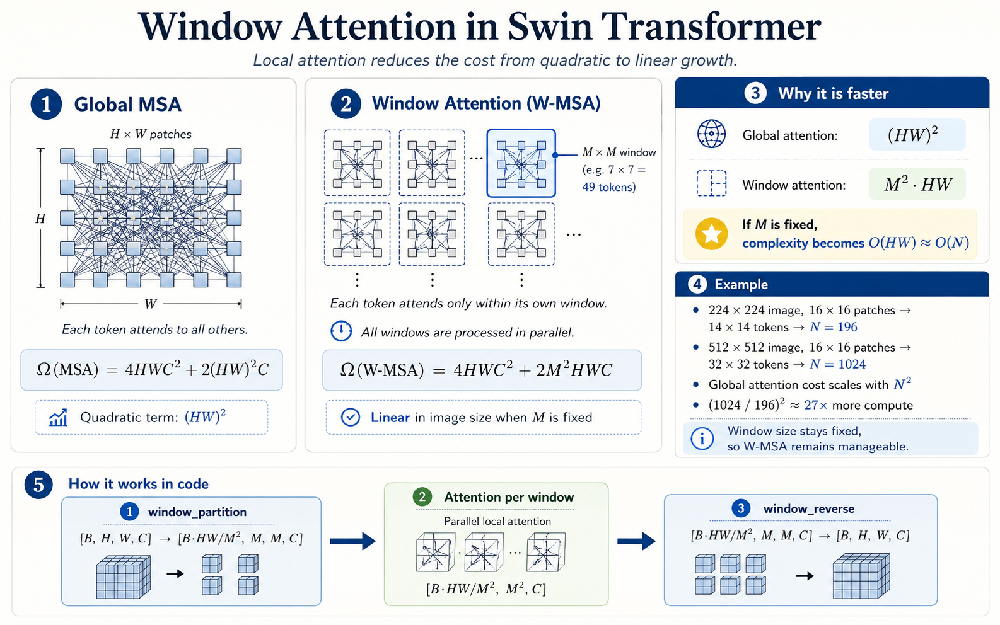
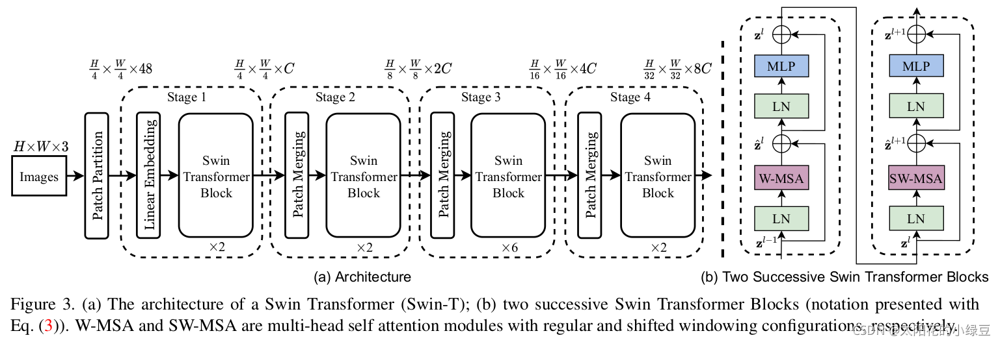
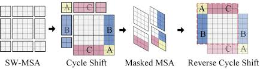
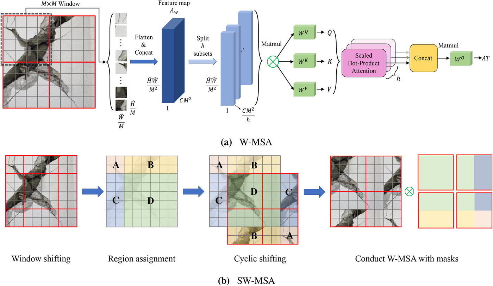



## 前言  
在前面的[博客](https://everglow01.github.io/Owen-Studio/posts/brief-discussion-on-vit/)中，我简单介绍了ViT这一初始模型的结构，
同时也提到了，ViT风格模型有着诸多变体，今天我将介绍由微软出品的Swin Transformer系列变体，介绍关于他的核心改进和算法原理，以及代码实现。  
如果你还没有阅读上一篇[博客](https://everglow01.github.io/Owen-Studio/posts/brief-discussion-on-vit/)，
建议先阅读完再来阅读本篇，本篇博客将会重点聚焦算法原理，偏基础的ViT细节将不会在这篇文章中提及。
同时，这将会是一个新的系列，我将拆分讲解更多的模型结构，从CNN到Transformer架构，从经典的VGG16到最近的DETR，敬请期待。

## Swin Transformer核心算法原理    
Swin Transformer的核心改进总体上可以分成四个点：   

- 窗口注意力（W-MSA）—— 解决计算复杂度问题
- Patch Merging —— Stage 之间的下采样，构建多尺度金字塔
- 移位窗口（SW-MSA）—— 解决窗口之间信息隔绝问题
- 相对位置编码 —— 替代 ViT 的绝对位置编码

接下来我将逐一介绍上述的改进。  

### 1.窗口注意力（W-MSA）  
首先让我们回顾一下ViT的核心学习机制——多头注意力机制，如果你有一定算法与数据结构基础，就能相当轻松地发现，整套算法的计算复杂度是$O(N^2)$，
N是指的Token数量。如一张224x224分辨率的图片用16x16的Patch切，N = 196，此时的复杂度还能够勉强接受。但如果要输入更高分辨率的图像以换取对小目标物体的敏感度的话，复杂度将会暴涨。比如512×512，$N$就变成 1024，复杂度暴增 27 倍，根本跑不动。  
那么Swin Transformer提出的解法是怎样的呢，就是把注意力限制在固定大小的局部窗口（默认7x7=49个token）。
每个token只和同一窗口内的其他token做注意力计算，窗口之间完全并行处理。 


设图像被切成 $H \times W$ 个 patch，窗口大小为 $M \times M$，
全局注意力和窗口注意力的计算复杂度对比如下：

$$\Omega(\text{MSA}) = 4HWC^2 + 2(HW)^2C$$  

$$\Omega(\text{W-MSA}) = 4HWC^2 + 2M^2HWC$$

其中 $C$ 是每个 token 的 embedding 维度。
可以看到，全局注意力的复杂度包含 $(HW)^2$ 项，随分辨率平方增长；
而窗口注意力将这一项替换为 $M^2 \cdot HW$，
由于窗口大小 $M$ 是固定常数（默认为 7），复杂度退化为关于图像尺寸的**线性复杂度** $O(N)$，
这使得 Swin 可以处理任意分辨率的输入而不会出现显存爆炸。  

如果图像输入分辨率是 224×224，按照 $M=7$ 的窗口大小划分：

- 图像首先经过 Patch Embedding，用 4×4 的 patch 切分，得到 $\frac{224}{4} \times \frac{224}{4} = 56 \times 56$ 个 token
- 再按 $M=7$ 的窗口划分，共得到 $\frac{56}{7} \times \frac{56}{7} = 8 \times 8 = 64$ 个窗口
- 每个窗口内有 $7 \times 7 = 49$ 个 token，仅在窗口内部做注意力计算

复杂度对比：

$$\Omega(\text{MSA}) = 2 \times (56 \times 56)^2 \times C = 2 \times 3136^2 \times C \approx 1.97 \times 10^7 C$$

$$\Omega(\text{W-MSA}) = 2 \times 7^2 \times 56 \times 56 \times C = 2 \times 49 \times 3136 \times C \approx 3.07 \times 10^5 C$$

窗口注意力的计算量仅为全局注意力的 $\dfrac{49}{3136} \approx \dfrac{1}{64}$，
**计算量降为原来的 1/64**，代价只是把感受野从全局缩小到了单个窗口内，
而当输入分辨率继续升高时，这一比例还会进一步拉大。



在代码中，"切窗口"和"还原窗口"由两个函数完成：

```python
def window_partition(x, window_size: int):
    """将特征图切分为一个个独立的窗口
    [B, H, W, C] -> [num_windows*B, window_size, window_size, C]
    """
    B, H, W, C = x.shape
    x = x.view(B, H // window_size, window_size, W // window_size, window_size, C)
    return x.permute(0, 1, 3, 2, 4, 5).contiguous().view(-1, window_size, window_size, C)

def window_reverse(windows, window_size: int, H: int, W: int):
    """将计算完注意力的窗口还原回完整特征图
    [num_windows*B, window_size, window_size, C] -> [B, H, W, C]
    """
    B = int(windows.shape[0] / (H * W / window_size / window_size))
    x = windows.view(B, H // window_size, W // window_size, window_size, window_size, -1)
    return x.permute(0, 1, 3, 2, 4, 5).contiguous().view(B, H, W, -1)
```

`window_partition` 把形状为 $[B, H, W, C]$ 的特征图，
按照窗口大小切分成 $\frac{H}{M} \times \frac{W}{M}$ 个窗口，
每个窗口展平为 $[M^2, C]$ 的 token 序列，
所有窗口拼成一个大 batch $[\frac{HW}{M^2} \cdot B,\ M^2,\ C]$，
一次性送入注意力模块并行计算，效率极高。
计算完成后，`window_reverse` 再把所有窗口拼回完整的特征图。

然而，窗口注意力引入了一个新的问题：**窗口之间的信息完全隔绝**。
每个 token 只能看到自己窗口内的邻居，不同窗口的 token 永远无法交流，
模型的感受野被硬性限制在一个窗口内，这显然不够。
这正是 Swin Transformer 第二个核心改进——**移位窗口（SW-MSA）** 要解决的问题。  

### 2. 编码器整体结构  


**在详细讲述 Patch Merging 与 SW-MSA 之前，我们必须先弄清楚编码器的整体结构。**  

完成 Patch Embedding 后，Swin Transformer 的编码器由 **4 个 Stage** 串联而成，
每个 Stage 内部包含若干个 SwinTransformerBlock（简称 Block），
每个 Block 的结构和 ViT 的 Encoder Block 完全一致：
Pre-LN → 注意力 → 残差 → Pre-LN → MLP → 残差。

以 Swin-Tiny 为例，4 个 Stage 的 Block 数量和通道数如下：

| Stage | Block 数 | 输入分辨率 | 通道数 C |
|-------|---------|-----------|---------|
| Stage 1 | 2 | 56×56 | 96 |
| Stage 2 | 2 | 28×28 | 192 |
| Stage 3 | 6 | 14×14 | 384 |
| Stage 4 | 2 | 7×7 | 768 |

对应代码中的工厂函数配置：

```python
def swin_tiny_patch4_window7_224(num_classes=1000):
    return SwinTransformer(
        embed_dim=96,
        depths=(2, 2, 6, 2),       # 4个Stage的Block数
        num_heads=(3, 6, 12, 24),  # 每个Stage的注意力头数
        window_size=7,
    )
```

可以看到两个规律：
- **通道数每个 Stage 翻倍**：$96 \to 192 \to 384 \to 768$，由 `embed_dim * 2^i` 决定
- **分辨率每个 Stage 减半**：$56 \to 28 \to 14 \to 7$，由 Stage 之间的下采样操作完成

这种"分辨率减半、通道翻倍"的层级结构，和经典 CNN（如 ResNet）的设计如出一辙，
这也是 Swin 能够直接对接 FPN 做检测和分割的根本原因——每个 Stage 的输出就是一个尺度的特征图。


### 3. Patch Merging——下采样与通道变化

Stage 与 Stage 之间的分辨率减半，由 **Patch Merging** 完成。
它的作用类似于 CNN 中的步长为 2 的卷积或池化，负责把空间分辨率压缩、通道数扩展。

**具体操作**：把特征图上每个 $2 \times 2$ 的相邻 patch 组合成一组，
将这 4 个 patch 的特征向量在通道维度上拼接，再经过一个 Linear 层压缩通道。

以 Stage 3 到 Stage 4 的过渡为例，输入是 $14 \times 14$ 个 patch，每个 patch 的维度是 $C=384$：

$$\text{输入：} [B,\ 14 \times 14,\ 384] = [B,\ 196,\ 384]$$

取出 $2 \times 2$ 邻域的 4 个 patch，在通道维拼接：

$$4 \times C = 4 \times 384 = 1536 \text{ 维}$$

patch 数量减少为原来的 $\frac{1}{4}$：

$$14 \times 14 \to 7 \times 7 = 49 \text{ 个 patch}$$

此时形状为 $[B,\ 49,\ 1536]$，再经过一个 $1536 \to 768$ 的 Linear 层压缩：

$$\text{输出：} [B,\ 49,\ 768]$$

**为什么通道是 $2C=768$ 而不是 $4C=1536$？**

这是有意为之的设计。4 个 patch 拼接后通道变为 $4C$，
但如果直接保留 $4C$，每个 Stage 的计算量会以 4 倍速增长，很快变得不可接受。
通过 Linear 层压缩到 $2C$，在保留空间下采样的同时，
将计算量的增长控制在可接受的范围内——分辨率减半带来的计算量减少（$\frac{1}{4}$）
恰好被通道翻倍的增加（$\times 4$）部分抵消，**净效果是每个 Stage 的总计算量大致持平**。

对应代码：

```python
class PatchMerging(nn.Module):
    def __init__(self, input_resolution, dim, norm_layer=nn.LayerNorm):
        super().__init__()
        self.reduction = nn.Linear(4 * dim, 2 * dim, bias=False)  # 4C → 2C
        self.norm = norm_layer(4 * dim)

    def forward(self, x, H, W):
        B, L, C = x.shape
        x = x.view(B, H, W, C)
        # 取出2×2邻域的4个patch，在通道维拼接
        x = torch.cat([
            x[:, 0::2, 0::2, :],  # 左上
            x[:, 1::2, 0::2, :],  # 左下
            x[:, 0::2, 1::2, :],  # 右上
            x[:, 1::2, 1::2, :],  # 右下
        ], dim=-1)                 # [B, H/2, W/2, 4C]
        H_out, W_out = H // 2, W // 2
        # LayerNorm + Linear 压缩通道：4C → 2C
        return self.reduction(self.norm(x.view(B, -1, 4 * C))), H_out, W_out
```


### 4. 移位窗口（SW-MSA）——打破窗口间的信息壁垒

**层与层之间的交替**

在每个 Stage 内部，相邻两个 Block 交替使用两种注意力方式：

```python
# BasicLayer 中，按奇偶为每个 Block 分配 shift_size
SwinTransformerBlock(
    ...,
    shift_size = 0 if (i % 2 == 0) else window_size // 2
    # 偶数 Block → shift_size=0 → W-MSA（普通窗口）
    # 奇数 Block → shift_size=3 → SW-MSA（移位窗口）
)
```

**为什么要交替？**
W-MSA Block 负责窗口内部的精细交流，其输出作为下一个 Block 的输入；
SW-MSA Block 把窗口整体偏移 $\lfloor M/2 \rfloor = 3$ 个 patch，
让上一层被窗口边界隔开的相邻 token 得以在同一窗口内相遇，完成跨边界的信息交流。
两个 Block 串联，局部交流与跨窗口交流各做一次，形成完整的感受野扩展。

**直接移位的问题**

如果直接把 $7 \times 7$ 的窗口向右下偏移 3 个 patch，
右下侧图像边缘区域会"移出"特征图，而左上方的图像则会凸出来，产生大小不一的残缺窗口，无法并行处理。
以 $14 \times 14$ 的特征图为例：

$$\text{原始窗口数：} \frac{14}{7} \times \frac{14}{7} = 4 \text{ 个完整窗口}$$

移位后：出现宽度为 3、4、7 的混合窗口，沿两个维度共有 3×3 = 9 种组合，无法统一处理

**Cyclic Shift：循环折叠**

Swin 的解法是不真正"移动"窗口，而是对整张特征图做**循环滚动**——
窗口向右下方偏移 $M/2$，右下角随之出现空缺，左上角的图片会凸出窗口
`torch.roll` 通过循环滚动把左侧和上方的 patch 补到左上角的空缺处：

```python
# 特征图向左上方循环滚动，等价于窗口向右下方偏移
x = torch.roll(x, shifts=(-self.shift_size, -self.shift_size), dims=(1, 2))
```

以 $14 \times 14$、$M=7$、$\text{shift}=3$ 为例，循环滚动后：

- 原本位于**左上角** $[0:3,\ 0:3]$ 区域的 patch，折叠到了**右下角** $[11:14,\ 11:14]$ 的空缺处
- 特征图总 token 数不变，仍是 $14 \times 14 = 196$ 个
- 按 $7 \times 7$ 正常切分，仍得到 4 个形状统一的完整窗口，可以一次性并行处理  


$$\text{滚动后切分：} \frac{14}{7} \times \frac{14}{7} = 4 \text{ 个窗口，每个 } 7 \times 7 = 49 \text{ 个 token}$$

根据示意图来看，折叠后，依旧是四个形状统一的完整窗口，但显然除去左上角的窗口，其他的窗口都或多或少会有本不应该相邻的区域又拼接，
而他们之间是不应该互相计算注意力的，这就需要使用注意力掩码登场了。

**Attention Mask——屏蔽不合法的 token 对**

折叠后，部分窗口内同时包含了**图像中本不相邻的区域**，这样不相邻的区域不应该互相计算注意力，
需要增添一个掩码以消除这一问题。


解决方案是在初始化时预先计算好一个 `attn_mask`，
把同一窗口内来自不同区域的 token 对的注意力分数强制置为 $-100$：

$$\text{Softmax}(-100 + \text{attn\_score}) \approx 0$$

即注意力权重趋近于 0，效果等同于完全屏蔽，但不需要任何额外的分支处理。

`attn_mask` 的计算逻辑是：把特征图划分为 9 个区域并分别编号（0-8），
切分成窗口后，同一窗口内编号不同的 token 对就是需要屏蔽的非法对：

```python
@staticmethod
def _compute_attn_mask(H, W, window_size, shift_size):
    img_mask = torch.zeros(1, H, W, 1)
    # 把特征图按滑动切片划分为9个区域，分别赋予编号 0-8
    h_slices = (slice(0, -window_size),
                slice(-window_size, -shift_size),
                slice(-shift_size, None))
    w_slices = (slice(0, -window_size),
                slice(-window_size, -shift_size),
                slice(-shift_size, None))
    cnt = 0
    for h in h_slices:
        for w in w_slices:
            img_mask[:, h, w, :] = cnt
            cnt += 1  # 共 9 个区域，编号 0-8

    # 切窗口，得到每个窗口内所有 token 的区域编号
    mask_windows = window_partition(img_mask, window_size)  # [nW, M, M, 1]
    mask_windows = mask_windows.view(-1, window_size * window_size)  # [nW, M*M]

    # 同一窗口内，两个 token 编号相减不为 0 → 来自不同区域 → 置为 -100
    attn_mask = mask_windows.unsqueeze(1) - mask_windows.unsqueeze(2)  # [nW, M*M, M*M]
    return attn_mask.masked_fill(attn_mask != 0, -100.0) \
                    .masked_fill(attn_mask == 0, 0.0)
```

这个 mask 在初始化时计算一次，注册为 `buffer`，推理时直接复用：

```python
# 在 forward 中加到注意力分数上
if mask is not None:
    nW = mask.shape[0]
    attn = attn.view(B_ // nW, nW, self.num_heads, N, N) \
               + mask.unsqueeze(1).unsqueeze(0)
    attn = attn.view(-1, self.num_heads, N, N)
attn = attn.softmax(dim=-1)
```

**计算完成后，反向滚动还原特征图位置：**

```python
x = torch.roll(x, shifts=(self.shift_size, self.shift_size), dims=(1, 2))
```

整个 SW-MSA 的完整流程：

$$\text{torch.roll}(-M/2) \to \text{window\_partition} \to \text{W-Attention + mask} \to \text{window\_reverse} \to \text{torch.roll}(+M/2)$$

所有 token 在每一层都被注意力完整覆盖，没有任何遗漏，
只是被 mask 屏蔽的非法 token 对实际上不产生信息交流——
**这是在不增加任何计算量的前提下，实现跨窗口信息流动的完整方案。**   

### 5. 整体梳理  


这是 Swin Transformer 中最精华也是最难理解的部分，我们再做一次完整的数据流梳理。

**Stage 的概念**

一个 Stage 可以类比为 ViT 中的若干个 Encoder Block 串联，
但在 Stage 尾部额外接了一个 Patch Merging 模块负责下采样——
分辨率减半、通道翻倍，从而构建出类似 CNN 中 FPN 的**多尺度特征金字塔**。
正是这个层级结构，让 Swin Transformer 能够同时感知大目标和小目标，
成为检测和分割任务的强力骨干，也是它能在 COCO 等传统视觉基准上大幅刷新记录的根本原因。

**Stage 内部结构**

Stage 内部的每个 Block 结构与 ViT 完全一致：Pre-LN → 注意力 → 残差 → Pre-LN → MLP → 残差   

唯一的区别是注意力机制被替换为 W-MSA 和 SW-MSA 的交替组合——
偶数编号（从0开始）的 Block 使用普通窗口注意力（W-MSA），奇数编号的 Block 使用移位窗口注意力（SW-MSA），
因此同一 Stage 内永远不会出现两个相同类型的 Block 相邻的情况。

**完整数据流（以 Swin-Tiny，输入 224×224 为例）**

$$[B,3,224,224] \xrightarrow{\text{Patch Embed}} [B,3136,96]$$

$$\xrightarrow{\text{Stage 1: 2个Block}} [B,3136,96] \xrightarrow{\text{Patch Merging}} [B,784,192]$$

$$\xrightarrow{\text{Stage 2: 2个Block}} [B,784,192] \xrightarrow{\text{Patch Merging}} [B,196,384]$$

$$\xrightarrow{\text{Stage 3: 6个Block}} [B,196,384] \xrightarrow{\text{Patch Merging}} [B,49,768]$$

$$\xrightarrow{\text{Stage 4: 2个Block}} [B,49,768]$$

最终根据任务类型分叉：
- **分类**：全局平均池化 → Linear → $[B,\ \text{num\_classes}]$
- **检测 / 分割**：各 Stage 输出 reshape 为 2D 特征图，返回 p2/p3/p4/p5 四个尺度（在每个 stage 进行 patch merging 之前提取）    


### 6. 相对位置编码

介绍完窗口注意力和移位窗口，还有一个细节值得单独拿出来讲——
Swin Transformer 用**相对位置编码**替换了原始 ViT 中的绝对位置编码。

#### 为什么要换掉绝对位置编码

ViT 的绝对位置编码是一个形状为 $[1, N+1, C]$ 的可学习参数，通过与原始embedding相加得到包含绝对位置信息的语义向量。 
而这也就意味着图像上的每一个位置是一个固定的值、固定的形状，这看上去似乎没有什么不妥，但却存在一个可能的隐患，
那就是**绝对位置编码和输入分辨率强绑定**。如果训练时输入是 $224 \times 224$（196 个 patch），
推理时换成 $384 \times 384$（576 个 patch），就会导致训练得到的位置编码和输入的图像信息对不上号，形状不对，
必须在pytorch中插值处理，会降低精度。

而Swin 的窗口注意力只在 $M \times M$ 的窗口内计算，
窗口大小固定为 $7 \times 7 = 49$ 个 token，
因此位置关系只需要描述**窗口内两个 token 之间的相对距离**，
而不需要知道它们在整张图中的绝对坐标。
这天然适合用相对位置编码来描述，同时也带来了更好的分辨率泛化能力。

#### 相对位置编码的数学形式

注意力分数的计算公式在原始 Transformer 的基础上加入了相对位置偏置项 $B$：

$$\text{Attention}(Q, K, V) = \text{Softmax}\left(\frac{QK^T}{\sqrt{d}} + B\right)V$$

其中 $B \in \mathbb{R}^{M^2 \times M^2}$ 是一个偏置矩阵，
$B_{ij}$ 表示窗口内第 $i$ 个 token 和第 $j$ 个 token 之间的相对位置偏置值，
由两个 token 的相对坐标 $(\Delta h, \Delta w)$ 查表得到。

#### 如何构建相对位置索引

窗口大小 $M=7$，窗口内每个 token 的坐标范围是 $[0, 6]$，
两个 token 之间的相对坐标范围是 $[-(M-1), M-1] = [-6, 6]$，共 $2M-1=13$ 个可能值。
行和列各有 13 个可能值，组合后共 $(2M-1)^2 = 169$ 种相对位置关系。

代码中预先计算好所有 token 对的相对位置索引，存为 `relative_position_index`：

```python
# 生成窗口内所有 token 的坐标网格
coords_h = torch.arange(self.window_size[0])  # [0,1,2,3,4,5,6]
coords_w = torch.arange(self.window_size[1])  # [0,1,2,3,4,5,6]
coords = torch.stack(torch.meshgrid(coords_h, coords_w, indexing="ij"))  # [2, 7, 7]
coords_flatten = torch.flatten(coords, 1)  # [2, 49]

# 计算所有 token 对之间的相对坐标：[2, 49, 49]
relative_coords = coords_flatten[:, :, None] - coords_flatten[:, None, :]
relative_coords = relative_coords.permute(1, 2, 0).contiguous()  # [49, 49, 2]

# 将相对坐标从 [-6,6] 平移到 [0,12]，方便作为索引使用
relative_coords[:, :, 0] += self.window_size[0] - 1  # 行方向平移
relative_coords[:, :, 1] += self.window_size[1] - 1  # 列方向平移

# 行方向乘以 (2M-1)，将二维索引展平为一维
relative_coords[:, :, 0] *= 2 * self.window_size[1] - 1
self.register_buffer("relative_position_index", relative_coords.sum(-1))  # [49, 49]
```

以两个 token 坐标 $(2, 3)$ 和 $(5, 1)$ 为例，计算其一维索引：

$$\Delta h = 2 - 5 = -3 \xrightarrow{+6} 3$$
$$\Delta w = 3 - 1 = 2 \xrightarrow{+6} 8$$
$$\text{index} = 3 \times 13 + 8 = 47$$

即这对 token 的相对位置偏置从 `relative_position_bias_table` 的第 47 行取出。

#### 位置偏置表的查表过程

`relative_position_bias_table` 是一个形状为 $[(2M-1)^2,\ \text{num\_heads}]= [169, \text{num\_heads}]$ 的可学习参数，
训练时和模型其他参数一起更新：

```python
self.relative_position_bias_table = nn.Parameter(
    torch.zeros((2 * self.window_size[0] - 1) * (2 * self.window_size[1] - 1), num_heads)
)  # [169, num_heads]
nn.init.trunc_normal_(self.relative_position_bias_table, std=0.02)
```

在前向传播中，用预计算好的 `relative_position_index` 查表，得到偏置矩阵 $B$，
加到注意力分数上：

```python
# 查表：[49*49] → [49, 49, num_heads] → [num_heads, 49, 49]
rpb = self.relative_position_bias_table[self.relative_position_index.view(-1)]
rpb = rpb.view(self.window_size[0] * self.window_size[1],
               self.window_size[0] * self.window_size[1], -1).permute(2, 0, 1)

# 加到注意力分数上，unsqueeze(0) 对应 batch 维度
attn = attn + rpb.unsqueeze(0)  # [B*nW, num_heads, 49, 49]
```

#### 相对位置编码的优势

相比绝对位置编码，相对位置编码有两个明显的优势：

**泛化性更强**：编码的是 token 之间的相对关系而非绝对坐标，
窗口大小固定为 $7 \times 7$，无论输入图像分辨率如何变化，
窗口内的相对位置关系始终只有 169 种，位置偏置表无需做任何修改。

**每个注意力头独立学习**：`relative_position_bias_table` 的第二维是 `num_heads`，
每个头拥有自己独立的位置偏置，可以学到不同的空间感知模式，
有的头可能更关注水平方向的相邻关系，有的头更关注垂直方向，
这与多头注意力"让不同头关注不同特征"的初衷不谋而合。  


## 总结  

到这里我们基本介绍完了 Swin Transformer 的算法原理。用简单的话来概括：

Swin 的核心改动是将 ViT 中的全局多头注意力替换为 W-MSA 和 SW-MSA 交替串联的窗口注意力机制，
将注意力的计算复杂度从 $O(N^2)$ 降低到 $O(N)$，从根本上解决了 ViT 处理高分辨率图像时的计算瓶颈。

由此衍生出了独特的多 Stage 层级结构——每个 Stage 通过 Patch Merging 完成下采样，
分辨率逐级减半、通道数逐级翻倍，构建出类似 CNN 中 FPN 的多尺度特征金字塔。
这一设计让 Swin 天然适配检测、分割等需要多尺度感知的视觉任务，
而这恰恰是原始 ViT 的短板所在，可谓一举两得。

此外，Swin 还做了两处细节改进：
用相对位置编码替换了 ViT 的绝对位置编码，使模型对不同输入分辨率的泛化能力更强，
每个注意力头也能独立学习不同的空间感知模式；
引入了 DropPath 随机深度正则化，随机跳过整个残差分支而非单个神经元，
训练稳定性和模型的泛化能力都得到了进一步提升。

这些改进共同造就了 Swin Transformer 在 COCO 等视觉基准上的统治级表现，
也使它成为了此后众多视觉大模型的标准骨干选择。  
 
## 常见问题 Q&A  
**Q：Swin-Tiny、Swin-Small、Swin-Base 三个变体的核心区别是什么？**

A：主要差异在两个地方——`embed_dim` 和 `depths`：

| 变体 | embed_dim | depths | 参数量 |
|------|-----------|--------|--------|
| Swin-Tiny | 96 | (2,2,6,2) | ~28M |
| Swin-Small | 96 | (2,2,18,2) | ~50M |
| Swin-Base | 128 | (2,2,18,2) | ~88M |

Tiny 和 Small 的通道数相同，区别只在 Stage 3 的深度（6 vs 18）；
Base 在此基础上把基础通道数从 96 提升到 128，四个 Stage 的通道数变为 128/256/512/1024，
整体参数量和计算量都有显著提升，适合对精度要求更高的场景。  

---  

**Q：Swin 处理不同分辨率的输入时会有问题吗？**

A：基本没有问题，代码对此做了专门处理。
当输入分辨率不能被窗口大小整除时，`SwinTransformerBlock` 的 forward 会自动 padding：

```python
pad_b = (ws - H % ws) % ws
pad_r = (ws - W % ws) % ws
if pad_b > 0 or pad_r > 0:
    x = F.pad(x, (0, 0, 0, pad_r, 0, pad_b))
```

计算完注意力后再裁剪掉补的部分，对结果没有影响。
相对位置编码只描述窗口内的相对关系，也不依赖输入分辨率，
所以 Swin 在处理任意分辨率输入时比 ViT 更加灵活。  

---

**Q：Swin 既然已经有了层级结构，为什么还需要 FPN，直接用四个 Stage 的输出不行吗？**

A：直接用四个 Stage 的输出做多尺度检测是可以的，这叫做简单特征金字塔（Simple FPN）。
但标准 FPN 的价值在于**自顶向下的特征融合**——
用高层的语义信息增强低层的细节信息，让 p2 这样的浅层特征图也具备足够的语义判断能力。
Swin 的各 Stage 输出之间没有跨尺度的信息流动，
接上 FPN 后浅层特征图的检测精度，尤其是对小目标的检测，会有明显提升。  

---

**Q：DropPath 是什么，和 Dropout 有什么区别？**

A：DropPath 又叫随机深度（Stochastic Depth），是专门为残差网络设计的正则化手段。
Dropout 随机置零单个神经元，DropPath 随机跳过整个残差分支——
被 drop 的 Block 直接输出输入本身（恒等映射），相当于这一层"不存在"。
在 Swin 代码中，越深的 Block 被赋予越高的 drop 概率（由 `drop_path_rate` 线性分配），
训练时模型学会了在不同深度下工作，推理时所有 Block 都参与计算，
这既起到了正则化的效果，又隐式地让模型具备了一定的深度自适应能力。

