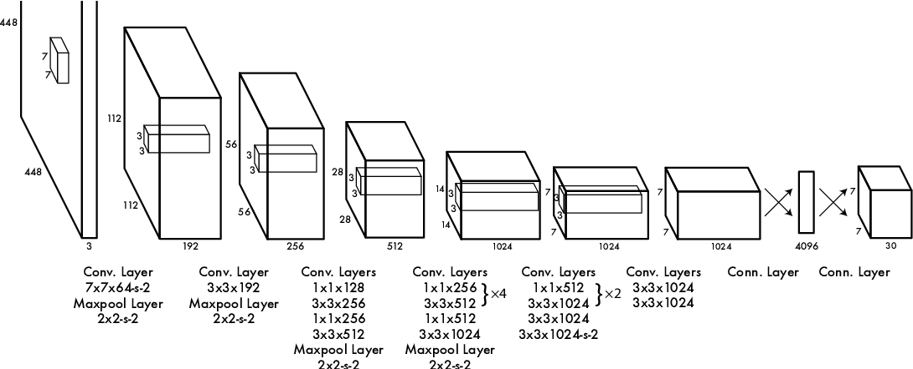
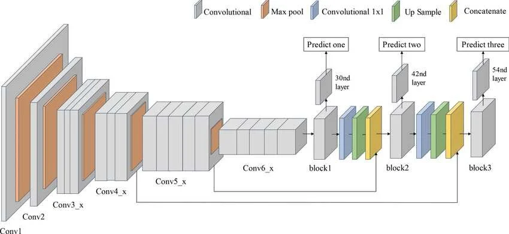
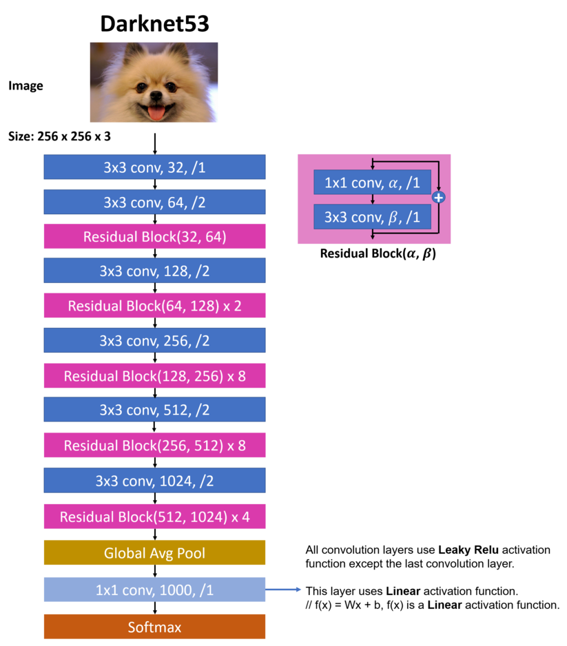



## 前言  
YOLO(You Only Look Once)恐怕是现今刚刚接触并学习CV的人最先接触到的深度学习视觉模型，
笔者在2023年开始钻研CV领域时，自己训练的第一个视觉模型就是彼时最热的YOLOv5。YOLO系列毫无疑问是计算机视觉领域的经典之作，
我将分三篇博客介绍YOLO的前世今生。
今天随着这篇文章，让我们以一个轻松的方式来回看YOLO的前世今生，历代YOLO模型的特点，再以个人的视角展望YOLO接下来的发展。  

但首先，我们必须先回答一个非常简单的问题——    
## 什么是YOLO？  
### 1.目标检测 or 图像分类  
从现在的视角，把这两个视觉任务分开来讲似乎有些奇怪了，我们接触的众多视觉框架都原生支持这两大任务，
但在十数年前，这其实是两个截然不同的任务。图像分类回答的问题是"图里有什么？"，而目标检测回答的问题不仅是这一点，
它还需要回答"它在图片上的哪里？"，它的输出并不只是一串经SoftMax处理过后的概率，而是一组**边界框（Bounding Box）+ 类别标签 + 置信度**，
这意味着"两个阶段"，那就是寻找"what"和"where"的两个阶段。  
### 2.传统两阶段检测器的思路  
以最经典的R-CNN系列为代表，在执行目标检测任务时，它们的流程是 **"先提名，再判断"**  
第一阶段，用**选择性搜索（Selective Search，原始 R-CNN/Fast R-CNN 使用）或后来的区域提议网络（RPN，Faster R-CNN 引入）**在图像上扫出约2000个"可能存在目标的区域"，
我们称之为**候选框（Region Proposal）**。第二阶段，把这2000个候选框一个个裁下来，分别送入CNN模型中进行特征提取，
再用传统的SVM（支持向量机）和线性回归器精修坐标，最后用NMS算法一个个去掉重叠框。  
乍一看流程非常的优雅、清晰，但实际上这里隐藏了一个致命的问题。2000个候选框，意味着2000次CNN前向传播，其中还有大量的候选框其实是无效框。
R-CNN在一张图片推理中要花40s-60s，实时检测速率仅有0.02fps左右，完全无法实现实时检测。
当然，后续的Fast R-CNN、Faster R-CNN对此进行了大量优化，但两阶段的架构锁死了它的上限。  
### 3.YOLO的革命性思想  
为了将上面的两阶段处理，变成单阶段处理，YOLO给出了革命性的方案。
在最初始的YOLOv1上，模型把整张图像分为7x7的网格，每个网格用来预测若干个边界框，
其中每个框包含：
- 中心坐标(x,y)
- 宽高(w,h)
- 置信度分数
- 所属类别的概率分布  

整张图片只经过**一次神经网络前向传播**，所有单元格的预测同步完成，而这也就是名字"You Only Look Once"的由来。
  
传统的两阶段方法对每个候选区域独立计算特征，特征计算量随着特征图数量线性增长，
而YOLO一张图仅进行一次完整的前向传播，所有格子共享同一次前向传播的结果。  

## YOLOv1  
### 诞生背景（八卦）  
YOLOv1发表的标志是2015年发表在CVPR的论文[《You Only Look Once: Unified, Real-Time Object Detection》](https://arxiv.org/abs/1506.02640)，
不知道各位读者有没有感觉，单看这些深度学习领域大佬起的论文标题都相当的大气，甚至有些倨傲，不过他们确实有这个实力啊。
这篇论文还有个很值得细品的点，论文作者团队中的Ross Girshick正是R-CNN系列的作者之一，这位传统两阶段检测的奠基人，
亲手参与构建了它的竞争对手。当然这也算是一种自我革新的精神吧。  
### 网络结构  
接下来我们来看看YOLOv1的网络结构:
  
**阶段一：捕捉大轮廓**  
用7x7大卷积扫描整张图片，在第一步建立大的感受野，让网络能感知边缘、颜色块、大尺度纹理等信息，接着MaxPool将空间尺寸对半砍，
减少计算量，保留最显著的特征。   
**阶段二：建立局部特征基础**  
用3x3卷积进一步提炼局部特征结构，扩展通道数，让神经网络开始学习更多样、深层的语义组合，再经一次MaxPool压缩空间。   
**阶段三：反复提取和压缩**  
从这里开始出现1x1和3x3卷积不断交替的模式。1x1先收缩通道减少计算量，3x3再展开特征提取，让网络在不暴涨计算成本的前提下，
持续加强图像理解能力。    
**阶段四：反复打磨**   
将上一个阶段的模式重复四次，堆叠卷积以让网络有足够的深度去理解图片的各类语义，从纹理、边缘逐渐抽象到物体的局部结构，比如轮子、眼睛、车窗。
通道数达到1024。   
**阶段五：收拢网络**   
用步长为2的卷积把空间压缩到7x7，完成从"特征提取"到"空间预测"的过渡。
最终的预测格子就是 7×7，网络在这里把整张图的特征信息对齐到这个网格上。  
**阶段六：整合语义**   
空间不再缩小，两层3x3的卷积对输入的特征图做最后的语义整合，为后续的回归预测做准备。  
**阶段七：预测**   
把7x7x1024的特征图展平，经过两个全连接层直接回归出所有预测值。预测的输出是7x7x30，7x7很好理解，就是前面的图像上被分割7x7个网格，注意，实际上这些网格是“不存在的”，在单次前向推理的时候仍然是完整的一张图片。而后面的30则是2x5+20。"5"是 $(x,y,h,w,c)$，两个是因为作者的设计，每个网格只有两个框，而20则是检测物体类别的概率，这里的两个框共用一组概率输出，这也使得**一个网格只能预测一种类别的物体**——即便它输出两个框，这两个框也必须属于同一个类。
### 坐标编码  
YOLOv1的坐标编码实际上奠定了YOLO全系列的基础，以 $(x,y,w,h)$ 为基础进行归一化，
而具体来说 $(x, y)$ 是目标中心相对于所在格子的偏移，归一化到 $[0, 1]$。比如中心恰好在格子正中间，$x=0.5$, $y=0.5$。
$(w, h)$ 是目标宽高相对于整张图的比例，同样归一化到 $[0, 1]$。预测时取的是 $√w$ 和 $√h$，而非 $w$、$h$ 本身——原因是平方根能放大小数值区间的梯度，让小目标的宽高误差获得更强的惩罚信号，否则一个小框偏差 5px 和大框偏差 5px 在 MSE 下会得到相同的惩罚，这显然不公平。  
### 损失函数  
整个损失函数由五项MSE相加构成，分别负责坐标、置信度、分类三个指标。  
**定位损失**：惩罚预测框的 $x$ $y$ $\sqrt{w}$ $\sqrt{h}$ 与真实值的偏差，引入权重系数 $\lambda_{\text{coord}}=5$，因为坐标预测相比分类更难学习、更难收敛，
所以可以对权重进行放大。   
**置信度损失**：对于存在目标的格子来说，置信度目标值是预测框和真实框的 $\text{IoU}$，而不是直接用1；对于不存在目标的格子来说，置信度目标值为0，
加入权重系数 $\lambda_{\text{noobj}}=0.5$，设置这么低的原因很简单，大部分格子里都没有目标，我们把它视为"背景"，如果背景和真样本平起平坐，训练会被背景误导。  
**分类损失**： 这个损失只对含有目标的格子计算，并且使用MSE而非交叉熵——分类问题的标准做法是用交叉熵，v1 这里用 MSE 显然不是最优解，这也是它被后续版本批评和改进的地方之一。  
以上五项分别涵盖了两个定位损失（xy一组，wh一组），两个置信度损失（有目标/无目标），以及分类损失。
计算的公式相当的简单：  
 $$L_{\text{total}} = 5\times(①+②) + ③ + 0.5\times④ + ⑤$$  
每个单独的一项全部都使用MSE来单独计算。  
### 总结  
作为YOLO系列的开山鼻祖，v1确实提供了即便放到现在来看也十分新颖的思路，他的创新重点并不在于对CNN神经网络内部层级进行大范围优化，
而是通过网格化和自定义的坐标编码实现了单阶段目标检测，这的确是非常新颖且非常有应用前景的，YOLO系列至今仍有充足的生命力有力地证明了这一点。
但它仍有诸多不足，如每个格子只能预测一个类，对于多类别且密集的场景模型几乎失效；全连接层丢失了大部分精细的空间信息；MSE在处理大目标和小目标的泛用性不好等等。通过这些缺陷，我们似乎能隐约看到日后每一代YOLO版本在这些方向作出的努力——多尺度检测、Anchor-based和Anchor-free，解耦头等等。
总而言之，这依然是一次伟大的创新，笔者写到这里时，YOLOv1的原始论文在Google scholar上已经被引用了七万六千余次，这足以说明这一模型的成功和其开创性的地位。   

## YOLOv2/YOLO9000  
### 诞生背景  
YOLOv2首次发表于2016年的CVPR，论文[《YOLO9000: Better, Faster, Stronger》](https://arxiv.org/abs/1612.08242)，主要作者是Joseph Redmon & Ali Farhadi，仔细看论文标题，点明了v2相对于v1作出改进的三个方向——Better, Faster, Stronger。  
### 网络结构——Faster

先来看看 YOLOv2 的整体结构。

v2 摒弃了 v1 中偏重分类设计的 GoogLeNet 风格网络，换用了专为检测任务设计的 **Darknet-19** 作为 backbone。顾名思义，这个网络共有 19 个卷积层和 5 个最大池化层。以每个 MaxPool 作为大层之间的分界点，整个网络可以划分为六个阶段，每个阶段的职责和 v1 大体一致——逐步提取从低级到高级的特征，同时缩小空间尺寸。

感兴趣的读者可以参考这个[开源实现](https://github.com/yakhyo/darknet-pytorch)查看完整结构细节。

**Conv → BN → LeakyReLU**

值得重点关注的是，Darknet-19 中每一个卷积单元不再是单纯的二维卷积，而是由卷积、批归一化（Batch Normalization）和 Leaky ReLU 激活函数串联而成的完整结构。这个组合在 ResNet 和此后的现代 YOLO 版本中随处可见，但这里是纯粹的串联结构，并不包含残差连接。

BN 的加入是一个重大改进。在原论文的实验中，仅凭加入 Batch Normalization，mAP 就提升了约两个百分点，且几乎不增加推理开销。除了精度收益，BN 还能稳定梯度、加速收敛，并通过正则化效果抑制过拟合。

**去掉全连接层**

v2 的另一个重要结构变化是彻底去掉了全连接层。v1 中的全连接层将特征图强行展平，破坏了 CNN 天然具备的空间结构信息。v2 改为全卷积结构，检测直接在特征图上进行，空间信息得以完整保留。

**输出格式：13×13×125**

v2 的输出张量是 **13×13×125**，拆开来看：

- **13×13**：最终特征图的空间尺寸，对应图像被划分成的网格
- **125 = 25 × 5**：每个格子预测 5 个 Anchor 框，每个框输出 25 个值
- **25 = 5 + 20**：5 个基础预测值（x, y, w, h, 置信度 c）加上 20 个类别概率（默认在 PASCAL VOC 上训练，共 20 类）

这里的 5 个 Anchor 是预先在训练集上聚类得到的不同尺寸候选框，每个格子都会针对这 5 个 Anchor 分别进行预测，Anchor 的具体含义和来历将在下一节详细介绍。

---

### 精度优化——Better

**1. Batch Normalization**

前文已提及，此处不再赘述。BN 层的优点已被深度学习领域广泛认可，是 v2 在训练稳定性上的重要基础。

**2. Anchor Box + K-Means 聚类**

这是 v2 最核心的架构变化，也是 YOLO 从 Anchor-free 转向 Anchor-based 的关键节点。

v1 让网络从零开始直接回归坐标，学习难度大，收敛慢。v2 引入**先验框（Anchor Box）**，网络只需预测相对于这些先验框的偏移量，任务难度大幅降低，召回率也随之提升约 7%。

先验框的尺寸不是人工拍脑袋设定的，而是通过 **K-Means 聚类**在训练集上自动学习出来的。这里的距离度量也经过专门设计，用 $1 - \text{IoU}(\text{box}, \text{centroid})$ 代替欧氏距离，使聚类结果中的框与真实框有更高的重叠度。实验表明，$K=5$ 是精度和复杂度之间最好的平衡点。

你可能会问：为什么是 5 个 Anchor，而不是像 Faster R-CNN 那样用 9 个？论文中作者做了对比实验——RPN 用 3 种尺度 × 3 种长宽比手工设定 9 个 Anchor，平均 IoU 为 60.9；而 YOLOv2 用 K-Means 聚类得到的 5 个 Anchor，平均 IoU 就达到了 61.0，已经追平甚至略优于手工 9 个。在精度近似的情况下，5 个 Anchor 的计算开销显然更低，因此最终选定 K=5 作为 v2 的设计。

**3. 直接位置预测（Direct Location Prediction）**

这是和 Anchor 紧密配套的另一个改进。引入 Anchor 之后，作者很快发现一个新问题——**训练初期模型不稳定，需要花很长时间才能收敛到合理范围**。

问题出在 Faster R-CNN 风格的坐标预测公式上：

$$x = (t_x \times w_a) + x_a, \quad y = (t_y \times h_a) + y_a$$

这里 $t_x, t_y$ 是网络预测的偏移量。但 $t_x, t_y$ **完全没有约束**——网络可以输出任意大小的值。这意味着一个挂在格子 (3, 3) 上的 Anchor，预测出的框中心可能跑到图像的任意位置。训练初期网络输出乱跳，框就在整张图上到处乱飞，自然难以收敛。

YOLOv2 的解法是把 Anchor 中心**强制锁死在它所属的那个网格内部**：

$$b_x = \sigma(t_x) + c_x$$
$$b_y = \sigma(t_y) + c_y$$
$$b_w = p_w \cdot e^{t_w}$$
$$b_h = p_h \cdot e^{t_h}$$

其中 $(c_x, c_y)$ 是当前网格的左上角坐标；$\sigma$ 是 sigmoid，把网络输出的偏移压到 $(0, 1)$ 之间——这样 $b_x$ 永远落在所属格子的范围内，无论网络输出什么值，框中心都不会跑到隔壁格子去。宽高方向用 $e^{t_w}$、$e^{t_h}$ 取指数，一来天然保证宽高永远是正数，二来在对数空间下，"放大 2 倍"和"缩小 1/2"是数值上对称的扰动，对网络的优化更友好。

这一改动配合 K-Means Anchor 一起使用，相比单独引入 Anchor 又额外贡献了约 5% 的 mAP 提升，且训练曲线明显更稳定。这套坐标编码方式也一直被沿用到 YOLOv3、v4、v5，可以说是 Anchor-based YOLO 的"标配公式"。

**4. 高分辨率分类器预训练**

v1 的训练流程是先用 224×224 在 ImageNet 上训练分类器，再直接切换到 448×448 做检测微调。这个分辨率突变让模型需要花大量迭代重新适应新的输入尺寸。

v2 在两者之间插入了一个过渡步骤：在正式进行检测训练之前，先用 448×448 在 ImageNet 上额外微调 10 个 epoch，让骨干网络充分适应高分辨率。这一步单独贡献了约 4% 的 mAP 提升。

**5. 细粒度特征直连（Passthrough Layer）**

检测头接收的是经过多次下采样后的低分辨率特征图，对小目标不够友好——目标太小时，到了 13×13 的特征图上可能只剩下一个格子甚至更少的响应。

v2 的解法是引入一条"直通层（Passthrough Layer）"：将网络中段较高分辨率的特征图（26×26×512）直接拼接到最终检测层，让检测头同时看到高层语义特征和低层细节特征。到这里，其实我们已经可以看到类似FPN的思想了，将浅层高分辨率特征引入深层预测，增强特征表达

拼接时有一个格式对齐的技巧：26×26 的特征图无法直接与 13×13 拼接，因此先通过**空间重排（Space-to-Depth）**将其变形为 13×13×2048，再与主路特征图做 concat，在不改变空间尺寸的前提下完成融合。

**6. 多尺度训练（Multi-Scale Training）**

由于 v2 已经去掉了全连接层、整个网络是全卷积结构，**输入图片的尺寸不再被锁死**——这成了多尺度训练的前提。

具体做法很简单：每训练 10 个 batch，就从 $\{320, 352, 384, ..., 608\}$ 这十个尺度中随机选一个（都是 32 的倍数，对应 stride=32 后特征图尺寸为 10×10 到 19×19），作为接下来 10 个 batch 的输入分辨率。同一个网络在训练过程中要被迫适应各种不同的输入尺寸，于是天然学到了尺度鲁棒性。

这样训练出来的模型有一个非常实用的特性：**推理时可以自由切换输入分辨率，一个权重对应一条速度-精度曲线**。想要更快？用 288×288 输入，速度极高但精度略降；想要更准？用 544×544 输入，速度慢一些但 mAP 显著更高。部署时可以根据硬件性能灵活选择，而不需要为不同场景训练多个模型。

论文里给出的对比数据：416×416 输入下 67 FPS / 76.8 mAP，544×544 输入下 40 FPS / 78.6 mAP，同一套权重不同推理分辨率，自然形成了一条速度-精度的 Pareto 前沿。这种"训练一次、多种部署"的特性也是 v2 相比 v1 在工程层面的一个重要进步。

### YOLO9000如何检测9000类——Stronger  

这是论文里最有创意的部分，解决了一个数据集层面的根本矛盾：检测数据集（COCO）有标注框但类别少，分类数据集（ImageNet）类别多但没有位置标注，两者的类别体系还互不兼容——COCO 里的"狗"和 ImageNet 里的"德国牧羊犬""柯基"并不互斥，不能用普通 Softmax 建模。  

于是论文中提出了 **WordTree**来解决这个问题，WordTree 的解法是把 ImageNet 和 COCO 的类别映射到 WordNet 的层级结构上，构造一棵树形分类体系。COCO 的标注是粗粒度的通用类别（如"飞机"），ImageNet 的标注是细粒度的（如"滑翔机""喷气机""空客"），WordTree 将这些细类作为"飞机"的子节点挂载。
把COCO 检测数据集和 ImageNet 前 9000 个类别通过 WordTree 合并后，最终的树形结构包含 9418 个节点论文标题《YOLO9000: Better, Faster, Stronger》里的 9000 就是这么来的。笔者在阅读这一部分的论文原文时，再一次回忆起了当初被“Tree”数据结构支配的恐惧，对于算法初学者来说，Tree数据结构中大量的递归绝对是最难以理解的算法之一，但在这里用一颗WordTree巧妙的解决了标签分类问题，实在是相当的高明。  

回到正题，v2在预测时也不是用一个简单的Softmax，而是在树的每一个节点做兄弟节点之间的Softmax，预测条件概率 $ P(德国牧羊犬 | 狗)$。最终某个类的绝对概率是从根节点到该类路径上所有条件概率的乘积。这简直可以考一道算法题......  

联合训练时，COCO 检测图和 ImageNet 分类图混合输入：检测图反传完整损失（坐标 + 置信度 + 分类），分类图只反传分类损失；COCO 以 4:1 的比例过采样以平衡数据集规模差异。  

最终，YOLO9000 在 ImageNet 检测验证集上取得 19.7 mAP，其中对于 156 个从未见过检测标注的类别仍能达到 16.0 mAP，同时保持实时检测速度。  

### 总结  
v2继承了v1端到端检测的思想，在此基础上进行了全面的升级。换用更高效的backbone；引入BN层稳定训练；K-Means Anchor降低学习难度等等诸多改动，在论文中，每项改动都有可量化的收益体现，这也让笔者感叹在v1发布后的这一年里这篇论文的工作量之大。  

而最终的结果也没有让这些工作白费，论文中的结果也显示，YOLOv2在基准测试场景下（PASCAL VOC 2007 测试集，运行硬件是 Nvidia GeForce GTX Titan X）
输入416x416分辨率图片帧数 67 FPS ，达到 76.8 mAP，在图片输入544x544分辨率下帧率达到 40 FPS ，达到 78.6 mAP，同时超越了同期的 Faster R-CNN with ResNet 和 SSD，速度还比它们快得多。既更准，又更快，标题里的 "Better, Faster" 算是实 至名归。  

而YOLO9000的WordTree设计更是直到今天都让人耳目一新，这个联合训练的思路放在当年可以说是相当超前，用分类数据的规模弥补检测标注的稀缺，让模型的"词汇量"突破数据集的边界。这个方向后来在零样本检测、开放词汇检测等领域都有着深远的影响。  

## YOLOv3  
### 背景  
来到YOLOv3，这篇论文发表于2018年——[《YOLOv3: An Incremental Improvement》](https://arxiv.org/abs/1804.02767)，标题已然表明，这只是“渐进性改进”，没有革命性突破。并且如果你真的有过阅读这篇论文，就会感觉这篇论文的文风是相当的随性，并且夹杂着作者大量的自嘲甚至是戏谑，Redmon真的是个很有趣的人，而这也是他自己在YOLO系列的最后一作，估计那时候的他不会想到，这系列居然能够薪火相传迭代至今。而Redmon本人，他在2020年以隐私和军事伦理为由退出了CV界，直到2026年又以共同作者的身份发了一篇[《OlmoEarth: Stable Latent Image Modeling for Multimodal Earth Observation》](https://arxiv.org/abs/2511.13655)，也是个相当传奇经历了。尽管如此。如果你有关注它的[github主页](https://github.com/pjreddie) 和 [个人网站](https://pjreddie.com/)，其实他还是在继续着他感兴趣的工作的，至少他public出来的项目和网站，仍然在正常维护和更新。从网上对他不多的评价看，他是个相当有个性的人，也是我们熟知的“YOLO之父”。顺带一提，他似乎还是小马宝莉的粉丝(?)  

### backbone改进——Darknet-53  
  
因为篇幅限制，我们依然不会详尽介绍这一网络结构。YOLOv2 的骨干是 Darknet-19，只有 19 层；YOLOv3 换成了 Darknet-53，共 53 层卷积，并在 ImageNet 上预训练后用于检测任务，检测网络在其基础上再叠加 53 层，整体共 106 层全卷积。  

既然不介绍详细网络结构，那么最关键的变化/改进在那里？最关键的无疑是引入了 **残差连接** 。每个残差块1×1 卷积（降通道）+ 3×3 卷积（提特征）+ shortcut（输入直连）构成，这里的设计显然借鉴了ResNet，解决了深层网络梯度消失的问题。论文的实验结果表示Darknet-53 在准确率上优于 ResNet-101，速度快 1.5 倍；精度与 ResNet-152 相当，速度快 2 倍。

除了残差连接，Darknet-53 还有几个结构特点值得一提。Darknet-53**完全去掉了 MaxPool，所有下采样都改用 stride=2 的 3×3 卷积**——MaxPool 是固定的、不可学习的下采样方式，会硬性丢弃信息，而 stride 卷积参数可学，下采样过程本身也参与梯度更新，能保留更多有效特征，这也是现代 CNN 设计的主流做法。卷积单元继续沿用 v2 的 **Conv → BN → Leaky ReLU** 三件套，每个残差块进一步规范成 **1×1 降通道 → 3×3 提特征 → shortcut 加回输入** 的标准形式。

除此之外，作者将整个网络分成 5 个 stage，每个 stage 入口用 stride=2 的 3×3 卷积把空间尺寸减半，随后堆叠若干残差块。从浅到深，五个 stage 的残差块数量分别是 **1, 2, 8, 8, 4**——绝大多数算力被堆在中间两段（8+8），这是因为中等抽象层级的特征（纹理→部件→物体）最值得反复提炼，而最浅层只是简单滤波、最深层只是高度抽象的语义表达，都不需要那么深。输入 416×416 时，五个 stage 的输出分辨率依次为 **208 → 104 → 52 → 26 → 13**，后三个尺度正好对应下一节 v3 多尺度检测的三个输入特征图——这并非巧合，**Darknet-53 的 stage 设计本身就是为了配合后面的 FPN 多尺度预测安排的**。而不论是本文的示例，还是原论文中的示例，都使用的416x416分辨率的图片作为参考，但实际上，得益于去除了全连接层，v3依然能够支持动态分辨率的输入，只需要保证输入的H和W是32的整数倍即可。

### 多尺度预测——FPN 思想的引入

如果说 Darknet-53 解决的是"网络深了好不好训"的问题，那 v3 真正在检测能力上带来质变的，是**多尺度预测**。

v1/v2 都只在单一尺度的特征图上做检测——v1 是 7×7、v2 是 13×13——对小目标天生不友好，目标稍微小一点在最深层特征图上就所剩无几，即使v2已经有了FPN思想的雏形，但并不完整，不过是把浅层的特征图下采样后再一次concat。v3 借鉴了同期 **FPN（Feature Pyramid Network）** 的思想，**在三个不同分辨率的特征图上各做一次检测**，输入 416×416 时三个检测尺度分别是：

- **13×13**（累积步长：stride=32）：负责检测大目标
- **26×26**（stride=16）：负责检测中等目标
- **52×52**（stride=8）：负责检测小目标

构造方式是FPN中经典的"自顶向下 + 横向连接"——深层 13×13 特征图先经过几层卷积后做检测，再上采样 2 倍得到 26×26，与 backbone 中段的同分辨率特征图做 concat；融合后的 26×26 再上采样到 52×52，与浅层特征图 concat。**深层提供"是什么"的语义信息，浅层提供"在哪里"的精细位置信息**，融合后输入各自的检测头。

这一改动直击 v1/v2 的最大短板。在 COCO 上，v3 的小目标 AP 相比 v2 大幅跃升，作者本人在论文里也不无得意地写道一句"我家的小目标检测好多了（we get much better small object detection）"。更重要的是，这一设计为后面全部的YOLO基本模型定了基调，"多尺度 + FPN" 这套架构从此成为之后所有 YOLO 版本（乃至大量其他检测器）的标配。

### Anchor 与坐标编码

Anchor 的设计在 v3 中变成了 **9 个 Anchor 分到三个尺度**——继续用 K-Means 聚类得到 9 个尺寸，按大小排序后**大的分给 13×13、中等的给 26×26、小的给 52×52**。这样每个格子在自己的尺度上只针对 3 个 Anchor 做预测，Anchor 形状和它要检测的目标尺度天然匹配，省去了"小目标硬挤大特征图"的尴尬。

每个尺度上的输出张量为 $N \times N \times [3 \times (4 + 1 + C)]$，COCO 80 类时就是 $N \times N \times 255$。三个尺度合起来，整张图共预测 $(13^2 + 26^2 + 52^2) \times 3 = 10647$ 个候选框，再经过 NMS 过滤得到最终输出。

坐标编码完全沿用 v2 的"直接位置预测"——sigmoid 锁中心、exp 缩放宽高，这套公式在 v3 这里已经成型并固化，被后续 v4、v5 一直沿用至今。

### 分类头——从 Softmax 到独立 Sigmoid

v3 另一个值得一提的改动是把分类头从 **Softmax 改成了独立 Sigmoid + 二元交叉熵（BCE）**。

原因在于像 Open Images 这样的数据集存在**标签层级**——一个对象既是"人"又是"女人"，标签之间不互斥。Softmax 强制所有类别概率之和为 1 的假设在这种场景下就不成立了。改成独立 Sigmoid 后，每个类别各自做一次二分类判断，互不干扰，多标签对象也能被正确处理。

论文中提到这一改动在 COCO（标签互斥）上对最终精度几乎无影响，主要意义是让模型在多标签场景下具备了原生支持，扩展性更好。

### 正负样本匹配——引入"忽略"机制

v3 的样本匹配规则也比 v2 更精细，引入了一个新的样本类别——**忽略样本（ignore）**：

- **正样本**：与某个 GT 框 IoU 最大的 Anchor，承担**坐标 + 置信度 + 分类**的全部损失。每个 GT 只指定唯一一个正样本 Anchor。
- **忽略样本**：与某个 GT 的 IoU 高于阈值（默认 0.5）但不是最大值的 Anchor，**不计入任何损失**——既不当正样本也不当负样本。
- **负样本**：与所有 GT 的 IoU 都低于阈值的 Anchor，只参与置信度损失（目标值为 0）。

引入"忽略"这一类别的关键意义在于：那些"看起来像但不是最佳匹配"的 Anchor，如果硬性当成负样本来惩罚，会给模型传递相互矛盾的信号——明明也挺像，凭什么算错？把它们直接屏蔽掉，训练信号会更干净，模型收敛也更稳。而到了这一步，Anchor-based模式已经大成，这样的模式将持续到Ultralytics主导的YOLOv5当中。

### 总结

YOLOv3 标题里那句 "Incremental Improvement" 看似低调，实际上 v3 是 YOLO 系列在工业界用得最久、最广的一代。**Darknet-53 + 多尺度 FPN + 独立 Sigmoid 分类头**这三件事合起来，让 v3 在精度与速度的平衡上达到了相当成熟的水平——COCO 上 320×320 输入 22 ms / 28.2 mAP，608×608 输入 51 ms / 33.0 mAP，同等精度下速度比同期的 RetinaNet 快约 3 倍。

经过三次迭代，YOLOv3将端到端检测真正做到了完全可用的地步，甚至有传言美国军队当中也在使用YOLOv3，而这也成为促使Redmon退出CV界的重要原因。也正是从 v3 开始，YOLO 真正成为了"目标检测的事实标准"，"You Only Look Once"的口号真正开始风靡整个CV界。后续的所有YOLO版本，从v4到最近的v26无一不是在v3的基础上进行的改造，你在它们身上一定能看到v3结构的影子，v1和v2也许是作者在端到端检测领域的探索，v3才是真正的YOLO系列奠基者，而它的后辈在此基础上不断换用更强的backbone，更轻量化的模块，更加强大的检测头，甚至到v8时代的Anchor-Free，YOLO系列仍然在不断创新。  

这是YOLO前世今生系列的第一篇，我们介绍了v1-v3的发展，从懵懂探索期逐渐成熟，每一个模型我们都花费了大量篇幅，因为这是理解YOLO系列的基础，
弄懂了这些，后面学习更强、更抽象的模型就不用再重复讲这些基础的架构，下一篇我将介绍从v4到v7的发展历史和每个模型的改进特点，敬请关注。