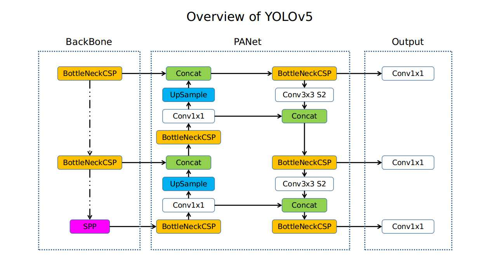
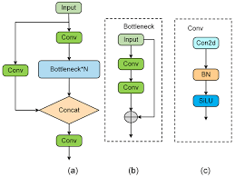
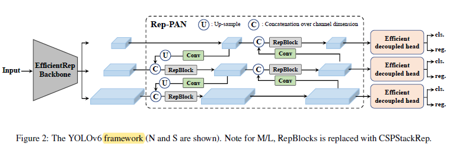
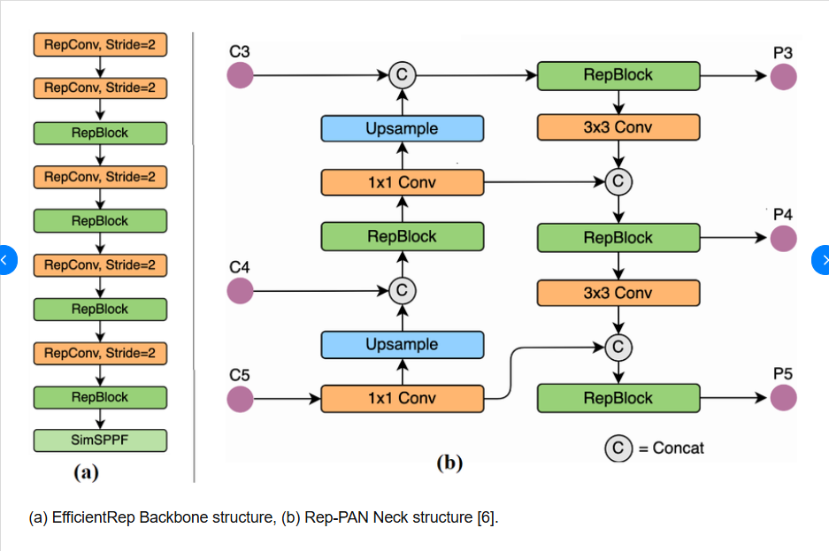
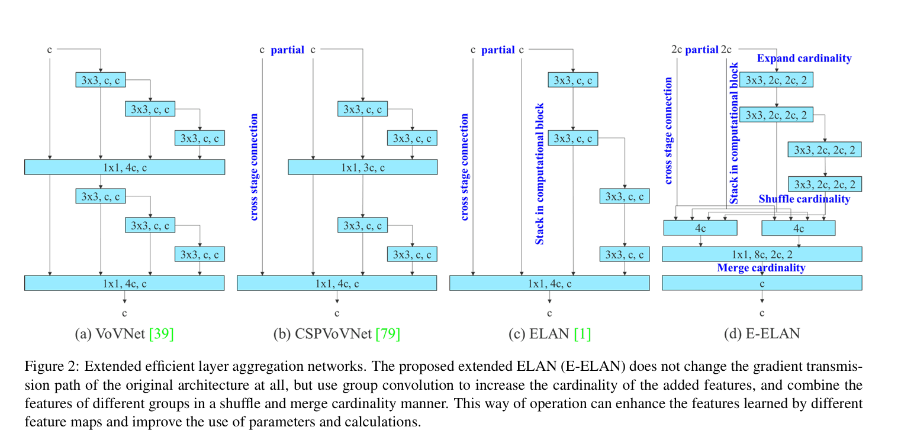


 
## 前言  
在上一期我详细介绍了YOLO的开端，以及从YOLOv1到YOLOv3的发展史，这一期我们将着重介绍从YOLOv4到YOLOv7的发展史。如果说v1到v3是YOLO（单阶段检测器）的探索期，那么本期YOLO在大的架构方面将会逐步稳定下来。“YOLO之父”Redmon在完成YOLOv3后就退出了YOLO系列的开发，但无数CV届的有志之士将不断将单阶段检测器推向新的高度。   

## YOLOv4  
### 背景  
YOLOv4发表于2020年的论文[《YOLOv4: Optimal Speed and Accuracy of Object Detection》](https://arxiv.org/abs/2004.10934)。主要工作由Alexey Bochkovskiy主导，这位也是CV领域大神，他后续还参与了YOLOv7的工作。  

首先不得不说的是，YOLOv4的研究恐怕是YOLO系列工作量最大、工程量最大的一个模型，论文原文中不仅对YOLO进行了大量创新，而且对每一个优化点都做了大量的工程试验以得到量化数据。我相信有过深度学习经验或发表过有关于深度学习论文的读者一定都知道我在说什么，其中大量的工程环节和消融实验让我光是看论文都觉得累，在这里由于篇幅和笔者能力限制不可能全部一一展开说明，只能大致介绍，如果有不理解的点各位可以查看原论文或开源仓库，感谢各位的理解。  

### 整体架构  
YOLOv4整体架构上延续了YOLOv3中FPN多尺度融合的思想，并最终提出了 **Backbone -> Neck -> Head**的架构，这标志着单阶段检测器整体架构的稳定，后来所有的单阶段检测器几乎都遵循这一整体架构。  

**1.CSPDarknet53（Backbone）**  
YOLOv4的backbone总体仍然使用YOLOv3中发明的Darknet-53，但在其中加入了CSP（Cross Stage Partial）连接模块，用来替换了原始网络中的“残差快”，将下采样后得到的特征图（每个Stage的入口处）从通道维度一分为二（各自用一个1x1的卷积压缩到C/2通道数），形成Part1和Part2两条通道。  

*Part1（短路）*：不经过残差快，直接横跨整个Stage。   
*Part2（主路）*：正常经过原来的N个残差快。  
两条路都走到Stage末尾后，做一次 **Concat**操作，再用一个1x1卷积将其中提炼的信息融合，把最终结果输出到下一个stage。  

  
这张图片非常清晰的展示CSP结构的数据流向，那么作者为什么要加入CSP连接呢？  

加入CSP连接的主要诉求，就是**减少梯度冗余**，这也是[CSPNet原论文](https://arxiv.org/abs/1911.11929)中提到的。在原网络中，梯度路径仅有唯一的一条，流经了所有的残差快，相邻层的梯度高度相关，大量的梯度冗余；加入了CSP后网络拥有了两条独立路径，梯度的来源不同，也降低了相邻层之间的梯度冗余。   
让人惊喜的是CSP带来的好处远不止这些，作者在实验中表明，CSP的加入减少了约20%的计算量，参数两也从原来的41M减少到27.6M；感受野从425x425（CSPResNeXt50 参照）提高到了725x725。   

这是一个非常重要的探索，接着往后学习，你会发现，后面的YOLO模型逐渐模块化，而像C3、C3K等等模块其实也使用CSP的思想，我们再接下来的章节也会讲到。

**2.SPP模块（Neck附加块）**   
  
示意图非常详细的展示了SPP模块的位置以及数据流向，简单来说就是把最后一个stage输出的深层特征图通过不同格式MaxPool进行感受野的放大，最后拼接回去并进行信息融合，这样原始的stage输出就携带了不同感受野的信息。  

需要强调的是SPP 不是插在 Backbone 的每个 Stage，而是只插在 **Backbone 最深层的输出之后**，紧接着进入PANet Neck之前。原论文说这样「significantly increases the receptive field, separates out the most significant context features and causes almost no reduction of the network operation speed」。   

在我们的上篇提到过MaxPool本身没有可学习参数，只是机械的计算窗口最大值，计算开销极小，新增的代价只有 Concat 后通道翻 4 倍带来的那一个 1×1 整合卷积，整体额外 FLOPs 不到 0.5%。这又是一个在不增加多少计算量的条件下提升网络性能的创新。

**3.PANet（Neck路径聚合）**  
  
PANet对比YOLOv3中的FPN，做出的最大改进用一句话就可以说清楚。把单行的自深层语义流向浅层位置信息的信息高速通路改为了双向的信息流动。   

原来的FPN浅层（56x56大感受野）的stage输出能够接收到来自深层的（13x13）带来的深层语义信息，但深层的stage输出却很难得到完整的浅层位置信息，这就是因为FPN的单向流动导致的。PANet在保留自深层到浅层的信息通路上加入了自浅层到深层的信息通路，将浅层的位置信息也能与深层的语义信息融合，保证输入到Head中的三个尺度都能含有位置信息和语义信息，这提升了模型整体的表达能力，并最终影响到了检测的精度。  

同时示意图中也提到了，原版PANet在两路特征融合时用的是逐元素相加（Add）。两路必须通道数相同，相加后信息直接叠加混合，两路特征互相干扰，区分度降低。YOLOv4把Add全部换成了Concat，然后接一个 1×1 卷积重新缩回需要的通道数，这样两路特征在通道维度上并排存放，各自独立，后续卷积可以自由选择利用哪一路的信息，表达能力更强。

**4.YOLOv3 Head（检测头，沿用）**  
YOLOv4 的检测头直接沿用 YOLOv3 的设计：Neck 输出三个尺度的特征图（52×52、26×26、13×13），各自经过若干 1×1 + 3×3 卷积后，输出预测张量，每个网格预测 3 个 Anchor 框，每个框输出 $(t_x, t_y, t_w, t_h, t_{obj})$ 加 $C$ 个类别置信度，共 $3 \times (5 + C)$ 个通道，三个尺度分别负责小、中、大目标的检测。YOLOv4 对 Head 本身未做改动，全部改进集中在 Backbone、Neck 和训练策略上。

### Bag of Freebies(BoF)  
“免费的午餐”，这是原论文中提出的概念，意味着下面的这些方法只在训练阶段发挥作用，推理阶段模型结构不变，在优化模型训练效果的同时不产生额外的使用开销。  

**数据增强**: 像素级增强  遮挡模拟  多图混合增强  
YOLO系列早期版本虽也使用了基础的数据增强，但 YOLOv4 是第一次系统化、大规模地将多种先进数据增强策略集成到训练流程中的版本。  

像素级增强包括了**光度失真（Photometric Distortion）**和**几何变换（Geometric Distortion）**。前者随机调整图像的亮度、对比度、色调、饱和度和噪声；后者随机缩放、裁剪、翻转、旋转。   

遮挡模拟包括了 ** Random Erase / CutOut**：在图像中随机选取矩形区域，填充随机值或零。**GridMask**：有规律地遮挡多个矩形区域。 **DropBlock**：在特征图层面做区域性随机丢弃，比 Dropout 更适合 CNN（Dropout 最初为全连接层设计）。    

多图混合增强包括了**MixUp**：将两张图像按不同比例加权叠加，标签也按比例混合。 **CutMix**：将一张图的裁剪区域覆盖到另一张图上，标签按面积比例调整。 **Mosaic**（YOLOv4 新提出）：将 4 张图像拼接成一张，使模型同时学习 4 种场景，有助于检测更小的目标，且降低了对 large mini-batch 的依赖。

**语义分布偏差处理**:  标签平滑 自对抗训练  
在视觉任务中，不同类别的样本数量、特征分布可能严重不均衡，导致模型在训练时出现偏差，YOLOv4在训练时做了以下的处理。  
**Label Smoothing（标签平滑）**：将 one-hot (0,1)硬标签转换为软标签(0.1,0.9)，提升模型鲁棒性，防止过拟合。**Self-Adversarial Training（SAT，自对抗训练）**：第一阶段：对输入图像执行对抗攻击，生成欺骗网络的对抗样本。第二阶段：用这些对抗样本正常训练网络。作用：提升模型对各种输入扰动的鲁棒性。

**边界框回归损失函数**:  
YOLOv3使用的传统方法用MSE对 $(x,y,w,h)$各点独立回归，忽略了边界框的整体性，且损失值随目标尺度增大而增大。原论文对IoU系列损失做出了详细的梳理和实验，最终选用了**CIoU Loss**： 
| 损失函数 | 考虑因素 | 不足 |
|----------|----------|------|
| MSE | 各坐标点独立回归 {x,y,w,h} | 忽视边界框整体性，损失随目标尺度增大而增大 |
| IoU Loss | 预测框与真值框的交并比（整体性） | 无重叠时梯度为零，无法引导框靠近真值 |
| GIoU Loss | IoU + 最小外接框惩罚（形状与方向） | 水平/垂直对齐时退化为 IoU，收敛慢 |
| DIoU Loss | IoU + 中心点距离 | 不考虑宽高比，形状匹配能力弱 |
| **CIoU Loss**（最终选用）| IoU + 中心点距离 + 宽高比一致性 | — |  
在实验中，CIoU同时考虑了重叠面积、中心点距离、宽高比，收敛速度和精度均优于前面几种

**归一化方法**:  
在YOLOv2中就引入了BN层（归一化的概念），而不同BN层存在的问题是单 GPU 训练时 batch size 很小（比如 4），用 4 张图算出的 **μ** 和 **σ** 噪声极大，归一化效果差。**CBN** 的解法是把过去 **k** 个 iteration 的统计量一起拿来用，相当于把「有效 batch size」扩大了 **k** 倍。但这里有一个麻烦：第 $t-3$ 次 iteration 时网络权重是 $\theta_{t-3}$，算出来的 **μ** 和 **σ** 是「在那组权重下」的激活值统计，到了第 $t$ 次 iteration 权重已经变成 $\theta_t$ 了，这两组统计量不在同一个坐标系下，不能直接平均。CBN 用泰勒多项式对旧统计量做补偿校正，把它们折算到「当前权重」下再合并，这个补偿计算是有额外开销的。

**CmBN** 将「跨 iteration」改成「跨 mini-batch within batch」，YOLOv4 训练时把一个大 batch 拆成 4 个 mini-batch 依次做前向，等 4 个 mini-batch 都跑完、权重还没有更新之前，把这 4 份统计量合并起来做一次归一化。这 4 个 mini-batch 是在同一组权重下跑的，统计量天然可比、无需任何校正，直接平均就是准确的。这样就既扩大了统计样本量，又完全规避了 CBN 里昂贵的泰勒补偿计算，实现简单、适合单 GPU 训练。

总结一下，**CmBN** 改的不是 BN 层里的计算逻辑，改变的是 **均值和方差从哪里收集** 这一件事。**CBN** 收集的信息跨越的是时间（不同 iteration，权重不同）；而 **CmBN** 跨越的是空间（同一 iteration 内的不同 mini-batch，权重相同），所以 CmBN 不需要再用泰勒多项式对旧统计量做补偿校正，减少了计算开销，这也解决了单 GPU 训练下 batch size 较小时导致BN 统计不稳定的问题，让 YOLO 系列真正可以在个人计算机上稳定训练。

**学习率调度**  
使用**Cosine Annealing LR（余弦退火学习率）**，让学习率按照余弦曲线平滑衰减，避免训练末期振荡，这也成为后续所有YOLO模型里默认的退火策略。

### Bag of Specials(BoS)  
这类方法不同于“免费午餐”，他们在推理阶段也会生效，会增加少许的计算量，但带来的精度收益远高于付出的代价。

**增大感受野**   
SPP（Spatial Pyramid Pooling）：如前所述，放在 Neck 中使用。  
值得一提的是ASPP / RFB也在论文中做过对比试验，最终YOLOv4选用了SPP。

**注意力机制**  
YOLOv4第一次引入了彼时火热的注意力机制模块——**SAM（Spatial Attention Module，空间注意力）**：并针对YOLOv4做了改进，将原本的卷积注意力改为**逐点注意力（point-wise attention）**。仅增加 0.1% 的额外计算量，却能提升模型对空间位置的聚焦能力。

**特征融合/路径聚合**  
如前文所述，加入PANet作为Neck的路径聚合模块，双向特征融合，增强多尺度表征。

**激活函数**   
替换了CSPDarknet-53 中的 Leaky ReLU激活函数，选择了**Mish 激活函数**： 
$$f(x)=x⋅tanh⁡(softplus(x))$$  
连续可微，在梯度传播上更平滑，有助于深层网络训练。

**后处理**   
DIoU NMS：在传统 NMS 基础上，将预测框的中心点距离信息加入筛选过程，对遮挡场景下的重叠框处理更准确，替代原来基于 IoU 阈值的 Soft-NMS。 

### 总结  
如原论文 Table 9 所示，YOLOv4 在 COCO test-dev 数据集上（输入分辨率 608×608，Tesla V100）取得了 **43.5% AP / 65.7% AP₅₀**，推理速度达 **65 FPS**；相比 YOLOv3（608×608）的 33.0% AP，精度提升约 **10.5 个百分点**，推理速度提升约 **12%**，在精度-速度曲线上全面超越了同期的 EfficientDet 系列。

YOLOv4整合了v3-v4那两年里计算机视觉领域的新成果，并将其定制化地运用到了YOLOv4中来，这是一项极其繁杂、庞大的工作，要不断地筛选，不断实验，还需要去归纳和判断不同策略或不同改进点之间互相影响的结果，向这篇论文的研究团队致敬。   

本章中我们简单介绍了v4的发展历史和做出的改进，你会发现随着模型越来越靠后，内在的结构和整体框架也越来越熟悉，而YOLO系列也正是在前人探索的基础上一步一步优化而来的。YOLOv4起到了承上启下的作用，它进一步拓展了v3，保留整体的骨干，为后续YOLOv5和Ultralytics的出现奠定了坚实的基础。

## YOLOv5  
### 背景  
2020年，由Glenn Jocher和Ultralytics带着全新的YOLOv5模型登场了，这可能是一些人心中最经典的YOLO模型，它深刻影响了YOLO社区和YOLO的底层实现方式。尽管研究团队没有将YOLOv5的成果转化为论文，但它的发布仍然像是给整个CV界投下一颗重磅炸弹，也宣告了YOLO系列Ultralytics(后简称U社)时代的来临。

值得一提的是，YOLOv5 的发布在社区中引发了一场不小的争议：部分研究者认为，在 Redmon 退出、原作者群体不知情的情况下，将一个没有论文支撑的工程项目命名为"YOLOv5"有蹭热度之嫌；也有声音认为这只是一个代号，评价模型本身才是重点。这场争论并没有定论，却在客观上埋下了后来 YOLO 系列群雄割据、各自为战的伏笔——从这里开始，"YOLOv×"的命名权不再归属于任何单一的学术机构。  

### 伟大的迁移  
一提到v5，首先想到的一定是这一次伟大的迁移，YOLOv1~YOLOv4都是基于C语言写的Darknet框架，部署复杂、生态封闭，对于新手的上手难度高。YOLOv5则用Pytorch完全进行了重构，从底层完全重写了网络结构，并且接入了丰富的Pytorch、Python社区。  

完全的重构，再加上U社在工程上的精妙设计，训练/推理/模型/检测头代码更易读，更容易修改，并且得益于Pytorch丰富的工具库，YOLOv5天然支持 TorchScript、ONNX、TensorRT 等格式导出，并借助Python已有生态，实现了训练数据可视化、实验追踪、数据管道追踪，使得科研人员能实时追踪训练动态，更好的定位问题。而在github上将整个工程项目开源出来，社区贡献的门槛大幅降低，任何人都可能成为YOLO系列的Contributer。这彻底点燃了人们对于YOLO的热情，YOLO的名字也开始不局限于CV学术届，国内外的大公司都开始着手研究，甚至将YOLOv5布局在商业产出中。   

U社的这一系列操作，让不同领域的开发者接触到了YOLO，不论是对YOLO本身进行开发，还是将YOLO应用到自己的实际项目中，进行私有定制或边缘部署，这些都极大地打响了YOLO的知名度，U社的大手开始发力。  
> 📄 U社文档 https://docs.ultralytics.com/zh/models/yolov5/   
> YOLOv5官方仓库 https://github.com/ultralytics/yolov5

### 网络架构  
#### 1.C3模块（CSP的YOLOv5实现）  

YOLOv5将YOLOv4里的CSP结构重新实现为C3模块（Cross Stage with 3 convolutions，名称来源于其中3个关键1×1卷积）。数据流上，输入经两个1×1卷积分为两路：短路直接横跨，主路经过N个Bottleneck堆叠，两路在末尾Concat后由第三个1×1卷积融合输出。与YOLOv4 CSP相比，C3在结构思想上完全一致（分路→Bottleneck堆叠→Concat→融合），Bottleneck内部的残差连接同样默认保留（`shortcut=True`）。本质区别在于这是一次用 PyTorch 对 Darknet CSP 的干净重写：代码更简洁、可读性更强，并天然获得 PyTorch 生态的所有工程红利。
C3是v5 Backbone的基本重复单元，后续v8中的C2f模块就是在C3的基础上演进而来的。   

#### 2.Focus层   
早期的YOLOv5在backbone的入口添加了一个**Focus**层，把输入的图像按像素间隔切片，将640x640x3变成320x320x12，再接一个3x3卷积。这样可以在不做池化的情况下实现两倍的下采样并保留所有像素信息。  

而在中后期的YOLOv5上，Focus层被替换成一个6x6，stride=2的卷积。因为有开发者实验发现二者效果相当，但后者更符合现代GPU计算，且对TensorRT量化更加友好。   

#### 3.SPPF(Spatial Pyramid Pooling - Fast)   
顾名思义，这就是YOLOv4中的SPP的改进版。SPP是把stage5中的输出**并行**送入 $k=1/5/9/13$四路进行MaxPool再Concat。YOLOv5将其改为SPPF，把三个5x5的MaxPool串行排列，等效的模拟了扩大感受野的效果。串行的池化从感受眼上等效于SPP的 5/9/13（每经过一个5x5，感受野扩展一次），但计算量大幅度减少，速度经实测超过SPP两倍以上，同时输出结果完全相同。  

$$SPP:  输入 → [MaxPool(1), MaxPool(5), MaxPool(9), MaxPool(13)] → Concat$$   
$$SPPF: 输入 → MaxPool(5) → MaxPool(5) → MaxPool(5) → Concat(各层输出)$$   

#### 4.模型缩放系列(n/s/m/l/x)   
YOLOv5首次在YOLO系列中引入**复合缩放(Compound Scaling)**,提供五个不同尺寸版本。   

| 版本 | 定位 | 参数量（约） | mAP50-95（COCO val） | FPS（V100） |
|------|------|------------|---------------------|------------|
| YOLOv5n(nano) | 极轻量，移动端/嵌入式 | 1.9M | 28.0% | 45 |
| YOLOv5s(small) | 轻量，平衡速度 | 7.2M | 37.4% | 98 |
| YOLOv5m(medium) | 通用场景 | 21.2M | 45.4% | 63 |
| YOLOv5l(large) | 高精度 | 46.5M | 49.0% | 40 |
| YOLOv5x(extra large) | 最高精度 | 86.7M | 50.7% | 23 |

> 数据来源：[YOLOv5 v6.1 官方 README](https://github.com/ultralytics/yolov5)，输入分辨率 640×640，Tesla V100，COCO val2017

控制缩放的方式包括控制网络深度（C3模块重复次数）和宽度（通道数），通过`depth_multiple` 和 `width_multiple`两个参数共同控制，而这一种模式在U社的工程方案里不断优化，最终演化成了使用yaml低代码形式，完成在模型工厂中的构建。你不需要写任何python代码就可以构建不一样的模型结构。

#### 5.PANet Neck（沿用）  
YOLOv5 的 Neck 直接沿用 YOLOv4 的 PANet 双向特征融合结构：Backbone 输出的 P3/P4/P5 三个尺度先经自顶向下的语义增强通路，再经自底向上的位置增强通路，保证每个尺度都同时携带浅层位置信息和深层语义信息后再送入检测头。与 YOLOv4 的区别在于，Neck 内的特征融合模块同样换成了 C3，代替原版 PANet 中的 CBL 堆叠，与 Backbone 保持统一的基本单元。

### Bag of Freebies——数据增强  
YOLOv5在YOLOv4的基础上增加和完善了多种数据增强   
| 增强方式 | 说明 |
|----------|------|
| **Mosaic**（继承自 v4） | 4 图拼接，扩大场景多样性 |
| **MixUp** | 两图按比例叠加 |
| **Copy-Paste** | 将目标实例随机复制粘贴到其他图像 |
| **Random Affine** | 随机旋转、缩放、平移、剪切 |
| **HSV 增强** | 随机调整色调/饱和度/亮度 |
| **Random Horizontal Flip** | 随机水平翻转 |
| **Albumentations** | 集成第三方增强库（可选） |    

### 损失函数的设计  
YOLOv5的总损失和YOLOv4几乎一致，主要由三部分组成：  
$$Loss = \lambda_1 L_{cls} + \lambda_2 L_{obj} + \lambda_3 L_{loc}$$   

| 分项 | 使用的损失函数 | 说明 |
|------|-------------|------|
| 分类损失 $L_{cls}$ | BCE Loss | 多标签二元交叉熵 |
| 置信度损失 $L_{obj}$ | BCE Loss | 是否含有目标 |
| 定位损失 $L_{loc}$ | **CIoU Loss** | 继承自 YOLOv4 |   

**除此之外，YOLOv5对于不同尺度的输出，有不同的设计**  

三个检测层（P3/P4/P5）的置信度损失权重不同。公式如下：  
$$L_{obj} = 4.0 \cdot L_{obj}^{small} + 1.0 \cdot L_{obj}^{medium} + 0.4 \cdot L_{obj}^{large}$$   
对于小目标检测层（P3，52x52）权重最大（4.0），因为小目标样本较少，漏检代价高；大目标检测层（P5，13x13）权重最小（0.4）。
这是YOLOv5对不同尺度检测头差异化关注的体现。 

### 边界框解码公式的改进  
这是一个冷门知识点，在YOLOv5中很容易被忽视但也很重要的一个细节。  

**YOLOv2/v3 的公式：**  

$$b_x = \sigma(t_x) + c_x, \quad b_y = \sigma(t_y) + c_y$$   

$$b_w = p_w \cdot e^{t_w}, \quad b_h = p_h \cdot e^{t_h}$$   

**存在的问题：**   

$\sigma(t_x)$ 的值域是 $(0, 1)$，中心点偏移永远无法精确到 0 或 1（即网格边缘），需要极端的 $t_x$ 值才能接近边界，梯度极小，优化困难。这就是「网格敏感性」问题。  
$e^{t_w}$ 无上界，宽高预测可以爆炸性增长，容易引发梯度爆炸和 NaN loss。  

**YOLOv5 的改进公式：**   

$$b_x = (2\sigma(t_x) - 0.5) + c_x, \quad b_y = (2\sigma(t_y) - 0.5) + c_y$$   

$$b_w = p_w \cdot (2\sigma(t_w))^2, \quad b_h = p_h \cdot (2\sigma(t_h))^2$$  

**改进效果：**  

中心点偏移范围从 $(0, 1)$ 扩展到 $(-0.5, 1.5)$，可以轻松到达网格边缘甚至跨越到相邻网格，消除边界梯度消失问题。   
宽高缩放比被限制在 $(0, 4)$ 倍 Anchor 大小，彻底消除了 $e^{t_w}$ 无界带来的训练不稳定风险。  

### 正样本匹配策略改进（build target）  
YOLOv5 改进了将 GT Box 分配给 Anchor 的策略：

**宽高比匹配：** 计算 GT 框和 Anchor 模板的宽高比 $r_w = w_{gt}/w_{at}$，$r_h = h_{gt}/h_{at}$，取 $r^{max} = \max(r_w^{max}, r_h^{max})$，若 $r^{max} < 4$ 则认为匹配成功（阈值可配置）。

**多网格分配：** 由于中心点偏移范围扩展到了 $(-0.5, 1.5)$，一个 GT Box 的中心点除了归属于其所在的网格外，还可以被分配给上/下/左/右相邻的网格参与预测，将正样本数量增加了约 3 倍，缓解了正负样本极度不均衡的问题，提升训练收敛速度。这进一步完善了YOLOv3中提出的Anchor-based策略，是Anchor的集大成者。   

### 优化器相关策略   
得益于整体迁移到Pytorch上进行开发，YOLOv5有更丰富的Optimizer进行选择和调用，在训练阶段能够使模型更加稳定的收敛，并减轻计算负担。    

| 策略 | 说明 |
|------|------|
| **Warmup + Cosine LR** | 训练初期线性升温，之后余弦衰减，继承自 YOLOv4 |
| **EMA（指数移动平均）** | 对模型权重做滑动平均，推理时使用 EMA 权重，比 SGD 瞬时权重更稳定，泛化性更好 |
| **混合精度训练（AMP）** | FP16 + FP32 混合，显存减半，速度提升，无精度损失 |
| **超参数进化（Evolve）** | 用遗传算法自动搜索最优超参数组合（学习率、增强强度等），默认演化 300 代（轮数可配置） |
| **AutoAnchor** | 训练前用 k-means 对数据集 GT Box 聚类，再用遗传算法以 CIoU + Best Possible Recall 为适应度函数优化 Anchor，迭代 1000 代，使 Anchor 与自定义数据集匹配 |   

这里的EMA、AMP、超参数进化等等，由于篇幅限制，在这篇博客中没法深入展开，因为这里面每个点几乎都可以单开一篇博客详谈，
如果各位读者对此感到好奇，可以到给种论坛或博客了解。   

### 总结  
YOLOv5做出的最大贡献就是把整个YOLO模型移植到了生态更丰富，对开发者更友好的Pytorch上，这其中其实也有相当不小的工作量，而且代码构建难度很高。事实证明这是个相当有远见的策略，它确实营造了现如今YOLO社区百花齐放的景象。而在当时，YOLOv5的仓库开源出来之后，也在内部不断迭代，这离不开GitHub上广大开源贡献者的贡献，所谓众人拾柴火焰高，每经过一个YOLOv5的小版本，背后都有人在对它不断做出改进和优化，向他们同样致以崇高敬意。  

而YOLOv5在模型优化和模型训练上也做出了大量的贡献，这其中除了U社的贡献，开源开发者做出的贡献也不容小觑。而他们共同把YOLOv5推向了市场，据我所知，现在仍然有许多目标检测、人脸识别等商业项目在沿用着YOLOv5，这也算得上是CV学术界将成果转化的标志性案例。   

U社也就此开启了它在CV界的传奇征程，顺便一提，笔者将在2026.5.14前往深圳参加U社组织的线下见面/问答会，如果读者有什么想问的问题说不定可以留言评论（？）直到今天U社在GitHub上面的仓库依然活跃，我们始终期待它能否给我们带来新的惊喜。  

## YOLOv6  
### 背景  
YOLOv6——一个比较小众，使用较少的版本，它由美团视觉智能部开发，并在2022年6月发表了论文[《YOLOv6: A Single-Stage Object Detection Framework for Industrial Applications》](https://arxiv.org/abs/2209.02976)。   

再上一个章节我们提到，YOLO形成了群雄割据的局面，它的命名权不属于任何一个公司或学术机构，而美团抢得了先机，抢先发布的按照自己需求优化的YOLO模型，而他们优化的方向更加考虑模型在边缘设备（硬件）上的部署效率。   
> **开源地址**：[github.com/meituan/YOLOv6](https://github.com/meituan/YOLOv6)

### 整体结构
YOLOv6 同样遵循 **Backbone → Neck → Head** 的整体框架，并在这三个组件上分别引入了全新的设计。整个网络最核心的亮点是**结构重参数化（Structural Re-parameterization）**技术的大规模运用，这让 YOLOv6 在训练和推理阶段拥有完全不同的网络结构，从而同时获得训练时的表达能力和推理时的部署效率。

#### 1. EfficientRep Backbone（结构重参数化）
YOLOv6 摈弃了 YOLOv5 的 C3 + CSP 路线，改用基于 RepConv（Reparameterizable Convolution）构建的 **EfficientRep** 作为 Backbone。   

**RepConv** 的核心思想来源于 [RepVGG（2021）](https://arxiv.org/abs/2101.03697)，本质是"训练时多分支、推理时单分支"：

- **训练阶段**：每个 RepConv 块是三路并联结构——3×3 卷积、1×1 卷积、Identity 捷径（仅在输入输出通道数相同时存在），三路结果逐元素求和输出。多分支结构类似小型隐式集成，梯度路径更丰富，特征表达能力更强。 

 

$$y_{train} = Conv_{3\times3}(x) + Conv_{1\times1}(x) + x$$

- **推理阶段**：利用卷积的线性可加性，将三路卷积**在参数层面合并**为一个等价的 3×3 卷积。1×1 卷积零填充边缘后等价为 3×3，Identity 等价于中心为 1、其余为 0 的 3×3 卷积核，吸收各自的 BN 参数后三者直接求和，推理时整个模块退化为一个简洁的 3×3 卷积。

$$y_{infer} = Conv_{3\times3}^{merged}(x)$$

这一设计带来了极大的工程价值：单一 3×3 卷积对现代 GPU / NPU / TensorRT 极度友好，没有残差加法、没有多路分支带来的额外显存占用，INT8 量化也更加稳定。这正好契合美团对边缘硬件部署效率的核心诉求。

在具体实现上，YOLOv6 针对不同规模的模型采用了不同策略：小模型（N/S）使用纯 **RepBlock**（多个 RepConv 堆叠），大模型（M/L）则引入 **CSP-RepBlock**，融合了 CSP 分路思想与 RepConv，在参数量更大的模型上进一步压缩冗余计算。

#### 2. Rep-PAN Neck（沿用 PANet，替换基本单元）
Neck 结构沿用了 YOLOv4/v5 中经过验证的 PANet 双向特征融合路径（P3/P4/P5 三尺度，自顶向下语义增强 + 自底向上位置增强），但将 Neck 内部的特征融合模块全部替换为 **RepBlock**，形成 **Rep-PAN**。

这与 YOLOv5 把 PANet 内的特征融合模块堆叠替换成 C3 的思路如出一辙，用当前版本的反复核心基本单元统一配置，保持 Backbone 与 Neck 的一致性，同时在 Neck 中也享受到结构重参数化带来的推理加速红利。

#### 3. 解耦检测头（Anchor-Free）
这是YOLOv6在YOLO中首次引入的两项颠覆性改动。将检测头解耦深刻影响后面所有的YOLO模型，也使得YOLO未来在面对不同任务（目标检测、语义分割、实例分割等）有了更方便的使用空间。

**Anchor-Free（无锚框设计）**

回顾YOLOv2～v5，每个网格都需要预定义若干Anchor模板GT Box必须找到最接近的Anchor才能被匹配，训练前还需要AutoAnchor对数据集做聚类。这套机制在不同数据集和不同输入分辨率下都需要重新调整，部署灵活性差。

YOLOv6采用了**无锚框设计**：每个网格直接预测目标中心点偏移量和框的宽高，不依赖任何预设Anchor模板，每个特征图上的每一个位置（网格点）都是一个**潜在的检测候选点**，不再绑定任何预设 Anchor 尺寸。消除了Anchor调参的工程负担，也让模型的泛化性更强。  

从Anchor-free到Anchor-based，再到回到Anchor-free，这本身就是研究团队再不断深入研究和试验后取得的成果。

**解耦检测头（Decoupled Head）**

YOLOv5 使用耦合检测头——分类分支和回归分支共享同一套卷积特征，最终输出层直接预测 $[t_x, t_y, t_w, t_h, obj, cls_1, \ldots, cls_C]$。

YOLOv6 将检测头拆分为两个独立的分支：
- **分类分支**：专注于语义特征，预测各类别置信度
- **回归分支**：专注于几何/空间特征，预测边界框坐标

这种解耦设计的逻辑非常清晰，分类任务依赖语义特征，定位任务依赖几何特征，强行耦合会让两个任务相互干扰，各自分开优化后精度更高。

### 正样本匹配：Task-Aligned Learning（TAL）
去掉了 Anchor 之后，正样本匹配策略也需要随之重新设计。YOLOv6 采用了来自 [TOOD（2021）](https://arxiv.org/abs/2108.07755)的 **TAL（Task-Aligned Learning）**。

YOLOv5 的 Anchor-based 匹配依赖宽高比阈值决定哪个 Anchor 对应哪个 GT，本质是纯几何匹配。TAL 换了一个视角：既然最终关心的是分类准不准和框回归准不准，那就**直接用这两个任务的质量联合评分**，分数最高的候选框才被认为是正样本。

TAL为每个GT Box和候选预测框计算一个**任务对齐分数**：

$$t = s^{\alpha} \cdot u^{\beta}$$

其中 $s$ 是分类预测得分，$u$ 是预测框与GT的IoU，$\alpha$ 和 $\beta$ 控制两个任务的权重比例。再从所有候选中按 $t$ 值取 **Top-k** 作为正样本。而这里的 $s$ 和 $u$ 分别代表模型在分类和定位两个子任务上的当前预测质量，直接来自前向传播的输出，无需额外计算。这种用预测质量本身来指导正样本选择的设计，比纯几何的 Anchor 匹配更贴近训练目标，在实验中效果也更好。

这样的匹配策略让"分类质量高且定位精准"的预测框优先成为正样本，从训练策略层面就对分类和回归两个任务进行了对齐，避免了分类打分高但框偏差大的"噪声正样本"污染梯度。

### 损失函数设计
#### 分类损失：VariFocal Loss（VFL）
普通的 Focal Loss 通过 $(1 - p)^\gamma$ 降低易分样本的权重，正负样本使用相同的调制策略。**VariFocal Loss** 来自 [VariFocalNet（2021）](https://arxiv.org/abs/2008.13367)，对正负样本进行**非对称调制**：

$$VFL(p, q) = \begin{cases} -q(q\log p + (1-q)\log(1-p)) & q > 0 \text{（正样本）} \\ -p^{\gamma} \log(1-p) & q = 0 \text{（负样本）} \end{cases}$$

正样本的学习目标 $q$ 不再是硬标签 1，而是**预测框与 GT 的 IoU 值**（软标签），迫使模型学习预测"这个框有多好"，而不只是"这里有没有目标"。负样本仍使用Focal Loss的指数调制压低简单背景样本的权重。这与 TAL 中对分类-定位联合质量的建模思路形成了很好的呼应。

#### 回归损失：SIoU Loss
YOLOv6 在回归损失上引入了 **SIoU Loss**（来自 [SIoU（2022）](https://arxiv.org/abs/2205.12740)），在 CIoU 的基础上额外加入了**角度对齐代价（Angle Cost）**：

| 损失函数 | 组成项 |
|----------|--------|
| CIoU | IoU + 中心点距离 + 宽高比 |
| **SIoU** | IoU + 中心点距离 + 宽高比 + **角度对齐** |

SIoU 先通过角度损失约束预测框中心与 GT 中心连线的方向，引导预测框沿水平或垂直方向收敛；方向对齐后再用距离损失缩小中心点偏差。这种分步引导的收敛路径比 CIoU 更短，在实验中收敛速度更快。

### 模型系列
YOLOv6 同样提供了多个尺寸版本以覆盖不同部署场景，以下数据来自 [YOLOv6 v3.0 论文（arXiv 2301.05586）](https://arxiv.org/abs/2301.05586)：

| 版本 | 参数量（约） | mAP50-95（COCO val） | 吞吐量（img/s） |
|------|------------|---------------------|----------------|
| YOLOv6-N | 4.7M | 37.5% | 1187 |
| YOLOv6-S | 18.5M | 45.0% | 484 |
| YOLOv6-M | 34.9M | 50.0% | 226 |
| YOLOv6-L | 59.6M | 52.8% | 116 |

> 数据来源：[YOLOv6 v3.0 arXiv 2301.05586](https://arxiv.org/abs/2301.05586)，COCO val2017，NVIDIA T4，TensorRT7

v3.0 是对初版的全面升级，在各尺寸上精度均有显著提升，感兴趣的读者建议以 v3.0 为基准进行横向比较。

### 总结
YOLOv6 是 YOLO 数字序列中首个完全拥抱 **Anchor-Free + 解耦头** 设计范式的版本，同时以结构重参数化为核心卖点，将"训练期表达力"和"推理期效率"这两个看似矛盾的目标在同一个模型里统一了起来。

相比 YOLOv5，YOLOv6 在 mAP50-95 上有约 7～8 个百分点的提升（以Small规格横向比较：45.0% vs 37.4%），在吞吐量上同样具有竞争力。

不过，YOLOv6在社区影响力上确实不如 YOLOv5，也没有像 U 社那样形成完整的工程生态，但却开创了企业孵化YOLO模型的先河。作为美团内部孵化并推向开源的工业化产品，它更多地被定位为**特定硬件场景下的工程方案**，而非通用的社区生态项目。但它引入的结构重参数化和Anchor-Free设计理念，已经在整个目标检测社区播下了种子——你会发现，这些思想在此后的 YOLOv8、RT-DETR 等模型中都有不同形式的延续。

## YOLOv7
### 背景
2022年7月，[《YOLOv7: Trainable Bag-of-Freebies Sets New State-of-the-Art for Real-Time Object Detectors》](https://arxiv.org/abs/2207.02696)正式发布。论文出自 Chien-Yao Wang、Alexey Bochkovskiy 和 Hong-Yuan Mark Liao 之手——YOLOv4 的主要贡献者 Bochkovskiy 时隔两年回归，与台湾中央研究院的 Wang 和 Liao 再度联手。

值得一提的是，YOLOv7 和 YOLOv6 几乎在同一时间段发布，这正是当时 YOLO 系列群雄割据的缩影。两者走的是截然不同的路线：YOLOv6 专注于结构重参数化和部署效率，YOLOv7 则把重心放在了更高的检测精度和更系统化的训练策略上，在精度-速度曲线上打出了当时实时检测器的新高点。

论文的核心主张借用了 YOLOv4 的框架语言——**Trainable Bag-of-Freebies（可训练的免费午餐）**，你可以把它理解为Alexey Bochkovskiy对自己两年前YOLOv4模型的更进一步。所有改进都不改变推理结构，不增加推理开销，却能通过更好的训练设计大幅提升精度。这也是论文名称的由来——在不牺牲速度的前提下，把精度"白赚"回来。

### 整体结构
YOLOv7 同样遵循 **Backbone → Neck → Head** 框架。最核心的架构创新集中在 Backbone——用 **E-ELAN** 取代了此前的 CSPDarknet / EfficientRep 路线；Neck 沿用 PANet 双向融合并以 E-ELAN 块为基本单元；Head 延续 YOLOv5 风格的耦合锚框检测头。  

#### 1. E-ELAN Backbone（高效层聚合网络）
YOLOv7 的 Backbone 核心是 **E-ELAN（Extended Efficient Layer Aggregation Networks）**，这一设计来自同团队对**梯度路径**的系统性研究。

理解 E-ELAN，需要先理解 **ELAN** 的设计哲学：

梯度从输出层反向传播时，路径越短信息越直接但特征复用越少，路径越长特征越丰富但梯度容易消失。ELAN 的核心思路是**同时维护"短路"和"长路"两类梯度通道**：输入在经过一系列卷积堆叠的同时，将不同深度处的中间层输出全部保留，最后统一 Concat 聚合。这样浅层的位置信息和深层的语义信息都能流入最终特征，梯度路径的长短由设计者显式控制，既不会太浅（特征单一），也不会太深（梯度消失）。

**E-ELAN** 在 ELAN 的基础上引入 **expand-shuffle-merge（扩展-混洗-归并）** 策略，使其能干净地扩展到更大规模的模型：

- **Expand（扩展）**：在每条并行路径内部使用**分组卷积（Group Convolution）**，将通道切分为多个独立的组，在不显著增加 FLOPs 的前提下扩展特征多样性
- **Shuffle（混洗）**：对分组后的通道进行重排（类似 ShuffleNet 的 Channel Shuffle），使不同组之间的信息能够流通，避免各组特征退化
- **Merge（归并）**：重新 Concat 聚合，保持整体通道数的一致性。  

这样做的好处在于：模型容量可以通过增加分组数来扩展，而不必改动梯度路径的网络结构本身，保证了训练稳定性和可扩展性。

#### 2. 针对拼接架构的复合缩放策略
YOLOv5 引入了通过YOLOv5同款的 `depth_multiple` 和 `width_multiple` 控制的复合缩放，这套策略对**序列卷积**网络工作良好。但 E-ELAN 是基于 **Concat 拼接**的聚合架构，存在一个隐患：

当你缩放深度（增加 ELAN 中的并行路径数量）时，最终 Concat 输出的通道数也随之增加。如果不同步调整后续 **过渡层（Transition Layer）** 的宽度，通道数就会不匹配，整网无法正常构建。

YOLOv7 为此专门设计了**拼接架构的复合缩放规则**：

**每次缩放深度时，必须同步缩放所有与之 Concat 关联的过渡层宽度，保持整网通道一致性。**

这是一个容易被忽视但至关重要的工程细节，也是 YOLOv7 能够干净地扩展出 YOLOv7-X / W6 / E6 / D6 / E6E 等完整系列版本的基础。

#### 3. 重参数化规划（RepConvN）
受 YOLOv6 的启发，YOLOv7 同样希望在 ELAN 的卷积层上使用结构重参数化来提升训练期的表达能力。

然而，原版 RepConv 的三路并联包含一条 **Identity 捷径**，这条直连路径在残差结构（$y = F(x) + x$）中天然成立；但在 ELAN 的 Concat 拼接结构里，不同来源的特征通道被并排拼接，Identity 加法会让通道语义混淆，破坏聚合结构的逻辑。

YOLOv7 的解决方案是使用 **RepConvN**（去掉 Identity 分支的 RepConv）：

$$y_{train} = Conv_{3\times3}(x) + Conv_{1\times1}(x)$$   

推理时仍然合并为单个 3×3 卷积。这样既保留了多分支训练的优化收益，又与 ELAN 的 Concat 拼接结构兼容。可以把这理解为 YOLOv7 根据自身网络拓扑对重参数化方案做出的**定制规划（Planned Re-parameterization）**——并非照搬 YOLOv6 的设计，而是针对自身架构特点做了适配。

### 训练创新：可训练的 Bag of Freebies
以下改进全部只作用于训练阶段，推理时网络结构完全不变，是真正意义上"不花推理代价"的精度提升。

#### 辅助训练头（Auxiliary Head）
YOLOv7 在 Backbone 或 Neck 的中间位置额外接入**辅助检测头（Auxiliary Head）**，与最终的主检测头（Lead Head）并行。辅助头只在**训练阶段参与前向和反向传播**，为中间层特征提供额外的梯度监督信号；推理时辅助头被完全移除，不引入任何额外开销。

YOLOv7 在此基础上设计了 **粗细结合（Coarse-to-Fine）** 的分工：
- **Lead Head（主检测头）**：负责精细预测，采用较严格的正样本匹配策略，产出最终检测结果
- **Auxiliary Head（辅助检测头）**：负责粗粒度预测，采用较宽松的正样本匹配策略，产出更密集的监督信号

辅助头的宽松匹配能分配到更多正样本，为中间层特征提供密集的监督，引导中间层表示往检测友好的方向收敛；主检测头的严格匹配则保证最终输出的精准度。训练结束后辅助头清零，只留主检测头做推理。

#### Lead Head 引导的标签分配
辅助头的"宽松匹配"到底宽松到什么程度？YOLOv7 的答案是：**由 Lead Head 的预测结果来决定**。

具体机制：先用主检测头当前的预测结果运行一次标签匹配，得到精细正样本集合 $S_{lead}$；再在此基础上放松约束，将更多候选框纳入辅助头的正样本集合 $S_{aux}$：

$$S_{aux} \supseteq S_{lead}$$

这样，辅助头的学习目标始终与主检测头的优化方向保持一致，不会因为宽松匹配引入梯度噪声——两个头从训练第一步起就协同收敛。

### 模型系列
YOLOv7 提供从轻量到超大的完整系列，以下数据来自 [YOLOv7 原始论文（arXiv 2207.02696）](https://arxiv.org/abs/2207.02696)，测试集 COCO test-dev，推理设备 Tesla V100：

| 版本 | 输入分辨率 | 参数量（约） | mAP50-95 | FPS（V100，batch=1） |
|------|-----------|------------|----------|---------------------|
| YOLOv7 | 640×640 | 36.9M | 51.4% | 161 |
| YOLOv7-X | 640×640 | 71.3M | 53.1% | 114 |
| YOLOv7-W6 | 1280×1280 | 70.4M | 54.9% | 84 |
| YOLOv7-E6 | 1280×1280 | 97.2M | 56.0% | 56 |
| YOLOv7-D6 | 1280×1280 | 154.7M | 56.6% | 44 |
| YOLOv7-E6E | 1280×1280 | 151.7M | 56.8% | 36 |

> 数据来源：[YOLOv7 arXiv 2207.02696](https://arxiv.org/abs/2207.02696)，COCO test-dev，Tesla V100，batch=1

在 640×640 输入下，YOLOv7 发布时以 51.4% AP / 161 FPS 超越了同期所有实时检测器，包括 YOLOv5-X（50.7% AP）。W6 / E6 / D6 / E6E 系列则是面向高精度场景的大分辨率版本。

### 总结
YOLOv7 是本期介绍的最后一个YOLO版本，也是YOLO系列里最后一个以"论文驱动、精度优先"为核心的大版本——此后 U 社接管，以 YOLOv8 开启了工程化优先的新时代。Alexey Bochkovskiy团队还是如同当初研发v4时一样，论文中无不展示着他们庞大的工作量和复杂的实验设计。

论文的最大亮点不是单一创新，而是将 E-ELAN、辅助训练头、Lead Head 引导标签分配、RepConvN 这一系列改动统一在"可训练 BoF"的框架下：**所有训练期的复杂机制，在推理时都归零**，用户拿到的是一个干净、快速的推理模型。"训练复杂、推理简单"的哲学在 YOLOv7 之后成为高性能检测器设计的重要范式。

从 v4 的“系统化 BoF/BoS 实验”，到 v5 的“PyTorch 生态迁移”，再到 v6 的“结构重参数化 + Anchor-Free”，再到 v7 的“可训练BoF + 保留每一层的特征图进行融合”，每一代 YOLO 都在前人的肩膀上找到了自己的突破口。而这四年间的积累，也为 YOLOv8 和此后更多版本的诞生提供了深厚的土壤。