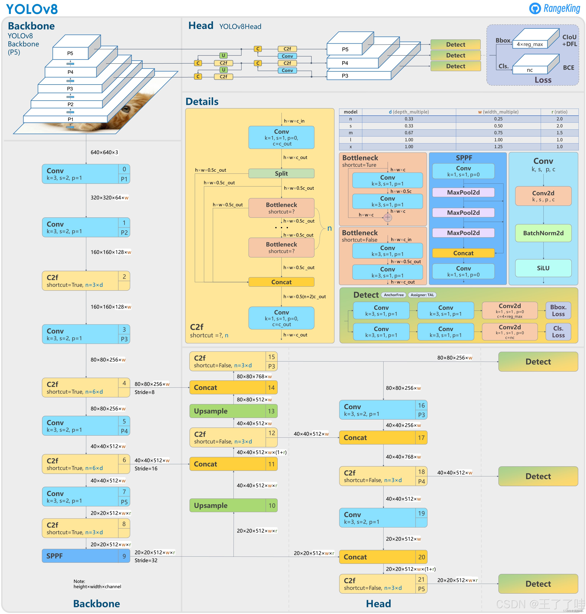
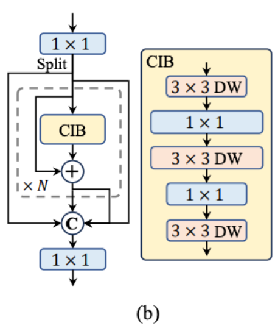
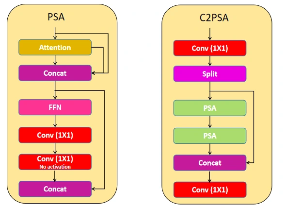
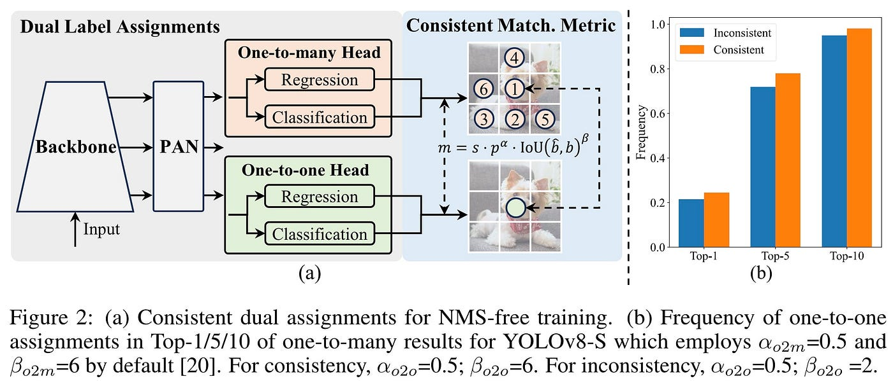
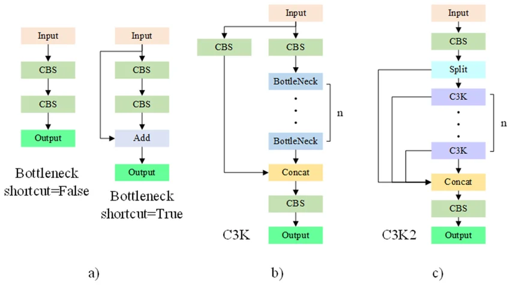

  

## 前言  
我们已经学习聊过了从 YOLOv1 到 YOLOv7 的发展，了解了 YOLO 从一个想法发展到日益成熟且不断精进的单阶段检测器。
而今天我们将介绍从 YOLOv8 一直到 YOLO26 的发展史。   

因为篇幅限制，本篇注定只能大概的对模型发展进行梳理，
特别是考虑这一篇的主角——Ultralytics（后简称U社），在同一大型号内部在不断进行小版本的迭代，这其中的改进，不论是工程上还是网络上的，都不可能详细展开说明，希望各位读者理解，如若有感兴趣的地方，诸位可以自行在网上寻找资料。   

## YOLOv8   
### 背景    
在很多人心中，YOLOv8 是最能代表 YOLO 系列的模型，因为它实在是太出名了，无数人用它做完了毕设，水了顶刊顶会。
在Google Scholar上搜索关键词 YOLOv8，会出现大量关于v8的论文。这一点我们上一篇提到的U社功不可没。   

YOLOv8 由U社正式发布于2023年，U社出品的新一代 YOLO 模型，并首次将模型集成到 Ultralytics 库中，
可以使用库中丰富的功能，简单、快捷进行模型训练/调优/推理/配置。放到今天，哪怕你对Python一窍不通，
也能用当下流行的AI coding软件训练自己的模型，哪怕你没有高性能显卡，依然可以使用CPU进行轻量模型的训练。   

虽然本系列博客的介绍一直集中在网络架构等方面，但不得不说 YOLOv8 在工程上的实践贡献绝对要超过网络架构上的改进——它是在是太方便太好用了。

> **开源地址**：[github.com/ultralytics/ultralytics](https://github.com/ultralytics/ultralytics)

### 整体结构
YOLOv8 整体延续了 Backbone → Neck → Head 的检测框架，与 YOLOv5 一脉相承，但对三个部分都做了现代化改造。最核心的结构改动是将 YOLOv5 的 **C3 模块**全面替换为新设计的 **C2f 模块**；同时在检测头上彻底摒弃了 Anchor 机制，采用 Anchor-Free 的解耦检测头。

需要特别说明的是：YOLOv8 **最初并没有随之发布论文**，只有一个 GitHub 仓库和官方文档，属于工程先行的发布方式，这在 YOLO 系列里颇为罕见。

#### 1. Backbone：C2f 模块（替代 C3）
YOLOv5 的 C3 模块将输入分为两路，一路经过若干 Bottleneck 堆叠，另一路直接跳连，最后 Concat 合并。C3 的局限在于梯度路径较单一——深层 Bottleneck 的梯度必须经过所有浅层才能回传。  

图示：YOLOv8整体网络结构    

YOLOv8 用 **C2f（Cross-Stage Partial with 2 outputs and more feature reuse）** 取而代之，其设计理念直接受到 YOLOv7 ELAN 梯度路径哲学的启发：

将输入投影为 $2c$ 维后均分为两个分支 $y_0, y_1 \in \mathbb{R}^c$，随后 $y_1$ 依次经过 $n$ 个 Bottleneck 得到 $b_1, b_2, \ldots, b_n$，将所有中间输出全部拼接后经过一个 $1\times1$ 卷积输出：

$$\text{C2f}(x) = \text{Conv}_{1\times1}\!\left(\text{Concat}(y_0,\; y_1,\; b_1,\; b_2,\; \ldots,\; b_n)\right)$$

与 C3 相比，C2f 多出了 $n$ 条直接通往输出的捷径：每个 Bottleneck 的输出都参与最终 Concat，梯度可以绕过后续层直接回传，有效缓解深层梯度消失。这正是 ELAN 所倡导的让不同深度的特征都直接贡献到最终输出的思路在 YOLOv8 中的落地。

#### 2. Neck：同样替换为 C2f
Neck 沿用 PANet 的双向特征融合路径（P3/P4/P5 三尺度，自顶向下语义增强 + 自底向上位置增强），将原有的 C3 模块统一替换为 C2f，保持与 Backbone 的设计一致性。

#### 3. Head：Anchor-Free + 解耦头 + 移除 Objectness
YOLOv8 沿用了 YOLOv6 已验证的无锚框设计和解耦检测头，并额外**移除了 Objectness（目标性）分支**。

在 YOLOv5 中，每个检测位置输出为 $[t_x, t_y, t_w, t_h, \text{obj}, \text{cls}_1, \ldots, \text{cls}_C]$，其中 $\text{obj}$ 独立预测“此处是否存在目标”。YOLOv8 认为在无锚框设计下 $\text{obj}$ 与分类分支存在语义重叠，因此直接删除，输出简化为两条独立分支：

- **分类分支**：$C$ 维向量，sigmoid 激活，预测各类别置信度
- **回归分支**：$4 \times \text{reg\_max}$ 维向量，预测边界框的 ltrb 距离分布（详见 DFL 损失）

### 正样本匹配：TAL（沿用 YOLOv6）
YOLOv8 继续沿用了来自 TOOD 的 TAL 正样本匹配策略，公式与流程和 YOLOv6 完全一致：

$$t = s^{\alpha} \cdot u^{\beta}$$

用分类得分 $s$ 与预测框-GT IoU 的乘积对每个候选位置打分，取 Top-k 作为正样本。可参见上一篇 YOLOv6 章节中的详细介绍，此处不再赘述。

### 损失函数设计
YOLOv8 回归损失的核心亮点是引入了 **DFL（Distribution Focal Loss）**，来自 [Generalized Focal Loss（GFL, 2020）](https://arxiv.org/abs/2006.04388)。

#### 分类损失：BCE
分类分支使用标准的 Binary Cross-Entropy（BCE），配合 TAL 的 Top-k 软正样本标签。

#### 回归损失：CIoU + DFL
**DFL** 改变了传统回归头对坐标的建模方式——不再直接输出一个确定性的距离值，而是输出一个在离散区间 $[0, 1, \ldots, n]$（默认 $n=16$）上的**概率分布** $P(y_i)$，最终坐标通过加权期望得到：

$$\hat{d} = \sum_{i=0}^{n} i \cdot P(y_i)$$

监督信号是以真实距离值 $y$ 为中心的**软标签**：将权重集中在 $y$ 两侧的相邻整数 $\lfloor y \rfloor$ 和 $\lceil y \rceil$ 上，权重由 $y$ 与各整数端点的距离决定，然后用交叉熵拟合这个软分布：

$$\mathcal{L}_{DFL} = -\left( (\lceil y \rceil - y)\log P(\lfloor y \rfloor) + (y - \lfloor y \rfloor)\log P(\lceil y \rceil) \right)$$

DFL 的直觉在于：传统回归隐式假设坐标的最优答案是一个确定点，但实际上由于目标边缘模糊、遮挡等原因，预测本身存在不确定性。DFL 让模型显式建模这种分布——分布越尖锐说明模型对该位置越有把握，训练信号也越聚焦。这与 TAL 用预测质量联合评分筛选正样本的思路一脉相承：二者都在鼓励模型为高质量预测给予更高的置信度。

最终回归损失为 CIoU 与 DFL 的加权求和：

$$\mathcal{L}_{reg} = \mathcal{L}_{CIoU} + \mathcal{L}_{DFL}$$

### 模型系列
YOLOv8 提供 N、S、M、L、X 五个尺寸，以下数据来自 Ultralytics 官方文档（COCO val2017，A100 GPU）：

| 版本 | 参数量 | mAP50-95（val） | 推理速度（ms, A100） |
|------|--------|-----------------|---------------------|
| YOLOv8n | 3.2M | 37.3% | 0.99 |
| YOLOv8s | 11.2M | 44.9% | 1.20 |
| YOLOv8m | 25.9M | 50.2% | 1.83 |
| YOLOv8l | 43.7M | 52.9% | 2.39 |
| YOLOv8x | 68.2M | 53.9% | 3.53 |

> 数据来源：[Ultralytics 官方文档](https://docs.ultralytics.com/models/yolov8/)，COCO val2017，A100 TensorRT10   

### 新一代Utralytics库  
仅需应用一句简单的pip管理器命令就能够安装功能丰富的Ultralytics库。大大简化了人们训练深度学习模型的工作量。
你不需要再从零写 dataset loader ，训练循环脚本，模型评估过程的tensorboard模块，训练结束后的评估图（包括 F1 confidence、
混淆矩阵等）等等所有的这一切都被集成在 Ultralytics 库内部，你只需要用简单的几行命令就可以控制这些功能。  

还有像 Roboflow 这样的标注平台。从前人们标注数据集只能在本地部署labelme类似的打标软件，Roboflow 平台能够团队管理数据集，更加方便控制数据集版本，并提供数据增强的定制方案，还能一键导出种类繁多的不同格式数据集。同时作为一个开源平台，你也能下载别人处理好的开源数据集用于自己的模型训练，U社不仅是搭建了一个深度学习的平台，它创造了一个新的深度学习社区，并且让这个社区门槛更低、学习更方便。

这种系统性的工程为后面所有的深度学习平台树立了典范，强大的社区支持和完备的训练文档成为所有深度学习新手上手模型训练的最佳平台。

### 总结
YOLOv8 的架构革新并不惊天动地——C2f、解耦头、Anchor-Free、DFL 都非首创，分别来自 ELAN、YOLOv6、GFL 等工作，YOLOv8 的贡献是把这些散落各处的最佳实践**整合成一套人人都能用的工具**。  

同时，YOLOv8 在 Ultralytics 框架下首次将多种视觉任务统一集成：目标检测、图像分类、实例分割、姿态估计均可通过切换对应的模型头快速实现，无需更换整套训练流程。

从学术视角看，它更接近于“最佳实践的工程集成”；从产业视角看，它把目标检测的门槛降到了历史最低点。无数工程师和研究生的第一个 YOLO 模型就是在 Ultralytics 库上训练的，这种影响力是任何一篇顶会论文都难以企及的。

YOLOv8 也是 Ultralytics 正式接过 YOLO 演进主导权的标志。此后的 YOLOv9、YOLOv10、YOLO11 都在这一体系下延续。不管外界研究者如何质疑，Ultralytics 的工程化路线已经让 YOLO 成为了目标检测领域事实上的“工业标准”。  

## YOLOv9
### 背景
YOLOv9 由 **王建尧（Chien-Yao Wang）、叶宜豪（I-Hau Yeh）和廖弘源（Hong-Yuan Mark Liao）**于 2024 年 2 月发布，作者正是 YOLOv7 的原班人马，论文标题为 [《YOLOv9: Learning What You Want to Learn Using Programmable Gradient Information》](https://arxiv.org/abs/2402.13616)。

> **开源地址**：[github.com/WongKinYiu/yolov9](https://github.com/WongKinYiu/yolov9)

如果说 YOLOv7 的核心主张是“可训练的 Bag of Freebies”，那么 YOLOv9 的核心主张是：**深度网络天然存在信息损失，我们需要从信息论的角度重新审视梯度传播**。YOLOv9 为此提出了两项主要贡献——**GELAN**（架构）和 **PGI**（训练机制），二者共同构成了 YOLOv9 的完整体系。

### 整体结构
YOLOv9 的架构依然遵循 Backbone → Neck → Head 的框架，主干网络使用 **GELAN** 替代了 YOLOv7 的 ELAN；训练阶段引入 **PGI** 提供高质量梯度信号；推理时 PGI 相关结构完全丢弃，保持与 GELAN 一致的轻量推理图。

#### 1. 信息瓶颈问题（PGI 的出发点）
YOLOv9 在文章开篇引用了信息论中经典的**信息瓶颈原理（Information Bottleneck Principle）**：数据经过深层网络逐层变换时，原始输入的信息会被不可避免地压缩和丢失。层数越深，到达该层的梯度信号所携带的“与原始输入相关的信息”就越少，网络深层事实上是在用一个退化的信息副本来更新参数。

这一问题在轻量模型上尤为严重——参数量受限时，网络不得不做更激进的信息压缩，梯度质量更差，训练更难收敛。

#### 2. PGI：Programmable Gradient Information（训练机制）
PGI 是 YOLOv9 的核心创新，其思路是：在训练时引入一条**辅助可逆分支（Auxiliary Reversible Branch）**，让梯度信号始终能追溯到原始输入，从而对抗深层网络的信息损耗。

PGI 由三个部分组成：

- **主推理分支（Main Branch）**：正常的 GELAN 推理路径，推理时唯一保留的部分
- **辅助可逆分支（Auxiliary Reversible Branch）**：一条与主分支并行运行的浅层可逆网络，满足“给定输出可完全还原输入”的可逆性约束，保证信息不丢失。这条分支仅在训练时存在，推理时完全丢弃，零额外推理开销。
- **多级辅助信息（Multi-level Auxiliary Information, MLAI）**：将辅助分支的特征与主分支的多尺度特征对齐后提供监督，使梯度信号在主分支的多个层级都能获得来自原始输入的高质量反馈

PGI 与 YOLOv7 的辅助检测头有一个本质区别：YOLOv7 的辅助头只在输出层加一个额外的检测监督，属于输出级增强；PGI 的辅助分支在特征级别对信息完整性做保障，梯度质量的提升发生在更靠近主干的层级。

#### 3. GELAN：Generalized Efficient Layer Aggregation Network（架构）
GELAN 是 YOLOv7 ELAN 的推广版本。ELAN 的核心思想是多层特征全部直接参与最终输出，但 ELAN 固定使用卷积作为基本计算单元。GELAN 将这一思路**泛化到任意计算块**：

$$\text{GELAN}(x) = \text{Conv}_{1\times1}\!\left(\text{Concat}(y_0,\; y_1,\; f_1(y_1),\; f_2(f_1(y_1)),\; \ldots)\right)$$

其中 $f_i$ 可以是任意计算模块（标准卷积、RepConv、C2f、注意力模块等），只要保证梯度路径的多样性和特征复用即可。在 YOLOv9 的具体实现中，$f_i$ 采用了类似 CSP 的 RepConvN 堆叠，延续了 YOLOv7 的设计风格。

GELAN 的意义在于它提供了一个统一的框架：ELAN（YOLOv7）、C2f（YOLOv8）从某种意义上都是 GELAN 的特例，区别仅在于选用的计算块不同。

### 正样本匹配与损失函数
YOLOv9 在正样本匹配上沿用了 TAL，损失函数延续了 YOLOv8 的 BCE + CIoU + DFL 组合，并将这套损失同时施加在**主分支**和**辅助分支**的预测头上。辅助分支的损失仅用于梯度回传，不参与最终评估指标。

### 模型系列
YOLOv9 提供 T/S/M/C/E 五个尺寸，以下数据来自 [YOLOv9 论文（arXiv 2402.13616）](https://arxiv.org/abs/2402.13616)：

| 版本 | 参数量 | mAP50-95（COCO val） | 吞吐量（img/s, V100） |
|------|--------|----------------------|----------------------|
| YOLOv9-T | 2.0M | 38.3% | — |
| YOLOv9-S | 7.2M | 46.8% | — |
| YOLOv9-M | 20.1M | 51.4% | — |
| YOLOv9-C | 25.3M | 53.0% | 232 |
| YOLOv9-E | 57.3M | 55.6% | 100 |

> 数据来源：YOLOv9 原论文，COCO val2017，NVIDIA V100

### 总结
YOLOv9 是 YOLO 系列中理论基础最扎实的版本之一。它用信息瓶颈原理解释了深度网络梯度退化的根源，并用 PGI 给出了一个有理论支撑的解决方案——而 PGI 的辅助可逆分支在推理时完全丢弃，延续了 YOLOv7 “训练复杂、推理简单”的一贯哲学。GELAN 则完成了从 ELAN 到通用框架的抽象，给后续研究者提供了更灵活的构建模块。  

但这其中理论分析太过复杂，笔者能力有限，这一部分实在无力做更进一步的分析，原论文涉及到很多信息论、离散数学中的思想和理论，将神经网络中的信息流动高度抽象化，需要系统性的学习才能完全理解。

不过从实际使用来看，YOLOv9 的大部分工程场景仍然是在 Ultralytics 生态下完成的，学术贡献与工程落地之间始终存在一定距离。v9 的影响力更多地体现在研究层面，而不是像 v8 那样重塑了整个使用者生态。

## YOLOv10
### 背景
YOLOv10 由**清华大学**的王翱等人于 2024 年 5 月发布，与v9的发布间隔仅两个月，论文标题为 [《YOLOv10: Real-Time End-to-End Object Detection》](https://arxiv.org/abs/2405.14458)。这是一篇来自学术界（而非 Ultralytics）的工作，但因为紧贴 YOLO 命名体系且切中了一个真实痛点，很快引起了广泛关注。

> **开源地址**：[github.com/THU-MIG/yolov10](https://github.com/THU-MIG/yolov10)

YOLOv10 的核心问题意识只有一句话：**所有 YOLO 变体在推理时都依赖 NMS（Non-Maximum Suppression）作为后处理，而 NMS 本质上是一个无法并行的串行算法，成为实时推理的速度瓶颈之一。** 能不能去掉 NMS，同时不损失精度？

### NMS 的问题
回顾一下 NMS 的工作方式：模型对同一目标会产生若干重叠的候选框，NMS 通过逐个比较 IoU 来筛选“最好的那一个”，本质上是一个 $O(n^2)$ 的串行过程。它的问题有两个：
- **速度**：无法被 GPU 高度并行化，尤其在候选框数量多时延迟明显
- **超参数敏感**：IoU 阈值、置信度阈值需要针对不同数据集手动调参，泛化性差

基于 Transformer 的 RT-DETR 用匈牙利匹配实现了端到端的无 NMS 检测，但代价是极高的计算成本。YOLOv10 的目标是**在轻量卷积框架内实现 NMS-Free**。

### 整体结构
YOLOv10 在 Backbone 和 Neck 上延续了 YOLOv8 的整体设计风格（C2f 为主），并针对效率做了若干局部优化；最核心的创新集中在**检测头的双标签分配（Dual Label Assignment）**机制上。

#### 1. 架构效率优化
YOLOv10 对不同位置的模块做了差异化的效率改造：

- **CIB（Compact Inverted Block）**：在计算成本较低的位置（如 Neck 深层）将标准卷积替换为类似 MobileNetV2 的倒残差结构（depthwise separable + inverted residual），在参数量和计算量上都更精简  

- **大核深度可分离卷积**：在网络浅层引入 $7\times7$ 深度可分离卷积扩大感受野，用深度可分离结构将大核的计算成本控制在可接受范围内——浅层通道数少，开销可控。

  这一设计背后有一条贯穿 YOLO 史的脉络——如何在网络最浅层以低代价获得大感受野，是每一代都在思考的问题：YOLOv5 的 **Focus 层**用的是“空间折叠”技巧，将 $H\times W\times C$ 的输入按 $2\times2$ 间隔采样后重排为 $\frac{H}{2}\times\frac{W}{2}\times 4C$，再接 $3\times3$ 卷积；该卷积实际覆盖原图 $6\times6$ 范围，无需真正的大核。YOLOv8 直接把 Focus 替换成 $6\times6$、步长为 2 的标准卷积，效果相近但更简洁。YOLOv10 继续沿这个方向，改用**可学习的 $7\times7$ 深度可分离卷积**，感受野更大，参数量与 $3\times3$ 相当。三者解法不同，动机相同。

- **PSA（Partial Self-Attention）**：放置在 Backbone 最深层（P5，约 $20\times20$ 的特征图）的轻量全局注意力模块，具体流程如下：

  1. 将输入 $x \in \mathbb{R}^{B\times C\times H\times W}$ 沿通道均分为两半：$x_1, x_2 \in \mathbb{R}^{B\times \frac{C}{2}\times H\times W}$
  2. 将 $x_2$ 展平空间维度后送入**多头自注意力（MHSA）**：$Q=x_2 W_Q,\ K=x_2 W_K,\ V=x_2 W_V$，计算 $\text{Attn}=\text{softmax}\!\left(\frac{QK^\top}{\sqrt{d_k}}\right)V$，再经 FFN 得到 $x_2'$
  3. $x_1$ 不经任何注意力，直接保留（保留局部卷积特征）
  4. 将 $x_1$ 与 $x_2'$ 拼接后过 $1\times1$ 卷积混合通道，输出与输入同维  

  设计要点有两个：其一，只对一半通道做注意力，计算量约为全局 MHSA 的一半，避免了自注意力 $O((HW)^2)$ 的全量代价；其二，PSA 放在 P5（特征图最小，$HW$ 最小），此时 $20\times20=400$ 个位置的全局注意力已完全可承受。$x_1$ 负责保留局部空间细节，$x_2'$ 负责建立长程依赖，最后 $1\times1$ 卷积让两路信息相互融合——这是“局部+全局双流”的经典思路，代价却极低。而这种设计在YOLO11中得到了保留，并被集成进C2PSA模块中。这是注意力机制在单对单检测器中完美融合的典范。

#### 2. 双标签分配：NMS-Free 的实现方式
这是 YOLOv10 的核心贡献。

传统 YOLO（v6/v7/v8/v9）的标签分配都是**一对多（One-to-Many）**：TAL 为每个 GT 分配 Top-k 个正样本，同一目标会被多个预测框学习，训练时梯度信号充足，但推理时必须用 NMS 去除重复框。

如果把标签分配改成**一对一（One-to-One）**——每个 GT 只分配一个正样本——那推理时就不会出现重复框，NMS 自然不需要了。但问题是一对一分配大幅减少了正样本数量，梯度信号稀疏，模型很难训练好。

YOLOv10 的解法是**同时保留两套头，各司其职**：   

| 分支 | 标签分配 | 用途 |
|------|----------|------|
| 一对多头（O2M Head） | TAL Top-k（与 v8 相同） | 仅用于训练，提供丰富梯度信号 |
| 一对一头（O2O Head） | TAL Top-1 | 训练 + **推理**，输出无重复预测 |

两个头共享同一套 Backbone 和 Neck，只有最终的检测头不同。训练时两套损失同时反传，O2M 头的丰富监督信号通过共享主干“辅导”了 O2O 头的特征表达；推理时只跑 O2O 头，每个 GT 只有一个预测框，**完全不需要 NMS**。

为了保证两套分配的一致性，YOLOv10 在 O2O 的 Top-1 选取时，直接从 O2M 的 Top-k 候选中挑分数最高的一个，形成一种“老师-学生”式的对齐。

### 损失函数
延续 YOLOv8 的标准组合：分类用 BCE，回归用 CIoU + DFL。O2M 头和 O2O 头分别独立计算损失后加权求和。

### 模型系列
YOLOv10 提供 N/S/M/B/L/X 六个尺寸（新增了介于 M 和 L 之间的 B 档），以下数据来自 [YOLOv10 论文（arXiv 2405.14458）](https://arxiv.org/abs/2405.14458)：

| 版本 | 参数量 | mAP50-95（COCO val） | 延迟（ms, T4） |
|------|--------|----------------------|---------------|
| YOLOv10-N | 2.3M | 38.5% | 1.84 |
| YOLOv10-S | 7.2M | 46.3% | 2.49 |
| YOLOv10-M | 15.4M | 51.1% | 4.74 |
| YOLOv10-B | 19.1M | 52.5% | 5.74 |
| YOLOv10-L | 24.4M | 53.2% | 7.28 |
| YOLOv10-X | 29.5M | 54.4% | 10.70 |

> 数据来源：YOLOv10 原论文，COCO val2017，NVIDIA T4，TensorRT

### 总结
YOLOv10 的改进思路非常清晰：**找到了 YOLO 系列一个长期存在但被接受的缺陷（NMS），并给出了在卷积框架内可行的解法（双标签分配）**。

双标签分配的设计非常优雅——它没有抛弃一对多分配的训练优势，而是让两套机制各司其职：一对多负责“喂饱梯度”，一对一负责“干净推理”。这种“训练时冗余、推理时精简”的思路，与 YOLOv7 RepConvN 的“训练多分支、推理单分支”有异曲同工之妙。

不过 YOLOv10 也有其局限：NMS 在现代 GPU 上的实际延迟并不总是瓶颈，双头设计带来了额外的训练复杂度，且精度相比同期的 YOLOv9/RT-DETR 并没有压倒性优势。它更多地提供了一个方向：端到端检测不一定需要 Transformer，卷积同样可以做到。   

## YOLO11
### 背景
2024 年 9 月，Ultralytics 在 YOLO Vision 2024 大会上推出了全新的 YOLO11 模型。与以往不同，这一次官方刻意去掉了名字中的 "v"——不是 "YOLOv11"，而是 "YOLO11"。这一改动看似细微，背后却传递了两个明确信号：其一，Ultralytics 希望强化自身对 "YOLO" 这一品牌的话语权（毕竟 v9/v10 都来自其他团队）；其二，标志着系列开始进入一个由工程化而非论文驱动的迭代阶段。

与 YOLOv8 一样，YOLO11 没有发布正式论文，所有技术细节通过代码、官方博客和文档公开。它在 v8 的基础上做了进一步的模块替换与效率优化，并继续保持了**一个仓库支持多任务**的生态优势。

> **开源地址**：[github.com/ultralytics/ultralytics](https://github.com/ultralytics/ultralytics)（与 YOLOv8 共用同一个仓库）

YOLO11 的核心目标可以概括为一句话：**在 YOLOv8 的工程框架上吸收 v9/v10 中被验证有效的设计，做一次精炼整合，让相同精度下的参数量和延迟进一步下降。** 这是一次YOLO的效率革命。

### 整体结构
YOLO11 的整体范式与 YOLOv8 完全一致：CSP 风格的 Backbone + PAN-FPN 颈部 + 解耦 Anchor-Free 检测头。真正变化的是其中两个关键模块。

#### 1. C3k2 模块：C2f 与 C3 的嵌套
YOLO11 在 Backbone 和 Neck 中将 YOLOv8 的 C2f 替换为 **C3k2**。要看懂 C3k2，需要先理解 **C3k**——C3k 是 C3 的“可调内核版本”，而 C3k2 则是把 C3k 嵌进 C2f 外壳里得到的**双层 CSP 结构**。

**第一步：C3k——C3 的可调版本**

C3k 直接继承自 YOLOv5 的 C3，结构基本一致：输入经两条 $1\times1$ 卷积分支拆成两路，主分支 $y_a$ 串联 $n$ 个 Bottleneck，旁支 $y_b$ 直通，最后 Concat 后再过一个 $1\times1$ 卷积输出：

$$\text{C3k}(x) = \text{Conv}_{1\times1}\!\left(\text{Concat}\!\left(\underbrace{\text{Bottleneck}^{(n)}(\text{Conv}_{1\times1}(x))}_{y_a},\ \underbrace{\text{Conv}_{1\times1}(x)}_{y_b}\right)\right)$$

唯一差别在于：C3 里 Bottleneck 内部固定使用 $3\times3$ 卷积，而 C3k 把 Bottleneck 内部的卷积核大小作为**可配置参数 $k$**（实现中默认 $k=3$，也允许更小的核）。当 $k=3$ 时 C3k 与 C3 结构等价——可以把 C3k 理解为“参数化版本的 C3”。

**第二步：C3k2——把 C3k 装进 C2f 的外壳**

C3k2 在外层完全沿用 YOLOv8 C2f 的拆分-堆叠-多路 Concat 结构：输入经 $1\times1$ 卷积投影到 $2c$ 后均分为 $y_0,y_1$，$y_1$ 依次过 $n$ 个内部 Block 得到 $b_1,\ldots,b_n$，所有中间特征拼接后再过一个 $1\times1$ 卷积。**C3k2 的关键改动是把 C2f 中固定的 Bottleneck 替换为一个可配置的内部 Block**——这个 Block 既可以是标准 Bottleneck，也可以是上一步的 C3k 模块：

$$\text{C3k2}(x) = \text{Conv}_{1\times1}\!\left(\text{Concat}(y_0,\ y_1,\ \mathcal{B}(y_1),\ \mathcal{B}^{(2)}(y_1),\ \ldots,\ \mathcal{B}^{(n)}(y_1))\right)$$

其中 $\mathcal{B} \in \{\text{Bottleneck},\ \text{C3k}\}$ 由配置开关 `c3k` 决定。当 `c3k=False` 时，C3k2 退化为完全等价于 C2f 的结构；当 `c3k=True` 时，每个内部 Block 自身就是一个小型的 CSP 模块，整个 C3k2 形成 **“外层 CSP（C2f 风格） + 内层 CSP（C3k 风格）” 的双层嵌套**。  

**第三步：和已有模块的对照**

| 模块 | 出处 | 外层结构 | 内部 Block | 输出端 Concat 路径数 |
|------|------|----------|------------|----------------------|
| C3 | YOLOv5 | 单层 CSP（2 分支） | 标准 Bottleneck（核固定 $3\times3$） | 2 |
| C3k | YOLO11 | 单层 CSP（2 分支） | 标准 Bottleneck（核可配置 $k$） | 2 |
| C2f | YOLOv8 | 多分支梯度（ELAN 风格） | 标准 Bottleneck | $n+2$ |
| C3k2 | YOLO11 | 多分支梯度（与 C2f 同构） | Bottleneck 或 C3k 二选一 | $n+2$ |

C3k2 的设计意图很务实：**外层保留 C2f 已经被验证有效的多路梯度结构，内层用 C3k 替换标准 Bottleneck，把每个 Block 的内部计算压缩得更紧**。配合 `c3k` 开关，工程师可以按层灵活调整——浅层通道少时用普通 Bottleneck（等价于 C2f），深层通道多、计算成本高时切到 C3k 形成嵌套 CSP，这也是 YOLO11 在相同精度下能进一步降低参数量的关键。

#### 2. C2PSA 模块：把 PSA 装进 CSP 框架
YOLO11 在 Backbone 最深层（P5 之后）插入了一个 **C2PSA** 模块——这是 YOLOv10 中 PSA 的工程化版本。其结构可概括为：

$$
\text{C2PSA} = \text{CSP 分支结构} + \text{若干个 PSA Block}
$$

具体做法是：将输入沿通道一分为二，一支保留原样作 shortcut，另一支依次过若干个 PSA Block（每个 Block 内部做“通道折半 → 一半走 MHSA、一半保留 → 拼接 → $1\times1$ 融合”，与 YOLOv10 的 PSA 完全一致），最后两支拼接并经 $1\times1$ 卷积输出。

C2PSA 的意义在于：**它把 YOLOv10 中作为单一模块出现的 PSA，按 CSP 模式做了堆叠和包装**，从而能够像 C2f / C3k2 那样作为一个标准的“特征提取单元”嵌入网络。这种“先证明有效、再纳入主线”的演进方式，正是 Ultralytics 一贯的工程哲学。

#### 3. 检测头的细节优化
YOLO11 沿用了 YOLOv8 的解耦 Anchor-Free 头结构（分类分支 + 回归分支 + DFL），但在分类分支中将部分标准卷积替换为**深度可分离卷积**，进一步压缩参数。回归分支保持不变。

需要指出的是：YOLO11 **回到了标准的一对多匹配 + NMS 路线**，没有采用 YOLOv10 的双头 NMS-Free 设计。Ultralytics 的判断是——双头带来的训练复杂度与一致性维护成本，在大多数工程场景下并不划算。

### 正样本匹配
完全沿用 YOLOv8 的 **TAL（Task-Aligned Assigner）**：根据分类置信度与回归 IoU 的联合得分 $t = s^\alpha \cdot u^\beta$ 选取 Top-k 正样本，详见 v6章节。

### 损失函数
与 YOLOv8 完全相同的三项组合：

$$
\mathcal{L} = \lambda_{\text{cls}}\,\text{BCE}_{\text{cls}} + \lambda_{\text{box}}\,\text{CIoU} + \lambda_{\text{dfl}}\,\text{DFL}
$$

### 模型系列
YOLO11 提供 N/S/M/L/X 五个尺寸，多任务（检测 / 实例分割 / 分类 / 姿态 / OBB）共用同一组主干，只更换任务头。

| 版本 | 参数量 | mAP50-95（COCO val） | YOLOv8 同档参数量 | YOLOv8 同档 mAP |
|------|--------|----------------------|---------------------|------------------|
| YOLO11-N | 2.6M | 39.5% | 3.2M | 37.3% |
| YOLO11-S | 9.4M | 47.0% | 11.2M | 44.9% |
| YOLO11-M | 20.1M | 51.5% | 25.9M | 50.2% |
| YOLO11-L | 25.3M | 53.4% | 43.7M | 52.9% |
| YOLO11-X | 56.9M | 54.7% | 68.2M | 53.9% |

> 数据来源：Ultralytics 官方文档，COCO val2017。

可以看到一个清晰的趋势：**相同档位下，YOLO11 普遍以更少参数取得了更高 mAP**——这正是这一代主打的卖点。

### 总结
YOLO11 没有像 v9 的 PGI、v10 的 NMS-Free 那样提出鲜明的理论创新，它的价值更多体现在**工程整合**层面：把 v8 的稳定底盘、v10 中验证有效的 PSA 注意力、以及深度可分离结构的进一步使用，糅合进同一套代码框架，做出了一个参数更少、精度更高、生态更完整的版本。

更值得注意的是命名方式上的转变。从 "YOLOv8" 到 "YOLO11"，少掉的那个 "v" 标志着 Ultralytics 将 YOLO 系列从一个开放式的研究脉络，逐步收拢为一个由自身主导的工程产品线。在 v9/v10 由学术团队引领创新之后，Ultralytics 通过 YOLO11 重新巩固了自己在工程生态上的主导地位。

如果说 v4-v7 是各路研究者百花齐放的时代，v8-v10 是学术与工程交替推动的时代，那么 YOLO11 则更像是一次"收束"——把过去几年涌现出的有效设计沉淀进同一套可维护、可商用、可多任务的框架。这种角色本身，对一个走过十年的检测器系列来说，已经足够重要。  

## YOLO26
### 背景
2025 年 9 月，Ultralytics 在 YOLO Vision 2025 大会上发布了 **YOLO26**——直接从 YOLO11 跳号到 26，命名上对齐“2026 年款”的产品节奏，也再次强化了 Ultralytics 把 YOLO 当作**产品线**而非论文序列来运营的态度。

> **开源地址**：[github.com/ultralytics/ultralytics](https://github.com/ultralytics/ultralytics)（仍是同一个仓库）

如果说 YOLO11 是“内部模块的精炼整合”，那么 YOLO26 的关键词只有一个——**端侧优先（Edge-first）**。Ultralytics 在大会上明确表示，这一代不再追求 COCO 上的 mAP 极限，而是把目标定为“在 CPU、移动端、嵌入式等资源受限平台上跑得更快、部署更省心”。为此他们做了几项颇为大胆的取舍，甚至**移除了从 YOLOv8 一直沿用至今的 DFL 头**。

需要提前说明：YOLO26 截至本文撰写时仍处于发布早期，部分实现细节可能随着后续迭代而调整，本节内容以官方发布会与公开文档披露的核心改动为准。

### 整体结构
YOLO26 在外层骨架上延续 YOLO11 的范式（C3k2 + C2PSA + 解耦头），真正的变化都集中在**减法**上——简化结构、简化输出、简化部署。

#### 1. 移除 DFL：回归头重新变“瘦”
从 YOLOv8 开始，回归头一直输出一个 reg_max 维度的离散概率分布，再通过加权期望得到坐标，对应的训练监督是 DFL。这套设计精度上确有收益，但代价不小：

- 输出张量更厚（每个边长 4 → $4 \times \text{reg\_max}$，默认 $\text{reg\_max}=16$ 即 64 维）
- 部署侧需要额外的“分布积分”计算，对一些不支持复杂算子融合的 NPU、ONNX runtime、CoreML 等不友好
- 推理后处理更繁琐，导出到边缘格式时常常成为性能瓶颈

YOLO26 的判断是：**对于绝大多数工程场景，DFL 带来的精度收益不足以抵消它在端侧带来的额外开销**。因此回归头被改回**直接预测 $(l,t,r,b)$ 四个标量距离**，输出维度从 $4\times16=64$ 直接降到 4。这一改动看似“开倒车”，但配合下面的 ProgLoss，精度并未明显下降，而导出图谱与端侧推理则显著简化。

#### 2. ProgLoss：渐进式回归损失
没有了 DFL 的分布监督，回归任务需要新的训练机制来弥补。YOLO26 引入 **ProgLoss（Progressive Loss）**：在训练早期，损失更宽容地容许大的回归误差，让模型先学到大致位置；随着训练推进，损失逐渐收紧，对预测框的几何精度提出更高要求。

这种由粗到精的课程式监督，与 DFL 的显式概率分布是两条不同的精度补偿路径——DFL 通过建模不确定性间接提升回归质量，ProgLoss 则通过训练动态调整来达成类似目标，但保留了简单标量回归的部署优势。

#### 3. STAL：小目标感知的标签分配
从 YOLOv6 开始，TAL 一直是 YOLO 系列的标准正样本分配策略。但 TAL 在小目标上有一个长期被诟病的问题：**联合得分 $t=s^\alpha u^\beta$ 中，IoU 项 $u$ 对小目标天然不友好**——同样的像素偏移，小目标的 IoU 损失要远大于大目标，导致小目标更难被选为正样本，正样本数量不足，训练不充分。

YOLO26 提出 **STAL（Small Target-Aware Label assignment）**，在 TAL 的基础上对小目标候选给予额外的分配权重，让小目标在 Top-k 选择时更容易胜出。这是对 TAL 的延伸而非取代——大、中目标的分配逻辑保持不变。

#### 4. 端到端推理：NMS-Free 成为默认选项
YOLOv10 当年提出的双标签分配头被 YOLO26 重新拾起并做了简化：训练时仍以一对多分配为主、保证梯度信号；导出推理时可以选择启用一对一头，直接输出无重复预测，**不再需要 NMS**。

与 YOLOv10 不同的是，YOLO26 把 NMS-Free 做成了**导出时的可选模式**而不是默认结构——研究端依然可以用一对多 + NMS 的传统流程训练评估，部署端只需在导出时切换一个开关，就能得到一个原生端到端的推理图。这种训练不变、部署可选的设计大大降低了 NMS-Free 的使用门槛。

#### 5. MuSGD：新的优化器
训练侧，YOLO26 引入了名为 **MuSGD** 的优化器——它结合了 SGD 的稳定收敛特性和 Muon 系优化器的二阶矩信息，旨在对小模型给出更稳定的训练曲线。在小尺寸（N、S）模型上效果尤为明显，缓解了过去 YOLO 小模型训练对学习率与权重衰减极为敏感的问题。

### 正样本匹配
TAL + STAL 组合：基础逻辑沿用 YOLOv8 的 Task-Aligned Assigner，对小目标候选叠加 STAL 提供的额外权重。

### 损失函数
相比 v8/v10/v11 的三项组合（BCE + CIoU + DFL），YOLO26 的损失被简化为两项：

$$
\mathcal{L} = \lambda_{\text{cls}}\,\text{BCE}_{\text{cls}} + \lambda_{\text{box}}\,\text{ProgLoss}(\text{IoU})
$$

其中 ProgLoss 包裹的是 IoU 系列损失（CIoU/DIoU 等），通过训练阶段调整其严格程度来实现由粗到精的渐进式监督。**DFL 项被完全移除。**

### 多任务统一与 SAM 生态融合
YOLO26 在任务覆盖上做了一次显著扩展——它原生支持**目标检测、实例分割、语义分割、图像分类、姿态估计、OBB（旋转目标检测）**六大基础视觉任务。其中**语义分割是 Ultralytics 系列首次纳入官方支持的任务类型**，这也补上了过去 YOLOv8/YOLO11 一直缺位的能力。

#### 1. 一套主干如何同时承担六种任务
能做到换头不换骨，靠的是 Ultralytics 从 YOLOv8 起就坚持的**统一 Backbone + 统一 Neck + 任务专属 Head** 范式。所有任务共享主干网络，差异完全收敛到最后一层 Head：

| 任务 | Head 设计要点 |
|------|---------------|
| 目标检测 | 每个网格输出 $C$ 维分类向量 + 4 维距离回归 |
| 实例分割 | 检测 Head 基础上额外输出 mask 系数，配合一组 prototype masks 通过线性组合重建实例掩膜（YOLACT 风格） |
| **语义分割（新增）** | 将 Neck 多尺度特征上采样回输入分辨率 $H\times W$，最后用 $1\times1$ 卷积输出**每像素的 $C$ 维类别分布**，逐像素 softmax 即可 |
| 姿态估计 | 检测 Head + 每框 $K$ 个关键点的 $(x,y,\text{conf})$ 输出 |
| 图像分类 | 直接在最深特征上接全局池化 + FC |
| OBB | 检测 Head 基础上额外回归一个旋转角度 $\theta$ |

语义分割与实例分割看似相近，实现路径却完全不同——**实例分割是逐目标输出掩膜（先检测再分割），语义分割是逐像素分类（不区分实例，只关心类别）**。前者复用检测头、后者直接做密集预测。Ultralytics 把两套头都封装进同一框架，用户只需要修改一行任务配置，相同的训练脚本就能切换。

这种范式的工程价值是：**所有任务共用同一份预训练主干**，迁移成本极低；社区贡献的预训练权重在六个任务之间可以互相 Warm-start，进一步降低了非检测任务的入门门槛。

#### 2. 与 Meta SAM 的协作
YOLO26 文档首次把 Ultralytics 与 Meta **SAM（Segment Anything Model）** 及 **SAM 2** 的深度集成列为正式的生态卖点。这一合作的关键在于——**YOLO 与 SAM 的能力是互补的，而不是替代的**：

- **YOLO**：擅长大规模、高速度的目标识别与定位，能给出稠密的 bounding box 与类别
- **SAM**：擅长任意目标的像素级掩膜生成，但本身不知道这个目标是什么，需要外部 prompt（点、框、文字）告诉它分割哪里

把这两件事拼起来，自然就是**YOLO 给框 → SAM 出掩膜**的流水线。Ultralytics 把这条链路工程化成了三个层面：

1. **同框架直接调用**：`SAM`、`FastSAM`、`MobileSAM`、`SAM 2` 已全部被纳入 `ultralytics` Python 包。可以在同一份脚本中混用 YOLO 检测器和 SAM 分割器，模型加载、推理、可视化使用一致的 API
2. **自动标注（Auto-Annotation）管线**：给一批未标注图像，框架自动跑 YOLO 出框 → 把框作为 prompt 喂给 SAM 出掩膜 → 直接导出为 COCO/YOLO 格式的实例分割训练数据。原本需要数周人力的标注工作能在几小时内完成
3. **训练数据增强**：通过 SAM 对训练数据生成像素级掩膜，可以反过来作为 YOLO26 实例分割/语义分割任务的伪标签来源，形成 **SAM 教 YOLO 分割** 的闭环

这套整合背后的判断很清晰：**YOLO 提供识别效率、SAM 提供分割精度，二者结合恰好覆盖了从识别到分割、从粗到精的完整链路**。Ultralytics 不再把 YOLO 当作唯一答案，而是定位为一个**生态枢纽**——这或许才是 YOLO 系列从命名取消 "v"、跳号到 26 之后真正想表达的姿态：YOLO 不是一个模型，是一套围绕实时视觉任务的开源工具集。

### 模型系列
YOLO26 提供 N/S/M/L/X 五档尺寸，多任务支持继续保留。这一代主推的卖点不是 mAP，而是**端侧延迟**——尤其在 CPU 与 ARM 平台上的提速极为显著。官方公布的关键对比是：YOLO26-N 在与 YOLO11-N 相当 mAP 的前提下，CPU 推理延迟可降低 ~40%。

| 版本 | 参数量 | mAP50-95（COCO val） | 关键特征 |
|------|--------|----------------------|----------|
| YOLO26-N | ~2.4M | ≈ YOLO11-N | 主打 CPU/边缘端，延迟显著下降 |
| YOLO26-S | ~9M | ≈ YOLO11-S | 移动端首选 |
| YOLO26-M | ~20M | 略优于 YOLO11-M | 平衡型 |
| YOLO26-L | ~25M | 略优于 YOLO11-L | 服务端主力 |
| YOLO26-X | ~57M | 略优于 YOLO11-X | 精度上限 |

> 数据来源：Ultralytics YOLO Vision 2025 发布会与官方文档，具体数值随后续 release 可能调整。

### 总结
YOLO26 是 Ultralytics 把**工程产品化**思路推到极致的一代。它的所有重要改动——移除 DFL、ProgLoss、STAL、可选的 NMS-Free 导出、MuSGD、原生语义分割、与 SAM 的深度集成——指向两个互补的目标：让 YOLO 在云端之外的世界里也能跑得又快又稳，同时让 YOLO 不再只是一个模型，而是一整套覆盖识别到分割的开源工具集。

值得注意的是其中体现的设计判断：DFL 这种自 YOLOv8 起被沿用、被无数后续工作引用的设计，并不是不能被去掉的——只要找到合适的替代品（ProgLoss）和明确的取舍场景（端侧部署）。“删一个流行模块”在学术语境下需要勇气，但在工程产品语境下只是一次正常的权衡。Ultralytics 显然选择了后一种语境。

从 YOLOv1 一路到 YOLO26，这条线索其实越来越清晰：早期由 Joseph Redmon 的研究热情驱动，中期被各路学术团队推着往理论纵深走（v4 的 BoF/BoS、v7 的 ELAN、v9 的信息瓶颈），近期则被 Ultralytics 拽回了工程主线，朝着“任意人、任意硬件、任意场景都能用”的方向一步步收紧。这未必是一段最浪漫的演进史，但它实实在在地把目标检测从论文课题变成了人人可用的工具——而这本身，已经是一件足够伟大的事情。

## 最终总结  
YOLO系列单阶段检测器自诞生起已经过了十一年，见证了CV界了繁荣到因为大语言模型冲击下的没落。笔者在2023年入坑CV界，而那时候YOLO已经在CV界已经占据了举足轻重的地位。  

YOLO系列的发展是无数个人和学术组织交替努力的成果，从最开始Redmon博士将一个“单阶段思想”落地成真正可以实现的项目，到Ultralytics将整个YOLO工程化、规模化。YOLO系列从学术贡献中走来，投入到工程实际中去，最后又化作无数科研人员和大学生的参考文献。这样的故事，放在互联网上的学术圈子和开源社区里实在是让人津津乐道，我也时常和朋友聊起这11年间YOLO的种种往事，而今天总算将这些经过完整的书写下来，也算是给自己一个交代。  

YOLO系列是否已经到了尽头？我也不知道，但是我对YOLO仍然包有期待，作为个人使用者，我并不希望从此以后U社的一家独大，而是希望更多从业者能够有更加开创性的发现，让我们能使用更加轻量、更加强大的模型，但现实情况是，大部分从事深度学习研究的人都跑去搞LLM和多模态了，CV界的没落已成为必然。  

不过话虽如此，今年9月，或许U社又会发布自己新的模型，届时让我们一起共同期待吧，我个人的小小心愿，现在的Ultralytics平台已经相当强大，真心希望U社能在网络结构或训练范式有新的规范和创新。（~~别再是集成SAM和DETR~~）
